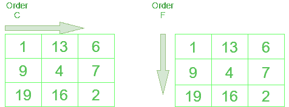

# 更改 NumPy 数组的尺寸

> 原文:[https://www . geeksforgeeks . org/change-the-dimension-of-a-numpy-array/](https://www.geeksforgeeks.org/change-the-dimension-of-a-numpy-array/)

让我们讨论如何改变数组的维数。在 [NumPy](https://www.geeksforgeeks.org/python-numpy/) 中，这可以通过多种方式实现。让我们讨论每一个。

**方法#1:使用 Shape()**

**语法:**

```
array_name.shape()

```

## 蟒蛇 3

```
# importing numpy
import numpy as np

def main():

    # initialising array
    print('Initialised array')
    gfg = np.array([1, 2, 3, 4])
    print(gfg)

    # checking current shape
    print('current shape of the array')
    print(gfg.shape)

    # modifying array according to new dimensions
    print('changing shape to 2,3')
    gfg.shape = (2, 2)
    print(gfg)

if __name__ == "__main__":
    main()
```

**输出:**

```
Initialised array
[1 2 3 4]
current shape of the array
(4,)
changing shape to 2,3
[[1 2]
 [3 4]]

```

**方法二:利用** [**重塑()**](https://www.geeksforgeeks.org/numpy-reshape-python/)

整形()函数的顺序参数是高级的和可选的。当我们使用 C 和 F 时，输出是不同的，因为 NumPy 改变结果数组索引的方式不同。顺序 **A** 使 NumPy 根据内存块中的可用大小从 C 或 F 中选择最佳顺序。



订单 C 和订单 F 之间的差异

**语法:**

```
numpy.reshape(array_name, newshape, order= 'C' or 'F' or 'A')

```

## 蟒蛇 3

```
# importing numpy
import numpy as np

def main():

    # initialising array
    gfg = np.arange(1, 10)
    print('initialised array')
    print(gfg)

    # reshaping array into a 3x3 with order C
    print('3x3 order C array')
    print(np.reshape(gfg, (3, 3), order='C'))

    # reshaping array into a 3x3 with order F
    print('3x3 order F array')
    print(np.reshape(gfg, (3, 3), order='F'))

    # reshaping array into a 3x3 with order A
    print('3x3 order A array')
    print(np.reshape(gfg, (3, 3), order='A'))

if __name__ == "__main__":
    main()
```

**输出:**

```
initialised array
[1 2 3 4 5 6 7 8 9]
3x3 order C array
[[1 2 3]
 [4 5 6]
 [7 8 9]]
3x3 order F array
[[1 4 7]
 [2 5 8]
 [3 6 9]]
3x3 order A array
[[1 2 3]
 [4 5 6]
 [7 8 9]]

```

**方法#3:使用** [**调整大小()**](https://www.geeksforgeeks.org/python-numpy-numpy-resize/)

也可以使用 resize()方法更改数组的形状。如果指定的维度大于实际数组，新数组中的额外空间将被原始数组的重复副本填充。

**语法:**

```
numpy.resize(a, new_shape)

```

## 蟒蛇 3

```
# importing numpy
import numpy as np

def main():

    # initialise array
    gfg = np.arange(1, 10)
    print('initialised array')
    print(gfg)

    # resezed array with dimensions in
    # range of original array
    np.resize(gfg, (3, 3))
    print('3x3 array')
    print(gfg)

    # re array with dimensions larger than
    # original array
    np.resize(gfg, (4, 4))

    # extra spaces will be filled with repeated
    # copies of original array
    print('4x4 array')
    print(gfg)

    # resize array with dimensions larger than 
    # original array
    gfg.resize(5, 5)

    # extra spaces will be filled with zeros
    print('5x5 array')
    print(gfg)

if __name__ == "__main__":
    main()
```

**输出:**

```
initialised array
[1 2 3 4 5 6 7 8 9]
3x3 array
[1 2 3 4 5 6 7 8 9]
4x4 array
[1 2 3 4 5 6 7 8 9]
5x5 array
[[1 2 3 4 5]
 [6 7 8 9 0]
 [0 0 0 0 0]
 [0 0 0 0 0]
 [0 0 0 0 0]]

```