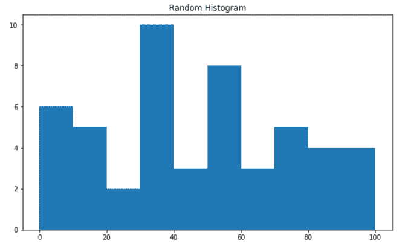
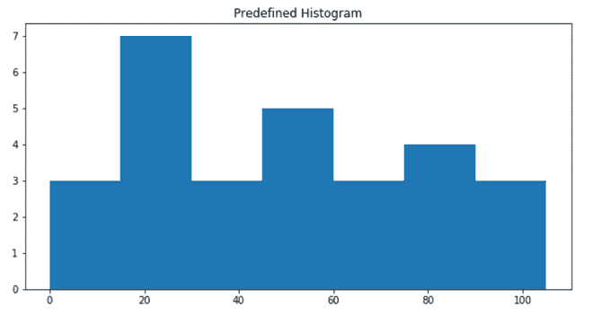

# 使用 Python 中的 NumPy 计算一组数据的直方图

> 原文:[https://www . geeksforgeeks . org/使用 python 中的 numpy 计算数据集直方图/](https://www.geeksforgeeks.org/compute-the-histogram-of-a-set-of-data-using-numpy-in-python/)

Numpy 为我们提供了使用 [**NumPy .直方图()**](https://www.geeksforgeeks.org/numpy-histogram-method-in-python/) 函数计算给定数据集的直方图的功能。直方图的形成取决于数据集，无论是预定义的还是随机生成的。

> **语法** : numpy .直方图(数据，箱=10，范围=无，赋范=无，权重=无，密度=无)

**案例 1:** 借助**随机**数据集计算数值直方图

## 蟒蛇 3

```py
# import Numpy and matplotlib
from matplotlib import pyplot as plt
import numpy as np

# Creating random dataset
data_set = np.random.randint(100, size=(50))

# Creation of plot
fig = plt.figure(figsize=(10, 6))

# plotting the Histogram with certain intervals
plt.hist(data_set, bins=[0, 10, 20, 30, 40, 50,
                         60, 70, 80, 90, 100])

# Giving title to Histogram
plt.title("Random Histogram")

# Displaying Histogram
plt.show()
```

**输出:**



在上面的例子中，我们使用[**NP . random . randint()**](https://www.geeksforgeeks.org/random-sampling-in-numpy-randint-function/)创建了一个随机数据集，并绘制了 Numpy 直方图

**案例 2:** 借助**预定义的**数据集计算数值直方图

## 蟒蛇 3

```py
# import Numpy and matplotlib
from matplotlib import pyplot as plt
import numpy as np

# Using predefined dataset
data_set = [45, 85, 95, 10, 58, 77, 92, 72, 52,
            22, 32, 5, 95, 2, 23, 24, 50, 40, 60,
            69, 44, 80, 21, 15, 17, 55, 21, 88]

# Creation of plot
fig = plt.figure(figsize=(10, 5))

# plotting the Histogram with certain intervals
plt.hist(data_set, bins=[0, 15, 30, 45, 60, 75, 90, 105])

# Giving title to Histogram
plt.title("Predefined Histogram")

# Displaying Histogram
plt.show()
```



在上面的例子中，我们获取了一个**预定义的**数据集，并绘制了数值直方图。