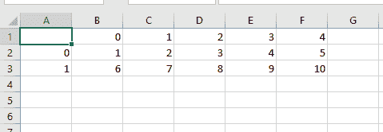
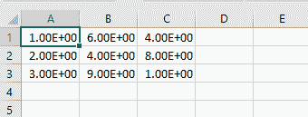

# 将 NumPy 数组转换成 csv 文件

> 原文:[https://www . geeksforgeeks . org/convert-a-numpy-array-in-a-CSV-file/](https://www.geeksforgeeks.org/convert-a-numpy-array-into-a-csv-file/)

在本文中，我们将看到将 [NumPy](https://www.geeksforgeeks.org/python-numpy/) 数组保存到 CSV 文件中的不同方法。CSV 文件格式是存储数据最简单、最有用的格式

有不同的方法可以将 NumPy 数组保存到 CSV 文件中

**方法一:使用**[**data frame . to _ CSV()**](https://www.geeksforgeeks.org/how-to-export-pandas-dataframe-to-a-csv-file/)**。**

此方法用于将数据帧写入 CSV 文件。

**示例:**将数组转换为 [**熊猫数据帧**](https://www.geeksforgeeks.org/python-pandas-dataframe/) 后保存为 CSV 格式。

## 蟒蛇 3

```
# import necessary libraries
import pandas as pd
import numpy as np

# create a dummy array
arr = np.arange(1,11).reshape(2,5)

# display the array
print(arr)

# convert array into dataframe
DF = pd.DataFrame(arr)

# save the dataframe as a csv file
DF.to_csv("data1.csv")
```

**输出:**

```
[[ 1  2  3  4  5]
[ 6  7  8  9 10]]

```



**方法二:**使用 **numpy_array.tofile()。**

此方法用于将数组写入文件。

**示例:**创建一个数组，然后保存到 CSV 文件中。

## 蟒蛇 3

```
# import the necessary library
import numpy as np

# create a dummy array
arr = np.arange(1,11)

# display the array
print(arr)

# use the tofile() method 
# and use ',' as a separator
# as we have to generate a csv file
arr.tofile('data2.csv', sep = ',')
```

**输出**:

```
[ 1  2  3  4  5  6  7  8  9 10]

```


**方法三:使用**[**numpy . save text()**](https://www.geeksforgeeks.org/numpy-savetxt/)**。**

此方法用于将数组保存到文本文件中。

**示例:**创建一个数组，然后保存为 CSV 文件。

## 蟒蛇 3

```
# import numpy library
import numpy

# create an array
a = numpy.array([[1, 6, 4],
                 [2, 4, 8],
                 [3, 9, 1]])

# save array into csv file
numpy.savetxt("data3.csv", a, 
              delimiter = ",")
```

**输出:**

