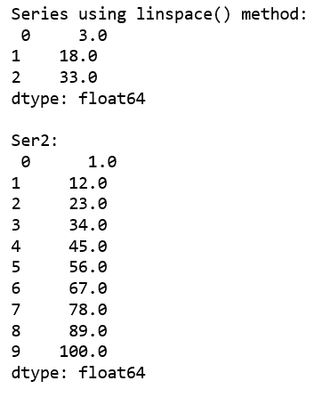
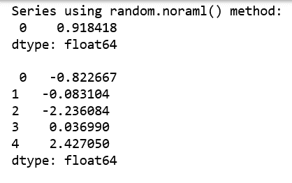
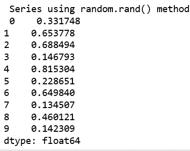
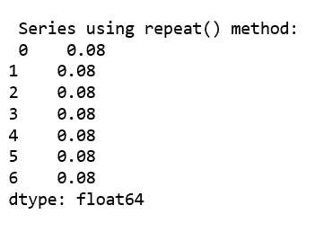

# 使用 NumPy 功能创建熊猫系列

> 原文:[https://www . geeksforgeeks . org/create-pandas-series-using-numpy-functions/](https://www.geeksforgeeks.org/create-pandas-series-using-numpy-functions/)

[Pandas Series](https://www.geeksforgeeks.org/python-pandas-series/) 是一个一维标记数组，能够保存任何类型的数据(整数、字符串、浮点、python 对象等)。).

让我们看看如何使用不同的`numpy` 功能创建[熊猫系列](https://www.geeksforgeeks.org/python-pandas-series/)。

**代码#1:** 使用 [numpy.linspace()](https://www.geeksforgeeks.org/numpy-linspace-python/)

```
# import pandas and numpy
import pandas as pd
import numpy as np

# series with numpy linspace() 
ser1 = pd.Series(np.linspace(3, 33, 3))
print(ser1)

# series with numpy linspace()
ser2 = pd.Series(np.linspace(1, 100, 10))
print("\n", ser2)

```

**输出:**


**代码#2:** 使用 [np.random.normal()](https://www.geeksforgeeks.org/rand-vs-normal-numpy-random-python/) 和[rand()](https://www.geeksforgeeks.org/numpy-random-randn-python/)方法。

```
# import pandas and numpy
import pandas as pd
import numpy as np

# series with numpy random.normal
ser3 = pd.Series(np.random.normal())
print(ser3)

# series with numpy random.normal
ser4 = pd.Series(np.random.normal(0.0, 1.0, 5))
print("\n", ser4)

# series with numpy random.rand
ser5 = pd.Series(np.random.rand(10))
print("\n", ser5)
```

**输出:**
 

**代码#3:** 使用 [numpy.repeat()](https://www.geeksforgeeks.org/numpy-repeat-python/)

```
# import pandas and numpy
import pandas as pd
import numpy as np

# series with numpy random.repeat
ser = pd.Series(np.repeat(0.08, 7))
print("\n", ser)
```

**输出:**
