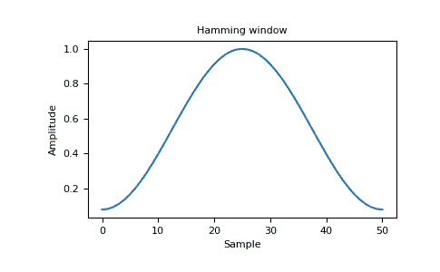

# Numpy 中的海明

> 原文:[https://www.geeksforgeeks.org/hamming-in-numpy/](https://www.geeksforgeeks.org/hamming-in-numpy/)

**汉明窗**是通过使用加权余弦形成的锥形

```
Parameters(numpy.hamming(M)): 

M : int Number of points in the output window.
    If zero or less, an empty array is returned.

Returns: 
out : array
```

窗口，最大值归一化为 1(只有当样本数为奇数时，才会出现值 1)。
**例:**

```
import numpy as np 
print(np.hamming(12))
```

**输出:**

```
[ 0.08        0.15302337  0.34890909  0.60546483  0.84123594  0.98136677
  0.98136677  0.84123594  0.60546483  0.34890909  0.15302337  0.08      ]

```

**绘制窗口及其频率响应(需要 SciPy 和 matplotlib):**
**对于窗口:**

```
import numpy as np 
import matplotlib.pyplot as plt 
from numpy.fft import fft, fftshift 

window = np.hamming(51)

plt.plot(window) 
plt.title("Hamming window")
plt.ylabel("Amplitude") 
plt.xlabel("Sample") 
plt.show() 
```

**输出:**


**频率:**

```
import numpy as np 
import matplotlib.pyplot as plt 
from numpy.fft import fft, fftshift 

window = np.hamming(51)

plt.figure()

A = fft(window, 2048) / 25.5
mag = np.abs(fftshift(A))
freq = np.linspace(-0.5, 0.5, len(A))
response = 20 * np.log10(mag)
response = np.clip(response, -100, 100)

plt.plot(freq, response)
plt.title("Frequency response of Hamming window")
plt.ylabel("Magnitude [dB]")
plt.xlabel("Normalized frequency [cycles per sample]")
plt.axis('tight')
plt.show()
```

**输出:**
