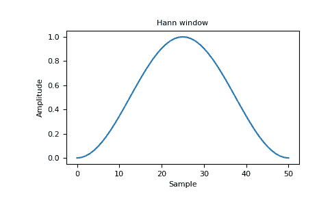
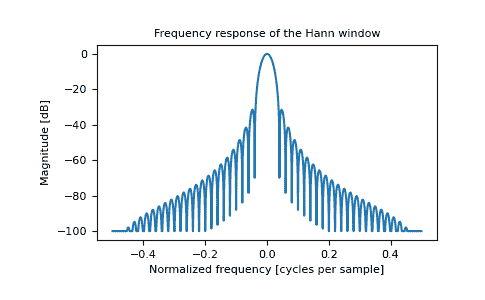

# Numpy | Python 中的汉宁

> 原文:[https://www.geeksforgeeks.org/hanning-in-numpy-python/](https://www.geeksforgeeks.org/hanning-in-numpy-python/)

**汉宁窗**是使用加权余弦形成的锥度。

```
Syntax:  numpy.hamming(M)

Parameters: 
M :  Number of points in the output window.

Returns:  AN array
```

窗口，最大值归一化为 1(值 1 仅在 M 为奇数时出现)。

**代码#1:**

```
import numpy as np

print(np.hanning(12))
```

**输出:**

```
[ 0\.          0.07937323  0.29229249  0.57115742  0.82743037  0.97974649
  0.97974649  0.82743037  0.57115742  0.29229249  0.07937323  0\.        ]

```

**代码#2:** 绘制窗口及其频率响应(需要 SciPy 和 matplotlib)。

```
import numpy as np
import matplotlib.pyplot as plt
from numpy.fft import fft, fftshift

window = np.hanning(51)

plt.plot(window)
plt.title("Hann window")
plt.ylabel("Amplitude"")
plt.xlabel("Sample")

plt.show()
```

**输出:**


**频率:**

```
import numpy as np
import matplotlib.pyplot as plt
from numpy.fft import fft, fftshift

window = np.hanning(51)
plt.figure()

A = fft(window, 2048) / 25.5
mag = np.abs(fftshift(A))
freq = np.linspace(-0.5, 0.5, len(A))
response = 20 * np.log10(mag)
response = np.clip(response, -100, 100)

plt.plot(freq, response)
plt.title("Frequency response of Hanning window")
plt.ylabel("Magnitude [dB]")
plt.xlabel("Normalized frequency [cycles per sample]")
plt.axis("tight")
plt.show()
```

**输出:**
