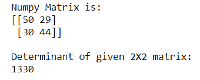
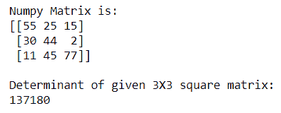
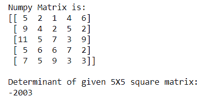

# 如何用 NumPy 计算矩阵的行列式？

> 原文:[https://www . geeksforgeeks . org/如何使用-numpy/](https://www.geeksforgeeks.org/how-to-calculate-the-determinant-of-a-matrix-using-numpy/) 计算矩阵的行列式

一个可以从方阵中计算出来的特殊数被称为方阵的**行列式**。Numpy 为我们提供了使用 **numpy.linalg.det()** 函数计算方阵行列式的功能。

**语法:**

```
numpy.linalg.det(array)

```

**示例 1:** 使用numpy.linalg.det()函数计算 **2X2 Numpy 矩阵**的行列式

## 蟒蛇 3

```
# importing Numpy package
import numpy as np

# creating a 2X2 Numpy matrix
n_array = np.array([[50, 29], [30, 44]])

# Displaying the Matrix
print("Numpy Matrix is:")
print(n_array)

# calculating the determinant of matrix
det = np.linalg.det(n_array)

print("\nDeterminant of given 2X2 matrix:")
print(int(det))
```

**输出:**



在上面的例子中，我们计算了 2X2 方阵的行列式。

**示例 2:** 使用 numpy.linalg.det()函数计算 **3X3 Numpy 矩阵**的行列式

## 蟒蛇 3

```
# importing Numpy package
import numpy as np

# creating a 3X3 Numpy matrix
n_array = np.array([[55, 25, 15],
                    [30, 44, 2],
                    [11, 45, 77]])

# Displaying the Matrix
print("Numpy Matrix is:")
print(n_array)

# calculating the determinant of matrix
det = np.linalg.det(n_array)

print("\nDeterminant of given 3X3 square matrix:")
print(int(det))
```

**输出:**



在上面的例子中，我们计算了 3X3 方阵的行列式。

**示例 3:** 使用 numpy.linalg.det()函数计算 **5X5 Numpy 矩阵**的行列式

## 蟒蛇 3

```
# importing Numpy package
import numpy as np

# creating a 5X5 Numpy matrix
n_array = np.array([[5, 2, 1, 4, 6],
                    [9, 4, 2, 5, 2],
                    [11, 5, 7, 3, 9],
                    [5, 6, 6, 7, 2],
                    [7, 5, 9, 3, 3]])

# Displaying the Matrix
print("Numpy Matrix is:")
print(n_array)

# calculating the determinant of matrix
det = np.linalg.det(n_array)

print("\nDeterminant of given 5X5 square matrix:")
print(int(det))
```

**输出:**



在上面的例子中，我们计算了 5X5 方阵的行列式。