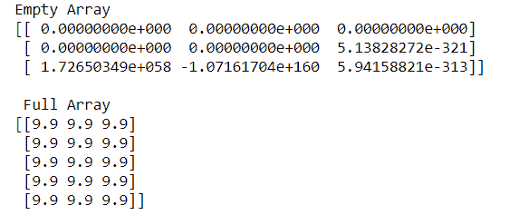

# 如何创建空的和满的 NumPy 数组？

> 原文:[https://www . geeksforgeeks . org/如何创建一个空且满的 numpy 数组/](https://www.geeksforgeeks.org/how-to-create-an-empty-and-a-full-numpy-array/)

有时需要为一个特定的问题同时创建一个空数组和一个满数组。在这种情况下，我们有两个函数命名为**[**numpy . empty()**](https://www.geeksforgeeks.org/numpy-empty-python/)和**[**numpy . full()**](https://www.geeksforgeeks.org/numpy-full-python/)**来创建一个空数组和一个满数组。******

********语法:********

```py
**numpy.full(shape, fill_value, dtype = None, order = ‘C’)
numpy.empty(shape, dtype = float, order = ‘C’)** 
```

******例 1:******

## ****蟒蛇 3****

```py
**# python program to create
# Empty and Full Numpy arrays

import numpy as np

# Create an empty array
empa = np.empty((3, 4), dtype=int)
print("Empty Array")
print(empa)

# Create a full array
flla = np.full([3, 3], 55, dtype=int)
print("\n Full Array")
print(flla)**
```

******输出:******

********

****在上面的例子中，我们创建了一个 3X4 的空数组和一个 3X3 的完整数组 **INTEGER** 类型。****

******例 2:******

## ****蟒蛇 3****

```py
**# python program to create
# Empty and Full Numpy arrays

import numpy as np

# Create an empty array
empa = np.empty([4, 2])
print("Empty Array")
print(empa)

# Create a full array
flla = np.full([4, 3], 95)
print("\n Full Array")
print(flla)**
```

******输出:******

********

****在上面的例子中，我们创建了一个 4X2 的空数组和一个 4X3 的完整数组，数组类型为 **INTEGER** 和 **FLOAT** 。****

******例 3:******

## ****蟒蛇 3****

```py
**# python program to create 
# Empty and Full Numpy arrays

import numpy as np

# Create an empty array
empa =  np.empty([3,3]) 
print("Empty Array")
print(empa)

# Create a full array
flla = np.full([5,3], 9.9)
print("\n Full Array")
print(flla)**
```

******输出:******

********

****在上面的例子中，我们创建了一个 3X3 的空数组和一个 5X3 的完整数组 **FLOAT** 类型。****