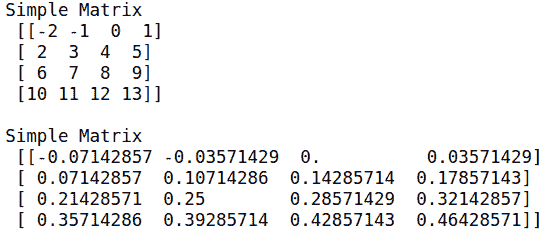

# 如何在 Python 中对 NumPy 中的数组进行归一化？

> 原文:[https://www . geeksforgeeks . org/如何规范化 python 中的数组/](https://www.geeksforgeeks.org/how-to-normalize-an-array-in-numpy-in-python/)

在本文中，我们将讨论如何使用 NumPy 在 Python 中规范化 1D 和 2D 数组。**归一化**是指将数组的值缩放到期望的范围。

## 1D 阵列的归一化

假设，我们有一个数组= [1，2，3]，在范围[0，1]内对其进行归一化意味着它会将数组[1，2，3]转换为[0，0.5，1]，因为 1，2 和 3 是等距的。

```py
Array [1,2,4] -> [0, 0.3, 1]
```

这也可以在一个范围内完成，即代替[0，1]，我们将使用[3，7]。

现在，

```py
Array [1,2,3] -> [3,5,7]
```

和

```py
Array [1,2,4] -> [3,4.3,7]
```

让我们看看代码示例

**例 1:**

## 蟒蛇 3

```py
# import module
import numpy as np

# explicit function to normalize array
def normalize(arr, t_min, t_max):
    norm_arr = []
    diff = t_max - t_min
    diff_arr = max(arr) - min(arr)    
    for i in arr:
        temp = (((i - min(arr))*diff)/diff_arr) + t_min
        norm_arr.append(temp)
    return norm_arr

# gives range staring from 1 and ending at 3  
array_1d = np.arange(1,4) 
range_to_normalize = (0,1)
normalized_array_1d = normalize(array_1d, 
                                range_to_normalize[0], 
                                range_to_normalize[1])

# display original and normalized array
print("Original Array = ",array_1d)
print("Normalized Array = ",normalized_array_1d)
```

**输出:**


**例 2:**

现在，让输入数组是[1，2，4，8，10，15]，范围也是[0，1]

## 蟒蛇 3

```py
# import module
import numpy as np

# explicit function to normalize array
def normalize(arr, t_min, t_max):
    norm_arr = []
    diff = t_max - t_min
    diff_arr = max(arr) - min(arr)
    for i in arr:
        temp = (((i - min(arr))*diff)/diff_arr) + t_min
        norm_arr.append(temp)
    return norm_arr

# assign array and range
array_1d = [1, 2, 4, 8, 10, 15]
range_to_normalize = (0, 1)
normalized_array_1d = normalize(
    array_1d, range_to_normalize[0], 
  range_to_normalize[1])

# display original and normalized array
print("Original Array = ", array_1d)
print("Normalized Array = ", normalized_array_1d)
```

**输出:**


## 2D 阵列的归一化

为了规范化 2D 阵列或矩阵，我们需要 NumPy 库。对于矩阵，一般的归一化是使用欧几里德范数或弗罗贝尼斯范数。

简单归一化的公式是


这里，v 是矩阵，|v|是行列式，也称为欧几里得范数。v-cap 是归一化矩阵。

以下是实现上述功能的一些示例:

**例 1:**

## 蟒蛇 3

```py
# import module
import numpy as np

# explicit function to normalize array
def normalize_2d(matrix):
    norm = np.linalg.norm(matrix)
    matrix = matrix/norm  # normalized matrix
    return matrix

# gives and array staring from -2
# and ending at 13
array = np.arange(16) - 2

# converts 1d array to a matrix
matrix = array.reshape(4, 4)
print("Simple Matrix \n", matrix)
normalized_matrix = normalize_2d(matrix)
print("\nSimple Matrix \n", normalized_matrix)
```

**输出:**


**例 2:**

我们也可以使用其他规范，如 1-规范或 2-规范

## 蟒蛇 3

```py
# import module
import numpy as np

def normalize_2d(matrix):
    # Only this is changed to use 2-norm put 2 instead of 1
    norm = np.linalg.norm(matrix, 1)
    # normalized matrix
    matrix = matrix/norm  
    return matrix

# gives and array staring from -2 and ending at 13
array = np.arange(16) - 2  
# converts 1d array to a matrix
matrix = array.reshape(4, 4)  
print("Simple Matrix \n", matrix)
normalized_matrix = normalize_2d(matrix)
print("\nSimple Matrix \n", normalized_matrix)
```

**输出:**



这样，我们就可以用 python 中的 NumPy 执行规范化。