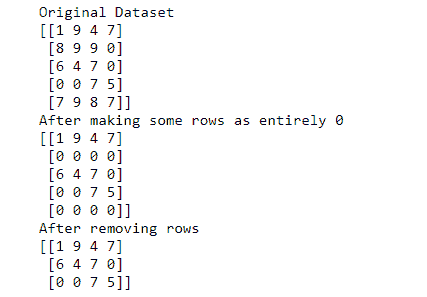

# 如何使用 NumPy 移除只包含 0 的数组行？

> 原文:[https://www . geeksforgeeks . org/如何使用-numpy/](https://www.geeksforgeeks.org/how-to-remove-array-rows-that-contain-only-0-using-numpy/) 移除仅包含-0 的数组行

Numpy 库提供了一个名为 [**numpy.all()**](https://www.geeksforgeeks.org/numpy-all-in-python/) 的函数，当传递给第一个参数的 n-d 数组的所有元素都为真时返回真，否则返回假。因此，要确定包含 0 的整行可以通过指定 axis=1 来移除。它将遍历每一行，并检查第一个参数中给出的条件。

**示例:**

```py
data=[[1,2,3]
      [0,0,0]
      [9,8,7]]
After removing row with all zeroes:
data=[[1,2,3]
      [9,8,7]]
```

**例 1:**

**遵循的方法:**

*   取一个 numpy n-d 数组。
*   使用 numpy.all()函数删除只包含零的行。
*   打印 n-d 数组。

## 蟒蛇 3

```py
import numpy as np
# take data
data = np.array([[1, 2, 3], [0, 0, 0], [4, 5, 6],
                 [0, 0, 0], [7, 8, 9], [0, 0, 0]])
# print original data having rows with all zeroes
print("Original Dataset")
print(data)

# remove rows having all zeroes
data = data[~np.all(data == 0, axis=1)]

# data after removing rows having all zeroes
print("After removing rows")
print(data)
```

**输出:**


**例 2:**

**遵循的方法:**

*   使用 numpy.random.choice()方法，取 0-10 之间的 20 个随机数。
*   使用 resform()方法将它们按行和列对齐。
*   显式地将一些行标记为完全 0。
*   删除全为零的行。
*   打印数据集。

## 蟒蛇 3

```py
import numpy as np
# take random data

# random.choice(x,y) will pick y elements from range (0,(x-1))
data = np.random.choice(10, 20)

# specify the dimensions of data i.e (rows,columns)
data = data.reshape(5, 4)

# print original data having rows with all zeroes
print("Original Dataset")
print(data)

# make some rows entirely zero
data[1, :] = 0  # making 2nd row entirely 0
data[4, :] = 0  # making last row entirely 0

# after making 2nd and 5th row as 0
print("After making some rows as entirely 0")
print(data)
data = data[~np.all(data == 0, axis=1)]

# data after removing rows having all zeroes
print("After removing rows")
print(data)
```

**输出:**

