# 使用 Python 中的 SciPy 和 NumPy 进行图像处理

> 原文:[https://www . geesforgeks . org/image-processing-with-scipy-and-numpy-in-python/](https://www.geeksforgeeks.org/image-processing-with-scipy-and-numpy-in-python/)

在本教程中，我们将使用核心科学模块(如 NumPy 和 SciPy)讨论 Python 中的图像处理。图像由 NumPy n 数组组成，因此我们可以处理和操作图像，SciPy 提供子模块 Scipy . n image，它提供可以在 NumPy 数组上操作的函数。


我们将讨论如何打开和写入图像，还将涵盖不同的操作和过滤技术。所以在开始之前，让我们看看如何安装这两个模块。

## 装置

**Numpy:** 到[安装 numpy](https://www.geeksforgeeks.org/how-to-install-numpy-on-linux/) 在终端中键入以下命令。

```
pip install numpy
```


**SciPy:** 也可以使用上面的命令安装 SciPy。

```
pip install scipy
```

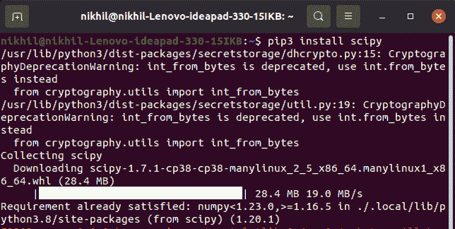

## 打开和写入图像

SciPy 的杂项包附带了一些预装的图像。我们将使用这些图像来学习图像处理。face()函数提供了一个这样的图像。face()函数将获得浣熊脸的彩色图像。

### **示例:使用 SciPy 保存图像**

## 蟒蛇 3

```
from scipy import misc
import imageio
import matplotlib.pyplot as plt

# reads a raccoon face
face = misc.face()

# save the image
imageio.imsave('raccoon.png', face)

plt.imshow(face)
plt.show()
```

**输出:**

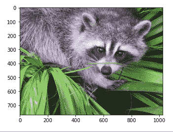

### 示例:从图像创建 NumPy 数组

这里我们将使用 imread()函数读取图像。

## 蟒蛇 3

```
from scipy import misc
import imageio
import matplotlib.pyplot as plt

img = imageio.imread('raccoon.png')

print(img.shape)
print(img.dtype)

plt.imshow(img)
plt.show()
```

**输出:**

```
(768, 1024, 3)
uint8
```

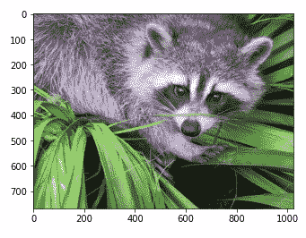

## 创建原始圆角

原始文件是包含来自图像传感器的最小处理数据的文件。我们可以使用 scipy 包的 tofile()方法创建这个文件。

### 示例:使用 SciPy 创建原始文件

## 蟒蛇 3

```
from scipy import misc
import imageio
import matplotlib.pyplot as plt

# reads a raccoon face
face = misc.face()

face.tofile("raccoon.raw")
```

这将在我们当前的工作目录中创建一个. raw 文件。

## 打开原始文件

为了开场。原始文件我们将需要使用 fromfile()方法的 NumPy 模块。该函数是读取已知数据类型的二进制数据以及解析简单格式文本的有效方法。

### 示例:使用 NumPy 读取原始文件

## 蟒蛇 3

```
import numpy as np

img = np.fromfile('raccoon.raw', 
                  dtype=np.uint8)

print(img.shape)
```

**输出:**

```
(2359296,)
```

## 获取统计信息

我们可以使用 max()和 min()函数来获得沿给定轴的最大值和最小值。为了找到平均值，我们可以使用 mean()函数。

### 示例:获取最小值、最大值和平均值

## 蟒蛇 3

```
from scipy import misc

img = misc.face()

print(img.max())
print(img.min())
print(img.mean())
```

**输出:**

```
255
0
110.16274388631184
```

## 裁剪图像

正如我们所知，图像是由矩阵中的数字表示的，因此改变矩阵的值将导致原始图像的改变。让我们看看如何使用这个想法来裁剪图像。

### 示例:裁剪图像

## 蟒蛇 3

```
from scipy import misc
import matplotlib.pyplot as plt

# for grascaling the image
img = misc.face(gray = True)

x, y = img.shape

# Cropping the image
crop = img[x//3: - x//8, y//3: - y//8]

plt.imshow(crop)
plt.show()
```

**输出:**

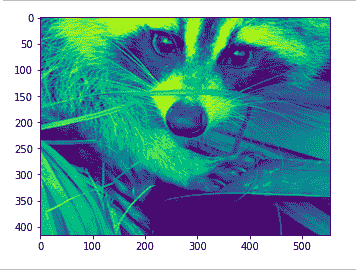

## 翻转图像

我们可以使用 numpy 模块的 [flipud()](https://www.geeksforgeeks.org/numpy-flipud-python/) 功能来翻转该图像。该函数沿上下方向翻转数组(每列中的条目)，形状保持不变。

### 示例:使用 Scipy 翻转图像

## 蟒蛇 3

```
from scipy import misc
import numpy as np
import matplotlib.pyplot as plt

img = misc.face()

flip = np.flipud(img)

plt.imshow(flip)
plt.show()
```

**输出:**

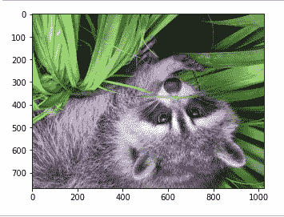

## 旋转图像

要旋转图像，我们可以使用 ndarray.rotate()函数。此功能以特定角度旋转图像。

### 示例:使用 SciPy 和 NumPy 旋转图像

## 蟒蛇 3

```
from scipy import misc,ndimage
import matplotlib.pyplot as plt

img = misc.face()

rotate = ndimage.rotate(face, 30)

plt.imshow(rotate)
plt.show()
```

**输出:**

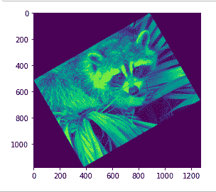

## 过滤图像

简单来说，图像过滤是一个增强或修改图像的过程，在这个过程中，我们可以增加清晰度、增强边缘或模糊图像。在图像滤波中，对给定图像的像素值应用某种算法，该算法确定输出图像的值。让我们看看可以使用 NumPy 和 SciPy 完成的一些图像过滤操作。

### 模糊图像

模糊图像是降低图像中噪声水平的过程。为此，我们可以使用高斯滤波器或独角兽滤波器。

### 示例:使用 SciPy 和 NumPy 模糊图像

## 蟒蛇 3

```
from scipy import misc,ndimage
import matplotlib.pyplot as plt

img = misc.face()

blur_G = ndimage.gaussian_filter(img,sigma=7)

plt.imshow(blur_G)
plt.show()
```

**输出:**

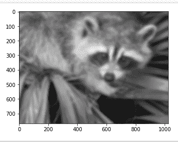

### 锐化图像

锐化是指增加明暗区域的对比度，使图像更加清晰，并呈现图像特征。锐化图像有三个主要原因:克服相机设备引入的模糊，将注意力吸引到某些区域，以及提高易读性。如果图像中有模糊的文字，就很容易阅读。

### 示例:使用 NumPy 和 SciPy 锐化图像

## 蟒蛇 3

```
from scipy import misc, ndimage
import matplotlib.pyplot as plt

img = misc.face(gray=True).astype(float)
blur = ndimage.gaussian_filter(img, 5)

# Showing Blur Image
plt.imshow(blur)
plt.show()

blur_G = ndimage.gaussian_filter(blur, 1)
alpha = 30
sharp = blur+alpha*(blur-blur_G)

# showing sharp images
plt.imshow(sharp)
plt.show()
```

**输出:**

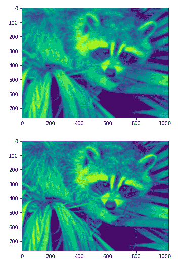

### 图像去噪

图像去噪是指从有噪声的图像重建信号的过程。去噪是为了去除图像中不需要的噪声，以更好的形式进行分析。首先，让我们创建一个嘈杂的图像–

### 示例 1:创建有噪声的图像

## 蟒蛇 3

```
from scipy import misc,ndimage
import matplotlib.pyplot as plt
import numpy as np

img=misc.face(gray=True).astype(float)
img=img[40:100,30:100]

noise_img=img+0.9*img.std()*np.random.random(img.shape)

plt.imshow(noise_img)
plt.show()
```

**输出:**

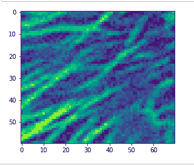

为了平滑边缘和噪声，我们使用高斯滤波器。

## 蟒蛇 3

```
denoised = ndimage.gaussian_filter(noise_img, 2.2)

plt.imshow(denoised)
plt.show()
```

**输出:**

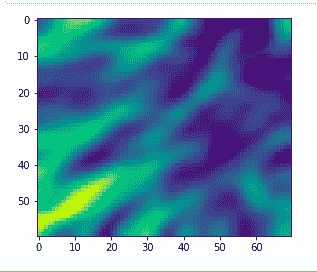

我们也可以使用中值滤波器来保留边缘。

## 蟒蛇 3

```
denoised = ndimage.median_filter(noise_img, 4)

plt.imshow(denoised)
plt.show()
```

**输出:**

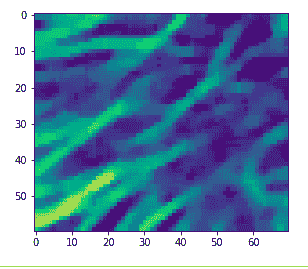

## 边缘检测

图像检测的过程包括检测图像中的边缘。它通过检测亮度的不连续性来工作。对于高强度的变化，我们可以使用索贝尔，一个梯度算子-

### 示例:使用 SciPy 和 NumPy 进行边缘检测

## 蟒蛇 3

```
from scipy import misc, ndimage
import matplotlib.pyplot as plt
import numpy as np

img = np.zeros((300, 300))
img[64:-64, 64:-64] = 1
img = ndimage.rotate(im, 30, mode='constant')
img = ndimage.gaussian_filter(im, 7)

# Original image
plt.imshow(im)
plt.show()

# edge detection
x = ndimage.sobel(im, axis=0, mode='constant')
y = ndimage.sobel(im, axis=1, mode='constant')
Sobel = np.hypot(x, y)

plt.imshow(sob)
plt.show()
```

**输出:**

