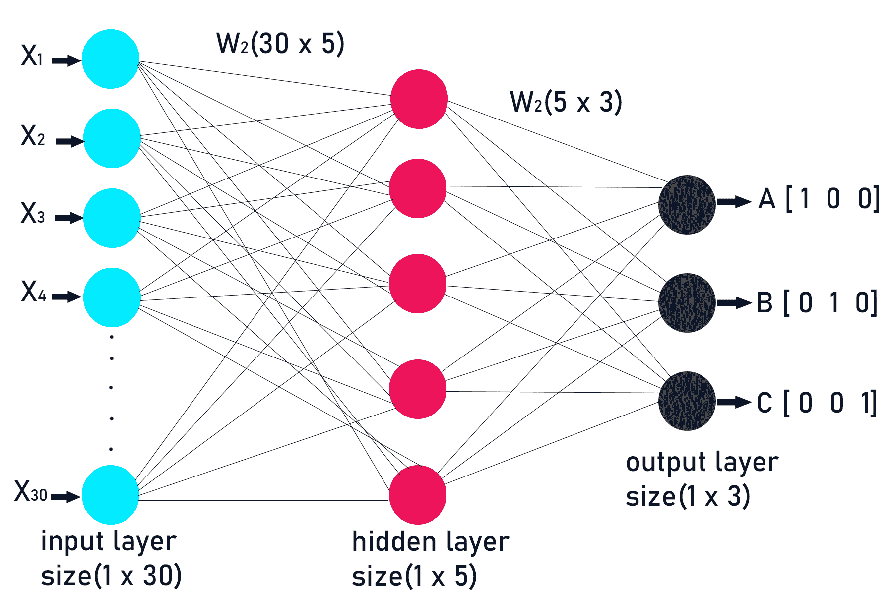
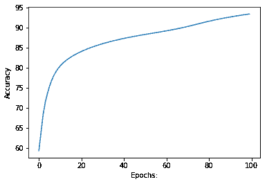
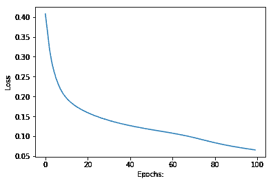

# 使用 NumPy

从头开始实现神经网络

> 原文:[https://www . geesforgeks . org/实现-神经网络-从零开始-使用-numpy/](https://www.geeksforgeeks.org/implementation-of-neural-network-from-scratch-using-numpy/)

**DNN(Deep neural network)** 在一个机器学习算法中，其灵感来自人脑的工作方式。DNN 主要用作分类算法。在本文中，我们将了解如何从头开始在 NumPy(Python 库)中实现基本 DNN 算法的分步方法。

本文的目的是让初学者对神经网络的工作原理及其实现细节有一个了解。我们将构建一个三个字母(A，B，C)的分类器，为了简单起见，我们将创建字母(A，B，C)作为 0 和 1 的 NumPy 数组，并且我们将忽略与每个节点相关的偏差项。


**步骤 1 :** 使用 0 和 1 的 numpy 数组创建数据集。
由于图像是矩阵中像素值的集合，我们将为 A、B、C 创建这些像素矩阵

```py
using 0 and 1
#A
0 0 1 1 0 0
0 1 0 0 1 0 
1 1 1 1 1 1
1 0 0 0 0 1 
1 0 0 0 0 1

#B
0 1 1 1 1 0
0 1 0 0 1 0 
0 1 1 1 1 0
0 1 0 0 1 0
0 1 1 1 1 0

#C
0 1 1 1 1 0
0 1 0 0 0 0
0 1 0 0 0 0
0 1 0 0 0 0
0 1 1 1 1 0

#Labels for each Letter
A=[1, 0, 0]
B=[0, 1, 0]
C=[0, 0, 1]
```

**代码:**

## 蟒蛇 3

```py
# Creating data set

# A
a =[0, 0, 1, 1, 0, 0,
   0, 1, 0, 0, 1, 0,
   1, 1, 1, 1, 1, 1,
   1, 0, 0, 0, 0, 1,
   1, 0, 0, 0, 0, 1]
# B
b =[0, 1, 1, 1, 1, 0,
   0, 1, 0, 0, 1, 0,
   0, 1, 1, 1, 1, 0,
   0, 1, 0, 0, 1, 0,
   0, 1, 1, 1, 1, 0]
# C
c =[0, 1, 1, 1, 1, 0,
   0, 1, 0, 0, 0, 0,
   0, 1, 0, 0, 0, 0,
   0, 1, 0, 0, 0, 0,
   0, 1, 1, 1, 1, 0]

# Creating labels
y =[[1, 0, 0],
   [0, 1, 0],
   [0, 0, 1]]
```

**第二步:数据集可视化**

## 蟒蛇 3

```py
import numpy as np
import matplotlib.pyplot as plt
# visualizing the data, ploting A.
plt.imshow(np.array(a).reshape(5, 6))
plt.show()
```

**输出:**


**第三步:由于数据集是列表的形式，我们将它转换成 numpy 数组。**

## 蟒蛇 3

```py
# converting data and labels into numpy array

"""
Convert the matrix of 0 and 1 into one hot vector
so that we can directly feed it to the neural network,
these vectors are then stored in a list x.
"""

x =[np.array(a).reshape(1, 30), np.array(b).reshape(1, 30),
                                np.array(c).reshape(1, 30)]

# Labels are also converted into NumPy array
y = np.array(y)

print(x, "\n\n", y)
```

**输出:**

```py
[array([[0, 0, 1, 1, 0, 0, 0, 1, 0, 0, 1, 0, 1, 1, 1, 1, 1, 1, 1, 0, 0, 0, 0, 1, 1, 0, 0, 0, 0, 1]]), 
 array([[0, 1, 1, 1, 1, 0, 0, 1, 0, 0, 1, 0, 0, 1, 1, 1, 1, 0, 0, 1, 0, 0, 1, 0, 0, 1, 1, 1, 1, 0]]),
 array([[0, 1, 1, 1, 1, 0, 0, 1, 0, 0, 0, 0, 0, 1, 0, 0, 0, 0, 0, 1, 0, 0, 0, 0, 0, 1, 1, 1, 1, 0]])] 

[[1 0 0]
[0 1 0]
[0 0 1]]
```

**步骤 4 :** 定义深层神经网络的架构或结构。这包括决定层数和每层中的节点数。我们的神经网络将具有以下结构。

```py
1st layer: Input layer(1, 30)
2nd layer: Hidden layer (1, 5)
3rd layer: Output layer(3, 3)

```



**第五步:声明并定义所有函数，构建深度神经网络。**

## 蟒蛇 3

```py
# activation function

def sigmoid(x):
    return(1/(1 + np.exp(-x)))

# Creating the Feed forward neural network
# 1 Input layer(1, 30)
# 1 hidden layer (1, 5)
# 1 output layer(3, 3)

def f_forward(x, w1, w2):
    # hidden
    z1 = x.dot(w1)# input from layer 1
    a1 = sigmoid(z1)# out put of layer 2

    # Output layer
    z2 = a1.dot(w2)# input of out layer
    a2 = sigmoid(z2)# output of out layer
    return(a2)

# initializing the weights randomly
def generate_wt(x, y):
    l =[]
    for i in range(x * y):
        l.append(np.random.randn())
    return(np.array(l).reshape(x, y))

# for loss we will be using mean square error(MSE)
def loss(out, Y):
    s =(np.square(out-Y))
    s = np.sum(s)/len(y)
    return(s)

# Back propagation of error
def back_prop(x, y, w1, w2, alpha):

    # hidden layer
    z1 = x.dot(w1)# input from layer 1
    a1 = sigmoid(z1)# output of layer 2

    # Output layer
    z2 = a1.dot(w2)# input of out layer
    a2 = sigmoid(z2)# output of out layer
    # error in output layer
    d2 =(a2-y)
    d1 = np.multiply((w2.dot((d2.transpose()))).transpose(),
                                   (np.multiply(a1, 1-a1)))

    # Gradient for w1 and w2
    w1_adj = x.transpose().dot(d1)
    w2_adj = a1.transpose().dot(d2)

    # Updating parameters
    w1 = w1-(alpha*(w1_adj))
    w2 = w2-(alpha*(w2_adj))

    return(w1, w2)

 def train(x, Y, w1, w2, alpha = 0.01, epoch = 10):
    acc =[]
    losss =[]
    for j in range(epoch):
        l =[]
        for i in range(len(x)):
            out = f_forward(x[i], w1, w2)
            l.append((loss(out, Y[i])))
            w1, w2 = back_prop(x[i], y[i], w1, w2, alpha)
        print("epochs:", j + 1, "======== acc:", (1-(sum(l)/len(x)))*100)  
        acc.append((1-(sum(l)/len(x)))*100)
        losss.append(sum(l)/len(x))
    return(acc, losss, w1, w2)

def predict(x, w1, w2):
    Out = f_forward(x, w1, w2)
    maxm = 0
    k = 0
    for i in range(len(Out[0])):
        if(maxm<Out[0][i]):
            maxm = Out[0][i]
            k = i
    if(k == 0):
        print("Image is of letter A.")
    elif(k == 1):
        print("Image is of letter B.")
    else:
        print("Image is of letter C.")
    plt.imshow(x.reshape(5, 6))
    plt.show()   

```

**步骤 6:** 初始化权重，因为神经网络有 3 层，所以会有 2 个权重矩阵与之关联。每个矩阵的大小取决于两个连接层中的节点数量。

**代码:**

## 蟒蛇 3

```py
w1 = generate_wt(30, 5)
w2 = generate_wt(5, 3)
print(w1, "\n\n", w2)
```

**输出:**

```py
[[ 0.75696605 -0.15959223 -1.43034587  0.17885107 -0.75859483]
 [-0.22870119  1.05882236 -0.15880572  0.11692122  0.58621482]
 [ 0.13926738  0.72963505  0.36050426  0.79866465 -0.17471235]
 [ 1.00708386  0.68803291  0.14110839 -0.7162728   0.69990794]
 [-0.90437131  0.63977434 -0.43317212  0.67134205 -0.9316605 ]
 [ 0.15860963 -1.17967773 -0.70747245  0.22870289  0.00940404]
 [ 1.40511247 -1.29543461  1.41613069 -0.97964787 -2.86220777]
 [ 0.66293564 -1.94013093 -0.78189238  1.44904122 -1.81131482]
 [ 0.4441061  -0.18751726 -2.58252033  0.23076863  0.12182448]
 [-0.60061323  0.39855851 -0.55612255  2.0201934   0.70525187]
 [-1.82925367  1.32004437  0.03226202 -0.79073523 -0.20750692]
 [-0.25756077 -1.37543232 -0.71369897 -0.13556156 -0.34918718]
 [ 0.26048374  2.49871398  1.01139237 -1.73242425 -0.67235417]
 [ 0.30351062 -0.45425039 -0.84046541 -0.60435352 -0.06281934]
 [ 0.43562048  0.66297676  1.76386981 -1.11794675  2.2012095 ]
 [-1.11051533  0.3462945   0.19136933  0.19717914 -1.78323674]
 [ 1.1219638  -0.04282422 -0.0142484  -0.73210071 -0.58364205]
 [-1.24046375  0.23368434  0.62323707 -1.66265946 -0.87481714]
 [ 0.19484897  0.12629217 -1.01575241 -0.47028007 -0.58278292]
 [ 0.16703418 -0.50993283 -0.90036661  2.33584006  0.96395524]
 [-0.72714199  0.39000914 -1.3215123   0.92744032 -1.44239943]
 [-2.30234278 -0.52677889 -0.09759073 -0.63982215 -0.51416013]
 [ 1.25338899 -0.58950956 -0.86009159 -0.7752274   2.24655146]
 [ 0.07553743 -1.2292084   0.46184872 -0.56390328  0.15901276]
 [-0.52090565 -2.42754589 -0.78354152 -0.44405857  1.16228247]
 [-1.21805132 -0.40358444 -0.65942185  0.76753095 -0.19664978]
 [-1.5866041   1.17100962 -1.50840821 -0.61750557  1.56003127]
 [ 1.33045269 -0.85811272  1.88869376  0.79491455 -0.96199293]
 [-2.34456987  0.1005953  -0.99376025 -0.94402235 -0.3078695 ]
 [ 0.93611909  0.58522915 -0.15553566 -1.03352997 -2.7210093 ]] 

 [[-0.50650286 -0.41168428 -0.7107231 ]
 [ 1.86861492 -0.36446849  0.97721539]
 [-0.12792125  0.69578056 -0.6639736 ]
 [ 0.58190462 -0.98941614  0.40932723]
 [ 0.89758789 -0.49250365 -0.05023684]]
```

**第七步:训练模型。**

## 蟒蛇 3

```py
"""The arguments of train function are data set list x,
correct labels y, weights w1, w2, learning rate = 0.1,
no of epochs or iteration.The function will return the
matrix of accuracy and loss and also the matrix of
trained weights w1, w2"""

acc, losss, w1, w2 = train(x, y, w1, w2, 0.1, 100)
```

**输出:**

```py
epochs: 1 ======== acc: 59.24962411875523
epochs: 2 ======== acc: 63.68540644266716
epochs: 3 ======== acc: 68.23850165512243
epochs: 4 ======== acc: 71.30325758406262
epochs: 5 ======== acc: 73.52710796040974
epochs: 6 ======== acc: 75.32860090824263
epochs: 7 ======== acc: 76.8094120430158
epochs: 8 ======== acc: 78.00977196942078
epochs: 9 ======== acc: 78.97728263498026
epochs: 10 ======== acc: 79.76587293092753
epochs: 11 ======== acc: 80.42246589416287
epochs: 12 ======== acc: 80.98214842153129
epochs: 13 ======== acc: 81.4695736928823
epochs: 14 ======== acc: 81.90184308791194
epochs: 15 ======== acc: 82.29094665963427
epochs: 16 ======== acc: 82.64546024973251
epochs: 17 ======== acc: 82.97165532985433
epochs: 18 ======== acc: 83.27421706795944
epochs: 19 ======== acc: 83.55671426703763
epochs: 20 ======== acc: 83.82191341206628
epochs: 21 ======== acc: 84.07199359659367
epochs: 22 ======== acc: 84.30869706017322
epochs: 23 ======== acc: 84.53343682891021
epochs: 24 ======== acc: 84.74737503832276
epochs: 25 ======== acc: 84.95148074055622
epochs: 26 ======== acc: 85.1465730591422
epochs: 27 ======== acc: 85.33335370190892
epochs: 28 ======== acc: 85.51243164226796
epochs: 29 ======== acc: 85.68434197894798
epochs: 30 ======== acc: 85.84956043619462
epochs: 31 ======== acc: 86.0085145818298
epochs: 32 ======== acc: 86.16159256503643
epochs: 33 ======== acc: 86.30914997510234
epochs: 34 ======== acc: 86.45151527443966
epochs: 35 ======== acc: 86.58899414916453
epochs: 36 ======== acc: 86.72187303817682
epochs: 37 ======== acc: 86.85042203982091
epochs: 38 ======== acc: 86.97489734865094
epochs: 39 ======== acc: 87.09554333976325
epochs: 40 ======== acc: 87.21259439177474
epochs: 41 ======== acc: 87.32627651970255
epochs: 42 ======== acc: 87.43680887413676
epochs: 43 ======== acc: 87.54440515197342
epochs: 44 ======== acc: 87.64927495564211
epochs: 45 ======== acc: 87.75162513147157
epochs: 46 ======== acc: 87.85166111297174
epochs: 47 ======== acc: 87.94958829083211
epochs: 48 ======== acc: 88.0456134278342
epochs: 49 ======== acc: 88.13994613312185
epochs: 50 ======== acc: 88.2328004057654
epochs: 51 ======== acc: 88.32439625156803
epochs: 52 ======== acc: 88.4149613686817
epochs: 53 ======== acc: 88.5047328856618
epochs: 54 ======== acc: 88.59395911861766
epochs: 55 ======== acc: 88.68290129028868
epochs: 56 ======== acc: 88.77183512103412
epochs: 57 ======== acc: 88.86105215751232
epochs: 58 ======== acc: 88.95086064702116
epochs: 59 ======== acc: 89.04158569269322
epochs: 60 ======== acc: 89.13356833768444
epochs: 61 ======== acc: 89.22716312996127
epochs: 62 ======== acc: 89.32273362510695
epochs: 63 ======== acc: 89.42064521532092
epochs: 64 ======== acc: 89.52125466556964
epochs: 65 ======== acc: 89.62489584606081
epochs: 66 ======== acc: 89.73186143973956
epochs: 67 ======== acc: 89.84238093800867
epochs: 68 ======== acc: 89.95659604815005
epochs: 69 ======== acc: 90.07453567327377
epochs: 70 ======== acc: 90.19609371190103
epochs: 71 ======== acc: 90.32101373021872
epochs: 72 ======== acc: 90.44888465704626
epochs: 73 ======== acc: 90.57915066786961
epochs: 74 ======== acc: 90.7111362751668
epochs: 75 ======== acc: 90.84408471463895
epochs: 76 ======== acc: 90.97720484616241
epochs: 77 ======== acc: 91.10971995033672
epochs: 78 ======== acc: 91.24091164815938
epochs: 79 ======== acc: 91.37015369432306
epochs: 80 ======== acc: 91.49693294991012
epochs: 81 ======== acc: 91.62085750782504
epochs: 82 ======== acc: 91.74165396819595
epochs: 83 ======== acc: 91.8591569057493
epochs: 84 ======== acc: 91.97329371114765
epochs: 85 ======== acc: 92.0840675282122
epochs: 86 ======== acc: 92.19154028777587
epochs: 87 ======== acc: 92.29581711003155
epochs: 88 ======== acc: 92.3970327467751
epochs: 89 ======== acc: 92.49534030435096
epochs: 90 ======== acc: 92.59090221343706
epochs: 91 ======== acc: 92.68388325695001
epochs: 92 ======== acc: 92.77444539437016
epochs: 93 ======== acc: 92.86274409885533
epochs: 94 ======== acc: 92.94892593090393
epochs: 95 ======== acc: 93.03312709510452
epochs: 96 ======== acc: 93.11547275630565
epochs: 97 ======== acc: 93.19607692356153
epochs: 98 ======== acc: 93.27504274176297
epochs: 99 ======== acc: 93.35246306044819
epochs: 100 ======== acc: 93.42842117607569
```

**第 8 步:绘制** **损失和精度相对于纪元数量(迭代)的曲线图。**

## 蟒蛇 3

```py
import matplotlib.pyplot as plt1

# ploting accuraccy
plt1.plot(acc)
plt1.ylabel('Accuracy')
plt1.xlabel("Epochs:")
plt1.show()

# plotting Loss
plt1.plot(losss)
plt1.ylabel('Loss')
plt1.xlabel("Epochs:")
plt1.show()
```

**输出:**

 

## 蟒蛇 3

```py
# the trained weigths are
print(w1, "\n", w2)
```

**输出:**

```py
[[-0.23769169 -0.1555992   0.81616823  0.1219152  -0.69572168]
 [ 0.36399972  0.37509723  1.5474053   0.85900477 -1.14106725]
 [ 1.0477069   0.13061485  0.16802893 -1.04450602 -2.76037811]
 [-0.83364475 -0.63609797  0.61527206 -0.42998096  0.248886  ]
 [ 0.16293725 -0.49443901  0.47638257 -0.89786531 -1.63778409]
 [ 0.10750411 -1.74967435  0.03086382  0.9906433  -0.9976104 ]
 [ 0.48454172 -0.68739134  0.78150251 -0.1220987   0.68659854]
 [-1.53100416 -0.33999119 -1.07657716  0.81305349 -0.79595135]
 [ 2.06592829  1.25309796 -2.03200199  0.03984423 -0.76893089]
 [-0.08285231 -0.33820853 -1.08239104 -0.22017196 -0.37606984]
 [-0.24784192 -0.36731598 -0.58394944 -0.0434036   0.58383408]
 [ 0.28121367 -1.84909298 -0.97302413  1.58393025  0.24571332]
 [-0.21185018  0.29358204 -0.79433164 -0.20634606 -0.69157617]
 [ 0.13666222 -0.31704319  0.03924342  0.54618961 -1.72226768]
 [ 1.06043825 -1.02009526 -1.39511479 -0.98141073  0.78304473]
 [ 1.44167174 -2.17432498  0.95281672 -0.76748692  1.16231747]
 [ 0.25971927 -0.59872416  1.01291689 -1.45200634 -0.72575161]
 [-0.27036828 -1.36721091 -0.43858778 -0.78527025 -0.36159359]
 [ 0.91786563 -0.97465418  1.26518387 -0.21425247 -0.25097618]
 [-0.00964162 -1.05122248 -1.2747124   1.65647842  1.15216675]
 [ 2.63067561 -1.3626307   2.44355269 -0.87960091 -0.39903453]
 [ 0.30513627 -0.77390359 -0.57135017  0.72661218  1.44234861]
 [ 2.49165837 -0.77744044 -0.14062449 -1.6659343   0.27033269]
 [ 1.30530805 -0.93488645 -0.66026013 -0.2839123  -1.21397584]
 [ 0.41042422  0.20086176 -2.07552916 -0.12391564 -0.67647955]
 [ 0.21339152  0.79963834  1.19499535 -2.17004581 -1.03632954]
 [-1.2032222   0.46226132 -0.68314898  1.27665578  0.69930683]
 [ 0.11239785 -2.19280608  1.36181772 -0.36691734 -0.32239543]
 [-1.62958342 -0.55989702  1.62686431  1.59839946 -0.08719492]
 [ 1.09518451 -1.9542822  -1.18507834 -0.5537991  -0.28901241]] 
 [[ 1.52837185 -0.33038873 -3.45127838]
 [ 1.0758812  -0.41879112 -1.00548735]
 [-3.59476021  0.55176444  1.14839625]
 [ 1.07525643 -1.6250444   0.77552561]
 [ 0.82785787 -1.79602953  1.15544384]]
```

**第九步:做预测。**

## 蟒蛇 3

```py
"""
The predict function will take the following arguments:
1) image matrix
2) w1 trained weights
3) w2 trained weights
"""
predict(x[1], w1, w2)
```

**输出:**

```py
Image is of letter B.
```

