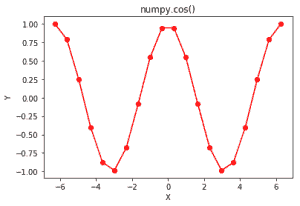

# Python 中的 numpy.cos()

> 哎哎哎:# t0]https://www . geeksforgeeks . org/num py-cos-python/

**numpy.cos(x[，out]) = ufunc 'cos') :** 这个数学函数帮助用户计算所有 x(作为数组元素)的三角余弦。
**参数:**

```py
array  : [array_like]elements are in radians. 
```

```py
2pi Radians = 360 degrees
```

**返回:**

```py
An array with trigonometric cosine 
of x for all x i.e. array elements 
```

**代码#1:工作**

## 计算机编程语言

```py
# Python program explaining
# cos() function

import numpy as np
import math

in_array = [0, math.pi / 2, np.pi / 3, np.pi]
print ("Input array : \n", in_array)

cos_Values = np.cos(in_array)
print ("\nCosine values : \n", cos_Values)
```

**输出:**

```py
Input array : 
 [0, 1.5707963267948966, 1.0471975511965976, 3.141592653589793]

Cosine values : 
 [  1.00000000e+00   6.12323400e-17   5.00000000e-01  -1.00000000e+00]
```

**代码#2:图形表示**

## 计算机编程语言

```py
# Python program showing
# Graphical representation of
# cos() function

import numpy as np
import matplotlib.pyplot as plt

in_array = np.linspace(-(2*np.pi), 2*np.pi, 20)
out_array = np.cos(in_array)

print("in_array : ", in_array)
print("\nout_array : ", out_array)

# red for numpy.cos()
plt.plot(in_array, out_array, color = 'red', marker = "o")
plt.title("numpy.cos()")
plt.xlabel("X")
plt.ylabel("Y")
plt.show()
```

**输出:**

```py
in_array :  [-6.28318531 -5.62179738 -4.96040945 -4.29902153 -3.6376336  -2.97624567
 -2.31485774 -1.65346982 -0.99208189 -0.33069396  0.33069396  0.99208189
  1.65346982  2.31485774  2.97624567  3.6376336   4.29902153  4.96040945
  5.62179738  6.28318531]

out_array :  [ 1\.          0.78914051  0.24548549 -0.40169542 -0.87947375 -0.9863613
 -0.67728157 -0.08257935  0.54694816  0.94581724  0.94581724  0.54694816
 -0.08257935 -0.67728157 -0.9863613  -0.87947375 -0.40169542  0.24548549
  0.78914051  1\.        ]
```



**参考文献:**
[https://docs . scipy . org/doc/numpy-dev/reference/generated/numpy . cos . html # numpy . cos](https://docs.scipy.org/doc/numpy-dev/reference/generated/numpy.cos.html#numpy.cos)
。