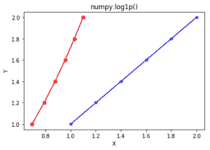

# Python 中的 numpy.log1p()

> 哎哎哎:# t0]https://www . geeksforgeeks . org/num py-log 1p-python/

**numpy.log1p(arr，out = None，*其中= True，casting = 'same_kind '，order = 'K '，dtype = None，ufunc 'log1p') :**
这个数学函数帮助用户计算出**x+1 的自然对数值**，其中 x 属于所有输入数组元素。

*   **log1p is reverse of exp(x) – 1**.

    **参数:**

    ```
    array    : [array_like]Input array or object.
    out      : [ndarray, optional]Output array with same dimensions as 
                Input array, placed with result.
    **kwargs : allows you to pass keyword variable length of argument to a function. 
               It is used when we want to handle named argument in a function.
    where    : [array_like, optional]True value means to calculate the universal 
               functions(ufunc) at that position, False value means to leave the 
               value in the output alone.

    ```

    **返回:**

    ```
    An array with natural logarithmic value of x + 1; 
    where x belongs to all elements of input array. 

    ```

    **代码 1:工作**

    ```
    # Python program explaining
    # log1p() function
    import numpy as np

    in_array = [1, 3, 5]
    print ("Input array : ", in_array)

    out_array = np.log1p(in_array)
    print ("Output array : ", out_array)
    ```

    **输出:**

    ```
    Input array :  [1, 3, 5]
    Output array :  [ 0.69314718  1.38629436  1.79175947]

    ```

    **代码 2:图形表示**

    ```
    # Python program showing
    # Graphical representation of 
    # log1p() function
    import numpy as np
    import matplotlib.pyplot as plt

    in_array = [1, 1.2, 1.4, 1.6, 1.8, 2]
    out_array = np.log1p(in_array)

    print ("out_array : ", out_array)

    y = [1, 1.2, 1.4, 1.6, 1.8, 2]
    plt.plot(in_array, y, color = 'blue', marker = "*")

    # red for numpy.log1xp()
    plt.plot(out_array, y, color = 'red', marker = "o")
    plt.title("numpy.log1p()")
    plt.xlabel("X")
    plt.ylabel("Y")
    plt.show()  
    ```

    **输出:**

    ```
    out_array :  [ 0.69314718  0.78845736  0.87546874  0.95551145  1.02961942  1.09861229]
    ```

    

    **参考文献:**
    [https://docs . scipy . org/doc/numpy-1 . 13 . 0/reference/generated/numpy . exp . html](https://docs.scipy.org/doc/numpy-1.13.0/reference/generated/numpy.exp.html)
    。