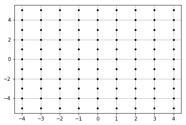
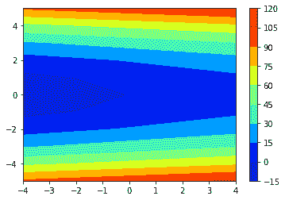
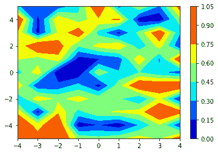
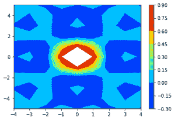

# 数值网格函数

> 原文:[https://www.geeksforgeeks.org/numpy-meshgrid-function/](https://www.geeksforgeeks.org/numpy-meshgrid-function/)

numpy.meshgrid 函数用于从代表笛卡尔索引或矩阵索引的两个给定一维数组中创建矩形网格。网格函数在某种程度上受到了 MATLAB 的启发。
考虑上图，X 轴范围为-4 到 4，Y 轴范围为-5 到 5。所以图中一共标记了(9 * 11) = 99 个点，每个点都有一个 X 坐标和一个 Y 坐标。对于任何平行于 X 轴的直线，标记点的 X 坐标分别为-4、-3、-2、-1、0、1、2、3、4。另一方面，对于任何平行于 Y 轴的直线，从下到上标记点的 Y 坐标为-5、-4、-3、-2、-1、0、1、2、3、4、5。numpy.meshgrid 函数返回两个二维数组，表示所有点的 X 和 Y 坐标。



**例:**

```
Input : x = [-4, -3, -2, -1, 0, 1, 2, 3, 4]
        y = [-5, -4, -3, -2, -1, 0, 1, 2, 3, 4, 5] 
Output :
x_1 = array([[-4., -3., -2., -1.,  0.,  1.,  2.,  3.,  4.],
             [-4., -3., -2., -1.,  0.,  1.,  2.,  3.,  4.],
             [-4., -3., -2., -1.,  0.,  1.,  2.,  3.,  4.],
             [-4., -3., -2., -1.,  0.,  1.,  2.,  3.,  4.],
             [-4., -3., -2., -1.,  0.,  1.,  2.,  3.,  4.],
             [-4., -3., -2., -1.,  0.,  1.,  2.,  3.,  4.],
             [-4., -3., -2., -1.,  0.,  1.,  2.,  3.,  4.],
             [-4., -3., -2., -1.,  0.,  1.,  2.,  3.,  4.],
             [-4., -3., -2., -1.,  0.,  1.,  2.,  3.,  4.],
             [-4., -3., -2., -1.,  0.,  1.,  2.,  3.,  4.],
             [-4., -3., -2., -1.,  0.,  1.,  2.,  3.,  4.]])

y_1 = array([[-5., -5., -5., -5., -5., -5., -5., -5., -5.],
       [-4., -4., -4., -4., -4., -4., -4., -4., -4.],
       [-3., -3., -3., -3., -3., -3., -3., -3., -3.],
       [-2., -2., -2., -2., -2., -2., -2., -2., -2.],
       [-1., -1., -1., -1., -1., -1., -1., -1., -1.],
       [ 0.,  0.,  0.,  0.,  0.,  0.,  0.,  0.,  0.],
       [ 1.,  1.,  1.,  1.,  1.,  1.,  1.,  1.,  1.],
       [ 2.,  2.,  2.,  2.,  2.,  2.,  2.,  2.,  2.],
       [ 3.,  3.,  3.,  3.,  3.,  3.,  3.,  3.,  3.],
       [ 4.,  4.,  4.,  4.,  4.,  4.,  4.,  4.,  4.],
       [ 5.,  5.,  5.,  5.,  5.,  5.,  5.,  5.,  5.]])

Input : x = [0, 1, 2, 3, 4, 5]
        y = [2, 3, 4, 5, 6, 7, 8]

Output :
x_1 = array([[0., 1., 2., 3., 4., 5.],
             [0., 1., 2., 3., 4., 5.],
             [0., 1., 2., 3., 4., 5.],
             [0., 1., 2., 3., 4., 5.],
             [0., 1., 2., 3., 4., 5.],
             [0., 1., 2., 3., 4., 5.],
             [0., 1., 2., 3., 4., 5.]])

y_1 = array([[2., 2., 2., 2., 2., 2.],
             [3., 3., 3., 3., 3., 3.],
             [4., 4., 4., 4., 4., 4.],
             [5., 5., 5., 5., 5., 5.],
             [6., 6., 6., 6., 6., 6.],
             [7., 7., 7., 7., 7., 7.],
             [8., 8., 8., 8., 8., 8.]]
```

下面是代码:

## 蟒蛇 3

```
# Sample code for generation of first example
import numpy as np
# from matplotlib import pyplot as plt
# pyplot imported for plotting graphs

x = np.linspace(-4, 4, 9)

# numpy.linspace creates an array of
# 9 linearly placed elements between
# -4 and 4, both inclusive
y = np.linspace(-5, 5, 11)

# The meshgrid function returns
# two 2-dimensional arrays
x_1, y_1 = np.meshgrid(x, y)

print("x_1 = ")
print(x_1)
print("y_1 = ")
print(y_1)
```

**Output:** 

```
x_1 = 
[[-4\. -3\. -2\. -1\.  0\.  1\.  2\.  3\.  4.]
 [-4\. -3\. -2\. -1\.  0\.  1\.  2\.  3\.  4.]
 [-4\. -3\. -2\. -1\.  0\.  1\.  2\.  3\.  4.]
 [-4\. -3\. -2\. -1\.  0\.  1\.  2\.  3\.  4.]
 [-4\. -3\. -2\. -1\.  0\.  1\.  2\.  3\.  4.]
 [-4\. -3\. -2\. -1\.  0\.  1\.  2\.  3\.  4.]
 [-4\. -3\. -2\. -1\.  0\.  1\.  2\.  3\.  4.]
 [-4\. -3\. -2\. -1\.  0\.  1\.  2\.  3\.  4.]
 [-4\. -3\. -2\. -1\.  0\.  1\.  2\.  3\.  4.]
 [-4\. -3\. -2\. -1\.  0\.  1\.  2\.  3\.  4.]
 [-4\. -3\. -2\. -1\.  0\.  1\.  2\.  3\.  4.]]
y_1 = 
[[-5\. -5\. -5\. -5\. -5\. -5\. -5\. -5\. -5.]
 [-4\. -4\. -4\. -4\. -4\. -4\. -4\. -4\. -4.]
 [-3\. -3\. -3\. -3\. -3\. -3\. -3\. -3\. -3.]
 [-2\. -2\. -2\. -2\. -2\. -2\. -2\. -2\. -2.]
 [-1\. -1\. -1\. -1\. -1\. -1\. -1\. -1\. -1.]
 [ 0\.  0\.  0\.  0\.  0\.  0\.  0\.  0\.  0.]
 [ 1\.  1\.  1\.  1\.  1\.  1\.  1\.  1\.  1.]
 [ 2\.  2\.  2\.  2\.  2\.  2\.  2\.  2\.  2.]
 [ 3\.  3\.  3\.  3\.  3\.  3\.  3\.  3\.  3.]
 [ 4\.  4\.  4\.  4\.  4\.  4\.  4\.  4\.  4.]
 [ 5\.  5\.  5\.  5\.  5\.  5\.  5\.  5\.  5.]]
```

网格的坐标输出也可用于绘制给定坐标范围内的函数。
**椭圆:**

```
*** QuickLaTeX cannot compile formula:

*** Error message:
Error: Nothing to show, formula is empty

```

## 蟒蛇 3

```
ellipse = xx * 2 + 4 * yy**2
plt.contourf(x_1, y_1, ellipse, cmap = 'jet')

plt.colorbar()
plt.show()
```

**输出:**



**随机数据:**

## 蟒蛇 3

```
random_data = np.random.random((11, 9))
plt.contourf(x_1, y_1, random_data, cmap = 'jet')

plt.colorbar()
plt.show()
```

**输出:**



**正弦函数:**

```
*** QuickLaTeX cannot compile formula:

*** Error message:
Error: Nothing to show, formula is empty

```

## 蟒蛇 3

```
sine = (np.sin(x_1**2 + y_1**2))/(x_1**2 + y_1**2)
plt.contourf(x_1, y_1, sine, cmap = 'jet')

plt.colorbar()
plt.show()
```

**输出:**



我们观察到 x_1 是行重复矩阵，而 y_1 是列重复矩阵。x_1 的一行和 y_1 的一列足以确定所有点的位置，因为其他值会一遍又一遍地重复。所以我们可以编辑上面的代码如下:
x_1，y_1 = np.meshgrid(x，y，稀疏=真)
这将产生以下输出:

```
x_1 = [[-4\. -3\. -2\. -1\.  0\.  1\.  2\.  3\.  4.]]
y_1 = [[-5.]
 [-4.]
 [-3.]
 [-2.]
 [-1.]
 [ 0.]
 [ 1.]
 [ 2.]
 [ 3.]
 [ 4.]
 [ 5.]]
```

x_1 的形状从(11，9)变为(1，9)，y_1 的形状从(11，9)变为(11，1)
但是矩阵的索引不同。实际上，它与笛卡尔索引完全相反。


对于上面显示的矩阵，对于给定的行，Y 坐标从左到右增加 0、1、2、3，而对于给定的列，X 坐标从上到下增加 0、1、2。
Matrix indexing 返回的两个二维数组将是前一个程序生成的数组的转置。以下代码可用于获取矩阵索引:

## 蟒蛇 3

```
# Sample code for generation of Matrix indexing
import numpy as np

x = np.linspace(-4, 4, 9)
# numpy.linspace creates an array
# of 9 linearly placed elements between
# -4 and 4, both inclusive
y = np.linspace(-5, 5, 11)

# The meshgrid function returns
# two 2-dimensional arrays
x_1, y_1 = np.meshgrid(x, y)

x_2, y_2 = np.meshgrid(x, y, indexing = 'ij')

# The following 2 lines check if x_2 and y_2 are the
# transposes of x_1 and y_1 respectively
print("x_2 = ")
print(x_2)
print("y_2 = ")
print(y_2)

# np.all is Boolean and operator;
# returns true if all holds true.
print(np.all(x_2 == x_1.T))
print(np.all(y_2 == y_1.T))
```

**Output:** 

```
x_2 = 
[[-4\. -4\. -4\. -4\. -4\. -4\. -4\. -4\. -4\. -4\. -4.]
 [-3\. -3\. -3\. -3\. -3\. -3\. -3\. -3\. -3\. -3\. -3.]
 [-2\. -2\. -2\. -2\. -2\. -2\. -2\. -2\. -2\. -2\. -2.]
 [-1\. -1\. -1\. -1\. -1\. -1\. -1\. -1\. -1\. -1\. -1.]
 [ 0\.  0\.  0\.  0\.  0\.  0\.  0\.  0\.  0\.  0\.  0.]
 [ 1\.  1\.  1\.  1\.  1\.  1\.  1\.  1\.  1\.  1\.  1.]
 [ 2\.  2\.  2\.  2\.  2\.  2\.  2\.  2\.  2\.  2\.  2.]
 [ 3\.  3\.  3\.  3\.  3\.  3\.  3\.  3\.  3\.  3\.  3.]
 [ 4\.  4\.  4\.  4\.  4\.  4\.  4\.  4\.  4\.  4\.  4.]]
y_2 = 
[[-5\. -4\. -3\. -2\. -1\.  0\.  1\.  2\.  3\.  4\.  5.]
 [-5\. -4\. -3\. -2\. -1\.  0\.  1\.  2\.  3\.  4\.  5.]
 [-5\. -4\. -3\. -2\. -1\.  0\.  1\.  2\.  3\.  4\.  5.]
 [-5\. -4\. -3\. -2\. -1\.  0\.  1\.  2\.  3\.  4\.  5.]
 [-5\. -4\. -3\. -2\. -1\.  0\.  1\.  2\.  3\.  4\.  5.]
 [-5\. -4\. -3\. -2\. -1\.  0\.  1\.  2\.  3\.  4\.  5.]
 [-5\. -4\. -3\. -2\. -1\.  0\.  1\.  2\.  3\.  4\.  5.]
 [-5\. -4\. -3\. -2\. -1\.  0\.  1\.  2\.  3\.  4\.  5.]
 [-5\. -4\. -3\. -2\. -1\.  0\.  1\.  2\.  3\.  4\.  5.]]

True

True
```

稀疏=真也可以添加到矩阵索引的网格函数中。在这种情况下，x_2 的形状将从(9，11)变为(9，1)，y_2 的形状将从(9，11)变为(1，11)。