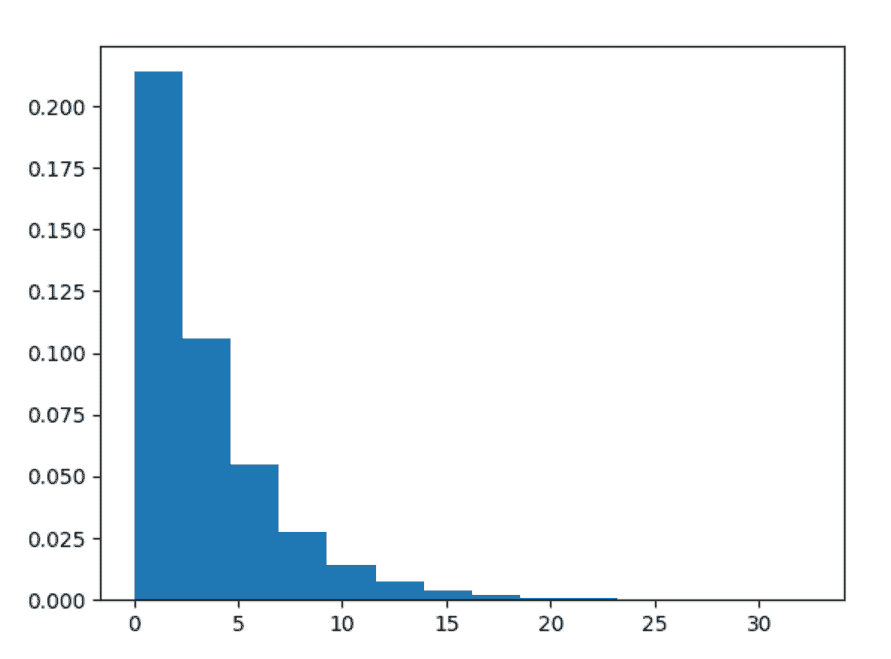
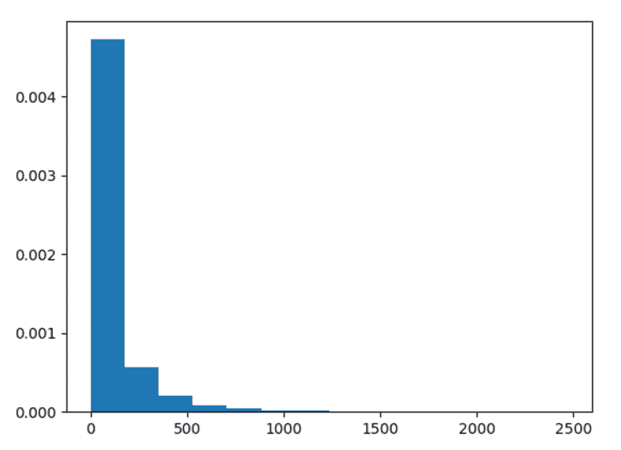

# Python 中的 numpy . random . index()

> 原文:[https://www . geesforgeks . org/numpy-random-index-in-python/](https://www.geeksforgeeks.org/numpy-random-exponential-in-python/)

借助**numpy . random . index()**方法，我们可以从指数分布中获取随机样本，并利用该方法返回随机样本的 numpy 数组。


指数分布

> **语法:**numpy . random . index(scale = 1.0，size=None)
> 
> **返回:**返回 numpy 数组的随机样本。

**示例#1 :**

在这个例子中我们可以看到，通过使用**numpy . random . index()**方法，我们能够得到指数分布的随机样本，并返回 numpy 数组的样本。

## 蟒蛇 3

```
# import exponential
import numpy as np
import matplotlib.pyplot as plt

# Using exponential() method
gfg = np.random.exponential(3.45, 10000)

count, bins, ignored = plt.hist(gfg, 14, density = True)
plt.show()
```

**输出:**

> 

**例 2 :**

## 蟒蛇 3

```
# import exponential
import numpy as np
import matplotlib.pyplot as plt

# Using exponential() method
gfg = np.random.exponential(101.123, 10000)
gfg1 = np.random.exponential(gfg, 10000)

count, bins, ignored = plt.hist(gfg1, 14, density = True)
plt.show()
```

**输出:**

> 