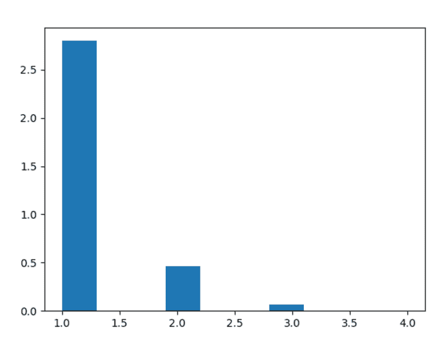

# Python 中的 numpy . random . geometry()

> 原文:[https://www . geesforgeks . org/numpy-random-geometry-in-python/](https://www.geeksforgeeks.org/numpy-random-geometric-in-python/)

借助 **numpy.random.geometric()** 方法，可以得到几何分布的随机样本，并利用该方法返回 numpy 阵列的随机样本。


几何分布

> **语法:** numpy.random.geometric(p，size=None)
> 
> **返回:**返回 numpy 数组的随机样本。

**示例#1 :**

在这个例子中我们可以看到，通过使用 **numpy.random.geometric()** 方法，我们能够获得几何分布的随机样本，并且通过使用该方法将随机样本作为 numpy 数组返回。

## 蟒蛇 3

```
# import numpy and geometric
import numpy as np
import matplotlib.pyplot as plt

# Using geometric() method
gfg = np.random.geometric(0.65, 1000)

count, bins, ignored = plt.hist(gfg, 40, density = True)
plt.show()
```

**输出:**

> 

**例 2 :**

## 蟒蛇 3

```
# import numpy and geometric
import numpy as np
import matplotlib.pyplot as plt

# Using geometric() method
gfg = np.random.geometric(0.85, 1000)

count, bins, ignored = plt.hist(gfg, 10, density = True)
plt.show()
```

**输出:**

> 