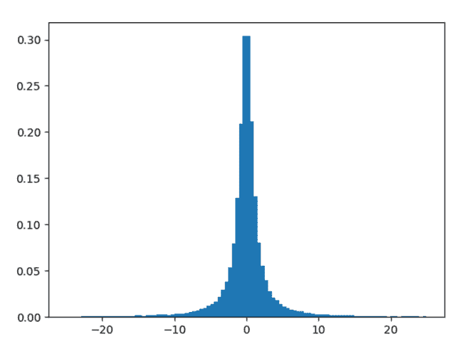
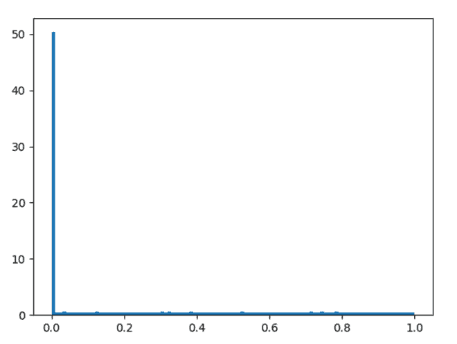

# 1 派森

中的 numpy.random.standard_cauchy()

> 原文:[https://www . geesforgeks . org/numpy-random-standard _ Cauchy-in-1 python/](https://www.geeksforgeeks.org/numpy-random-standard_cauchy-in-1python/)

借助**numpy . random . standard _ cauchy()**方法，我们可以看到从一个标准的 Cauchy 分布中得到随机样本并返回随机样本。


标准柯西分布

> **语法:**numpy . random . standard _ Cauchy(size = None)
> 
> **返回:**将随机样本作为 numpy 数组返回。

**示例#1 :**

在这个例子中我们可以看到，通过使用**numpy . random . standard _ cauchy()**方法，我们能够获得标准 Cauchy 分布的随机样本，并从中生成随机样本。

## 蟒蛇 3

```py
# import numpy
import numpy as np
import matplotlib.pyplot as plt

# Using standard_cauchy() method
gfg = np.random.standard_cauchy(100000)

gfg = gfg[(gfg>-25) & (gfg<25)]
plt.hist(gfg, bins = 100, density = True)
plt.show()
```

**输出:**

> 

**例 2 :**

## 蟒蛇 3

```py
# import numpy
import numpy as np
import matplotlib.pyplot as plt

# Using standard_cauchy() method
gfg = np.random.standard_cauchy(100000)
gfg1 = np.random.power([gfg>0], 100000)

plt.hist(gfg1, bins = 100, density = True)
plt.show()
```

**输出:**

> 