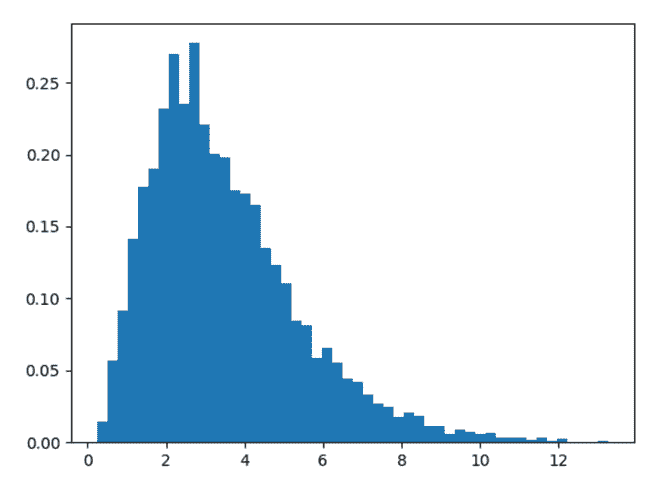
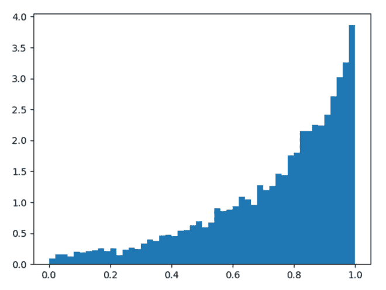

# Python 中的 numpy.random.standard_gamma()

> 原文:[https://www . geesforgeks . org/numpy-random-standard _ gamma-in-python/](https://www.geeksforgeeks.org/numpy-random-standard_gamma-in-python/)

借助**numpy . random . standard _ gamma()**方法，我们可以从标准 gamma 分布中获取随机样本，并利用该方法返回随机样本。


标准伽玛分布

> **语法:** numpy.random.standard_gamma(形状，大小=无)
> 
> **返回:**将随机样本作为 numpy 数组返回。

**示例#1 :**

在这个例子中我们可以看到，通过使用**numpy . random . standard _ gamma()**方法，我们能够从标准 gamma 分布中获得随机样本并返回随机样本。

## 蟒蛇 3

```py
# import numpy
import numpy as np
import matplotlib.pyplot as plt

# Using standard_gamma() method
gfg = np.random.standard_gamma(3.47, 5000)

plt.hist(gfg, bins = 50, density = True)
plt.show()
```

**输出:**

> 

**例 2 :**

## 蟒蛇 3

```py
# import numpy
import numpy as np
import matplotlib.pyplot as plt

# Using standard_gamma() method
gfg = np.random.standard_gamma(3.47, 5000)
gfg1 = np.random.power(gfg, 5000)

plt.hist(gfg1, bins = 50, density = True)
plt.show()
```

**输出:**

> 