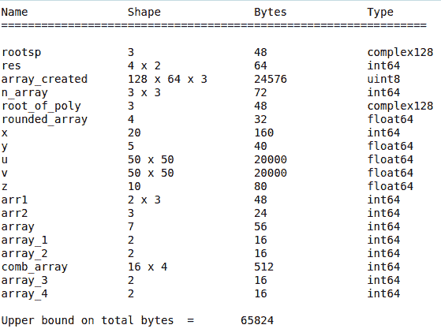

# Python 中 numpy.who()函数

> 原文:[https://www.geeksforgeeks.org/numpy-who-function-in-python/](https://www.geeksforgeeks.org/numpy-who-function-in-python/)

**numpy.who(vardict=None)** 函数打印给定字典中的 Numpy ndarrays。如果没有传入字典或者 vardict 为 None，则在 *globals()* 字典中打印 NumPy 数组。

> **参数:**
> 
> **vardict:** 可能包含 ndarrays 的字典。默认值为 globals()。
> 
> **返回:**
> 
> **出:**无

**注意:**它打印出 vardict 中存在的所有 ndarrays 的名称、形状、字节和类型，但不返回任何内容。

**示例#1:** 在本例中，字典作为参数传递给 ***numpy.who()*** 函数。

## 蟒蛇 3

```py
# import the numpy module as np
import numpy as np

# dictionary containing numpy ndarrays
gfg = {'arr_1': np.arange(3), 'arr_2': np.arange(6),
       'name': 'some text', 'number': 34523}

# passing the dict as argument
np.who(gfg)
```

**输出:**


**示例#2:** 在此示例中，没有参数传递给 ***numpy.who()*** 函数，因此它在 *globals()* 字典中打印 ndarray。

## 蟒蛇 3

```py
# import the numpy module as np
import numpy as np

# creating numpy ndarrays
x = np.arange(20)
y = np.ones(5)
z = np.zeros(10)

# function called without passing any argument
np.who()
```

**输出:**

