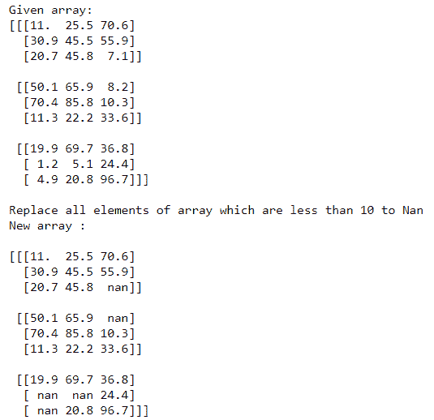

# 替换不满足给定条件的 NumPy 数组元素

> 原文:[https://www . geesforgeks . org/replace-numpy-array-elements-不满足给定条件/](https://www.geeksforgeeks.org/replace-numpy-array-elements-that-doesnt-satisfy-the-given-condition/)

有时在 Numpy 数组中，我们希望应用某些条件来过滤掉一些值，然后替换或删除它们。条件可以是这样的:如果某些值大于或小于某个特定的常数，则用其他数字替换所有这些值。

为此，我们可以使用**“>”、“<”、**等关系运算符以及 **numpy.where()等其他函数。**

**方法 1:使用关系运算符**

**示例 1:在一维 Numpy 阵列中**

## 蟒蛇 3

```py
# Importing Numpy module
import numpy as np

# Creating a 1-D Numpy array
n_arr = np.array([75.42436315, 42.48558583, 60.32924763])
print("Given array:")
print(n_arr)

print("\nReplace all elements of array which are greater than 50\. to 15.50")
n_arr[n_arr > 50.] = 15.50

print("New array :\n")
print(n_arr)
```

**输出:**


在上面的问题中，我们将一维 Numpy 数组中所有大于 50 的值替换为 15.50。

**例 2(A):在二维数值阵列中**

## 蟒蛇 3

```py
# Importing Numpy module
import numpy as np

# Creating a 2-D Numpy array
n_arr = np.array([[45.42436315, 52.48558583, 10.32924763],
                  [5.7439979, 50.58220701, 25.38213418]])
print("Given array:")
print(n_arr)

print("\nReplace all elements of array which are greater than 30\. to 5.25")
n_arr[n_arr > 30.] = 5.25

print("New array :\n")
print(n_arr)
```

**输出:**


在上面的问题中，我们将二维 Numpy 数组中所有大于 30 的值替换为 5.25。

**示例 3:在三维数字阵列中**

## 蟒蛇 3

```py
# Importing Numpy module
import numpy as np

# Creating a 3-D Numpy array
n_arr = np.array([[[11, 25.5, 70.6], [30.9, 45.5, 55.9], [20.7, 45.8, 7.1]],
                  [[50.1, 65.9, 8.2], [70.4, 85.8, 10.3], [11.3, 22.2, 33.6]],
                  [[19.9, 69.7, 36.8], [1.2, 5.1, 24.4], [4.9, 20.8, 96.7]]])

print("Given array:")
print(n_arr)

print("\nReplace all elements of array which are less than 10 to Nan")
n_arr[n_arr < 10.] = np.nan

print("New array :\n")
print(n_arr)
```

**输出:**



在上面的问题中，我们用 Nan 替换三维 Numpy 数组中所有小于 10 的值。

**方法二:使用**[**numpy . where()**](https://www.geeksforgeeks.org/numpy-where-in-python/)

返回满足给定条件的输入数组中元素的索引。

**例 1:**

## 蟒蛇 3

```py
# Importing Numpy module
import numpy as np

# Creating a 2-D Numpy array
n_arr = np.array([[45, 52, 10],
                  [1, 5, 25]])

print("Given array:")
print(n_arr)

print("\nReplace all elements of array which are \
greater than or equal to 25 to 0")

print("else remains the same ")
print(np.where(n_arr >= 25, 0, n_arr))
```

**输出:**


在上面的问题中，我们用 0 替换所有大于或等于 25 的值，否则保持不变。

**例 2:**

## 蟒蛇 3

```py
# Importing Numpy module
import numpy as np

# Creating a 2-D Numpy array
n_arr = np.array([[45, 52, 10],
                  [1, 5, 25],
                  [50, 40, 81]])

print("Given array:")
print(n_arr)

print("\nReplace all elements of array which are \
less than or equal to 25 with Nan")

print("else with 1 ")
print(np.where(n_arr <= 25, np.nan, 1))
```

**输出:**


在上面的问题中，我们用 Nan 替换所有小于或等于 25 的值，用 1 替换 else。