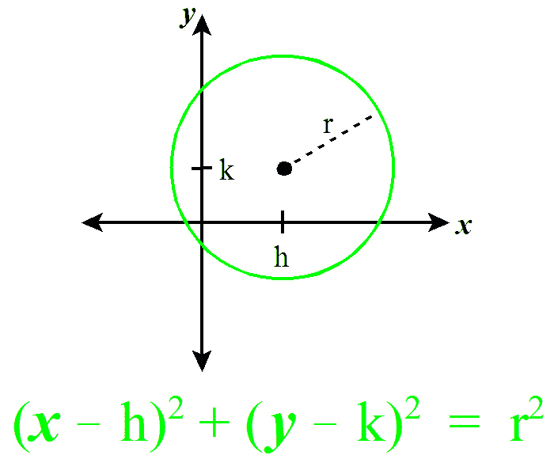

# 使用 OpenCV | Python 进行圆检测

> 原文:[https://www . geesforgeks . org/circle-detection-use-opencv-python/](https://www.geeksforgeeks.org/circle-detection-using-opencv-python/)

圆形检测在生物医学应用中有多种用途，从虹膜检测到白细胞分割。遵循的技术类似于用于检测线条的技术，如本文[中所述](https://www.geeksforgeeks.org/line-detection-python-opencv-houghline-method/)。

**圆检测基础**

圆可以用下面的等式来描述:



为了检测圆，我们可以固定一个点(x，y)。现在，我们需要找到 3 个参数:a、b 和 r。因此，问题是在三维搜索空间中。为了找到可能的圆，该算法使用一个称为“累加器矩阵”的三维矩阵来存储潜在的 a、b 和 r 值。a(中心的 x 坐标)的值可以在 1 到行的范围内，b(中心的 y 坐标)可以在 1 到列的范围内，r 可以在 1 到 maxRadius = 的范围内。

下面是算法的步骤。

*   **初始化累加器矩阵:**用零初始化维度行*列*最大半径的矩阵。
*   **预处理图像:**在图像上应用模糊、灰度和边缘检测器。这样做是为了确保圆圈显示为暗图像边缘。
*   **循环通过点:**在图像上选择一个点。
*   **固定 r 并循环 a 和 b:** 使用双嵌套循环来寻找 r 的值，在给定的范围内改变 a 和 b。

    ```py
    for a in range(rows):
        for b in range(cols):
            r = math.sqrt((xi - a)**2 + (yi - b)**2)
            accum_matrix[a][b][r] += 1
    ```

*   **投票:**选取累加器矩阵中值最大的点。这些都是强点，表明有 a，b 和 r 参数的圆的存在。这给了我们圆的霍夫空间。
*   **寻找圆:**最后，用上面的圆作为候选圆，根据图像进行投票。累加器矩阵中的最大投票圆给了我们这个圆。

OpenCV 中的`HoughCircles`功能有以下参数，可以根据图像进行更改。

> **检测方法:** OpenCV 有一个高级的实现，HOUGH_GRADIENT，它使用边缘的梯度代替填充整个 3D 累加器矩阵，从而加快了过程。
> **dp:** 这是原始图像分辨率与累加器矩阵的比值。
> **minDist:** 此参数控制检测到的圆之间的最小距离。
> **Param1:** Canny 边缘检测需要两个参数——minVal 和 maxVal。Param1 是两者中较高的阈值。第二个参数设置为参数 1/2。
> **参数 2:** 这是候选检测圆的累加器阈值。通过增加该阈值，我们可以确保只返回对应于较大累加器值的最佳圆。
> **最小半径:**最小圆半径。
> **最大半径:**最大圆半径。

下面是使用 OpenCV 在上面的输入图像上寻找圆的代码。

```py
import cv2
import numpy as np

# Read image.
img = cv2.imread('eyes.jpg', cv2.IMREAD_COLOR)

# Convert to grayscale.
gray = cv2.cvtColor(img, cv2.COLOR_BGR2GRAY)

# Blur using 3 * 3 kernel.
gray_blurred = cv2.blur(gray, (3, 3))

# Apply Hough transform on the blurred image.
detected_circles = cv2.HoughCircles(gray_blurred, 
                   cv2.HOUGH_GRADIENT, 1, 20, param1 = 50,
               param2 = 30, minRadius = 1, maxRadius = 40)

# Draw circles that are detected.
if detected_circles is not None:

    # Convert the circle parameters a, b and r to integers.
    detected_circles = np.uint16(np.around(detected_circles))

    for pt in detected_circles[0, :]:
        a, b, r = pt[0], pt[1], pt[2]

        # Draw the circumference of the circle.
        cv2.circle(img, (a, b), r, (0, 255, 0), 2)

        # Draw a small circle (of radius 1) to show the center.
        cv2.circle(img, (a, b), 1, (0, 0, 255), 3)
        cv2.imshow("Detected Circle", img)
        cv2.waitKey(0)
```

**输出:**

