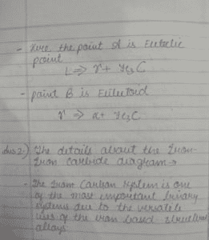
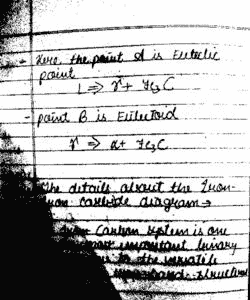

# CLAHE 直方图均衡化–OpenCV

> 原文:[https://www . geeksforgeeks . org/clahe-直方图-eqization-opencv/](https://www.geeksforgeeks.org/clahe-histogram-eqalization-opencv/)

在本教程中，我们将看到如何应用**对比度受限的自适应直方图均衡化(CLAHE)** 来均衡图像。CLAHE 是*自适应直方图均衡化(AHE)* 的变体，它处理对比度的过度放大。CLAHE 对图像中的小区域(称为切片)而不是整个图像进行操作。然后使用双线性插值来组合相邻的图块，以移除人工边界。
该算法可用于提高图像的对比度。

我们也可以将 CLAHE 应用于彩色图像，其中通常将其应用于亮度通道，并且仅均衡 HSV 图像的亮度通道后的结果比均衡 BGR 图像的所有通道好得多。
在本教程中，我们将学习如何应用 CLAHE 并处理给定的输入图像进行直方图均衡化。

> **参数:**
> 应用 CLAHE 时，需要记住两个参数:
> **clip limit–**该参数设置对比度限制的阈值。默认值为 40。
> **tileGridSize–**这将设置行和列中的平铺数量。默认情况下，这是 8×8。它在图像被分割成小块以应用 CLAHE 时使用。

**以上代码:**

## 蟒蛇 3

```
import cv2
import numpy as np

# Reading the image from the present directory
image = cv2.imread("image.jpg")
# Resizing the image for compatibility
image = cv2.resize(image, (500, 600))

# The initial processing of the image
# image = cv2.medianBlur(image, 3)
image_bw = cv2.cvtColor(image, cv2.COLOR_BGR2GRAY)

# The declaration of CLAHE
# clipLimit -> Threshold for contrast limiting
clahe = cv2.createCLAHE(clipLimit = 5)
final_img = clahe.apply(image_bw) + 30

# Ordinary thresholding the same image
_, ordinary_img = cv2.threshold(image_bw, 155, 255, cv2.THRESH_BINARY)

# Showing all the three images
cv2.imshow("ordinary threshold", ordinary_img)
cv2.imshow("CLAHE image", final_img)
```

**输入图像:**



输入图像

**输出:**



普通阈值


CLAHE 应用