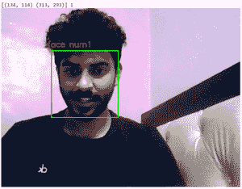

# 使用 Python–OpenCV

统计人脸数量

> 原文:[https://www . geesforgeks . org/count-face-number-use-python-opencv/](https://www.geeksforgeeks.org/count-number-of-faces-using-python-opencv/)

**先决条件:** [使用 *dlib* 和 *openCV*](https://www.geeksforgeeks.org/opencv-facial-landmarks-and-face-detection-using-dlib-and-opencv/) 进行人脸检测

在本文中，我们将使用图像处理来检测和统计人脸的数量。我们不应该得到脸的所有特征。相反，目标是通过一些方法获得边界框，即图像中面部的坐标，这取决于坐标数量所覆盖的不同区域，将计算的面部数量。

### 必需的库:

*   [**python 中的 OpenCV**](https://www.geeksforgeeks.org/opencv-python-tutorial/) 库是一个计算机视觉库，主要用于图像处理、视频处理，以及分析、面部识别和检测等。
*   **python 中的 Dlib** 库包含预训练的面部地标检测器，用于检测映射到面部面部结构的(x，y)坐标。
*   [**Numpy**](https://www.geeksforgeeks.org/numpy-in-python-set-1-introduction/) 是一个通用的数组处理包。它提供了一个高性能多维数组对象和使用这些数组的工具。

**下面是计算人脸数量的分步方法:**

**步骤 1:** 导入所需库。

## 蟒蛇 3

```py
# Import libraries
import cv2
import numpy as np
import dlib
```

**第二步:**打开默认摄像头捕捉人脸，使用*dlib*库获取坐标。

## 蟒蛇 3

```py
# (0) in VideoCapture is used to
# connect to your computer's default camera
cap = cv2.VideoCapture(0)
# Get the coordinates
detector = dlib.get_frontal_face_detector()
```

**第三步:**统计人脸数量。

*   连续捕捉画面。
*   将帧转换为灰度(不需要)。
*   取一个迭代器 *i* 并初始化为零。
*   每次得到框架中面结构的坐标时，将迭代器增加 1。
*   在每个检测到的人脸周围画出方框以及人脸数量。

## 蟒蛇 3

```py
while True:

    # Capture frame-by-frame
    ret, frame = cap.read()
    frame = cv2.flip(frame, 1)

    # Our operations on the frame come here
    gray = cv2.cvtColor(frame, cv2.COLOR_BGR2GRAY)
    faces = detector(gray)

    # Counter to count number of faces
    i = 0
    for face in faces:
        x, y = face.left(), face.top()
        x1, y1 = face.right(), face.bottom()
        cv2.rectangle(frame, (x, y), (x1, y1), (0, 255, 0), 2)

        # Increment the iterartor each time you get the coordinates
        i = i+1

        # Adding face number to the box detecting faces
        cv2.putText(frame, 'face num'+str(i), (x-10, y-10),
                    cv2.FONT_HERSHEY_SIMPLEX, 0.7, (0, 0, 255), 2)
        print(face, i)

    # Display the resulting frame
    cv2.imshow('frame', frame)
```

**步骤 4:** 终止循环。

## 蟒蛇 3

```py
# Enter key 'q' to break the loop
if cv2.waitKey(1) & 0xFF == ord('q'):
    break
```

**第五步:**开窗。

## 蟒蛇 3

```py
# When everything done, release
# the capture and destroy the windows
cap.release()
cv2.destroyAllWindows()
```

**以下是上述方法的完整程序:**

## 蟒蛇 3

```py
# Import required libraries
import cv2
import numpy as np
import dlib

# Connects to your computer's default camera
cap = cv2.VideoCapture(0)

# Detect the coordinates
detector = dlib.get_frontal_face_detector()

# Capture frames continuously
while True:

    # Capture frame-by-frame
    ret, frame = cap.read()
    frame = cv2.flip(frame, 1)

    # RGB to grayscale
    gray = cv2.cvtColor(frame, cv2.COLOR_BGR2GRAY)
    faces = detector(gray)

    # Iterator to count faces
    i = 0
    for face in faces:

        # Get the coordinates of faces
        x, y = face.left(), face.top()
        x1, y1 = face.right(), face.bottom()
        cv2.rectangle(frame, (x, y), (x1, y1), (0, 255, 0), 2)

        # Increment iterator for each face in faces
        i = i+1

        # Display the box and faces
        cv2.putText(frame, 'face num'+str(i), (x-10, y-10),
                    cv2.FONT_HERSHEY_SIMPLEX, 0.7, (0, 0, 255), 2)
        print(face, i)

    # Display the resulting frame
    cv2.imshow('frame', frame)

    # This command let's us quit with the "q" button on a keyboard.
    if cv2.waitKey(1) & 0xFF == ord('q'):
        break

# Release the capture and destroy the windows
cap.release()
cv2.destroyAllWindows()
```

**输出:**

