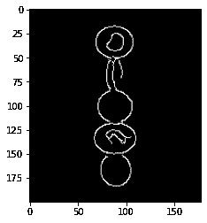
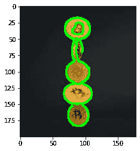

# 使用 Python-OpenCV 计算对象数量

> 原文:[https://www . geesforgeks . org/count-object-number-use-python-opencv/](https://www.geeksforgeeks.org/count-number-of-object-using-python-opencv/)

在本文中，我们将使用图像处理来计算 Python 中使用 OpenCV 的对象数量。

## 需要的模块

*   [**OpenCv**](https://www.geeksforgeeks.org/opencv-python-tutorial/)**:**OpenCv 是一个开源库，对于图像处理、视频处理、面部识别和检测等计算机视觉应用非常有用。
*   [**Numpy**](https://www.geeksforgeeks.org/numpy-in-python-set-1-introduction/)**:Numpy 是一个用于科学计算的 python 包。这是一个受欢迎的机器学习数学库。Numpy 的主要对象是多维数组。**
*   [**Matplotlib**](https://www.geeksforgeeks.org/python-introduction-matplotlib/)**:**Matplotlib 是一个用于数据可视化和数据图形化绘图的 Python 库。

### 使用的图像:。


## 逐步实施

**步骤 1:** 导入所需库。

## 蟒蛇 3

```
# Import libraries
import cv2
import numpy as np
import matplotlib.pyplot as plt
```

**第二步:**我们将使用**“cv2 . imread(image-name)”**命令&读取图像，然后使用**“cv2 . CVT color(image-name，cv2)将该图像转换为灰度图像。COLOR _ BGR2GRAY)“T5”命令。**

## 蟒蛇 3

```
image = cv2.imread('coins.jpg')
gray = cv2.cvtColor(image, cv2.COLOR_BGR2GRAY)
plt.imshow(gray, cmap='gray')
```

**输出:**


**第三步:**为了计数，我们必须检测边缘，但是在检测边缘之前，我们必须使图像模糊以避免噪声。使用**cv2。GaussianBlur(图像名称，内核大小，标准。偏差】)**。

## 蟒蛇 3

```
blur = cv2.GaussianBlur(gray, (11, 11), 0)
plt.imshow(blur, cmap='gray')
```

**输出:**


**步骤 4:** 现在我们将使用 canny 算法检测边缘，cv2.canny()函数中的第二个&第三个参数是阈值。30&150 之间值被认为是该图像的边缘。

## 蟒蛇 3

```
canny = cv2.Canny(blur, 30, 150, 3)
plt.imshow(canny, cmap='gray')
```

**输出:**


**第五步:**我们可以看到边没有连接。我们需要连接边缘，必须让更多的 thiker &可见。

## 蟒蛇 3

```
dilated = cv2.dilate(canny, (1, 1), iterations=0)
plt.imshow(dilated, cmap='gray')
```

**输出:**



**第六步:**现在我们要计算图像中的轮廓&把图像从 BGR &转换成 RGB 然后画出轮廓。

## 蟒蛇 3

```
(cnt, hierarchy) = cv2.findContours(
    dilated.copy(), cv2.RETR_EXTERNAL, cv2.CHAIN_APPROX_NONE)
rgb = cv2.cvtColor(image, cv2.COLOR_BGR2RGB)
cv2.drawContours(rgb, cnt, -1, (0, 255, 0), 2)

plt.imshow(rgb)
```

**输出:**



**第 7 步:**打印结果

## 蟒蛇 3

```
print("coins in the image : ", len(cnt))
```

**输出:**

```
coins in the image:  5
```

下面是完整的实现:

## 蟒蛇 3

```
# Import libraries
import cv2
import numpy as np
import matplotlib.pyplot as plt

image = cv2.imread('coins.jpg')
gray = cv2.cvtColor(image, cv2.COLOR_BGR2GRAY)

blur = cv2.GaussianBlur(gray, (11, 11), 0)
canny = cv2.Canny(blur, 30, 150, 3)
dilated = cv2.dilate(canny, (1, 1), iterations=0)

(cnt, hierarchy) = cv2.findContours(
    dilated.copy(), cv2.RETR_EXTERNAL, cv2.CHAIN_APPROX_NONE)
rgb = cv2.cvtColor(image, cv2.COLOR_BGR2RGB)
cv2.drawContours(rgb, cnt, -1, (0, 255, 0), 2)

print("coins in the image : ", len(cnt))
```

**输出:**

```
coins in the image :  5
```