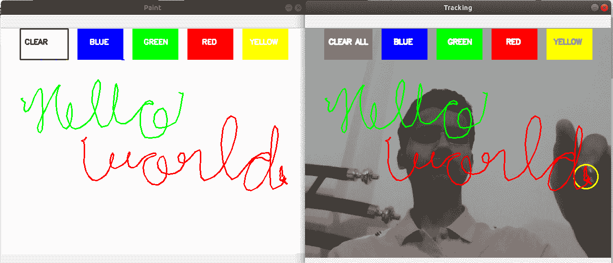
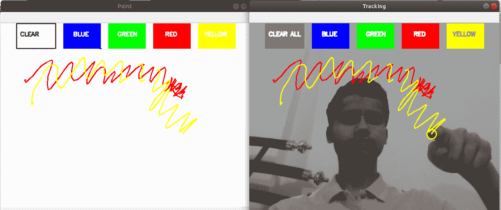

# 使用 Python-OpenCV 创建空气画布

> 原文:[https://www . geesforgeks . org/create-air-canvas-using-python-opencv/](https://www.geeksforgeeks.org/create-air-canvas-using-python-opencv/)

曾经想通过在空中挥舞手指来吸引你的想象力。在这篇文章中，我们将学习构建一个空中画布，只需用相机捕捉彩色标记的运动，就可以在上面绘制任何东西。这里，指尖的彩色物体被用作标记。

我们将使用 **OpenCV** 的计算机视觉技术来构建这个项目。首选语言是 Python，因为它有详尽的库和易于使用的语法，但了解基础知识后，它可以用任何支持 OpenCV 的语言实现。

这里使用颜色检测和跟踪来实现目标。检测到颜色标记并产生掩模。它包括对产生的掩模进行形态学操作的进一步步骤，即腐蚀和膨胀。侵蚀减少了掩模中存在的杂质，膨胀进一步恢复了被侵蚀的主掩模。

**要求:**

*   [蟒蛇 3](https://www.geeksforgeeks.org/python-programming-language/)
*   num py
*   [OpenCV](https://www.geeksforgeeks.org/opencv-python-tutorial/)

**算法:**

1.  开始读取帧并将捕获的帧转换为 HSV 颜色空间(易于颜色检测)。
2.  准备画布框架，并在上面放置相应的油墨按钮。
3.  调整跟踪条值以找到彩色标记的遮罩。
4.  使用形态学操作(腐蚀和膨胀)对蒙版进行预处理。
5.  检测轮廓，找到最大轮廓的中心坐标，并将其保存在连续帧的数组中(用于在画布上绘制点的数组)。
6.  最后在框架和画布上画出存储在数组中的点。

下面是实现。

```
import numpy as np
import cv2
from collections import deque

# default called trackbar function 
def setValues(x):
   print("")

# Creating the trackbars needed for 
# adjusting the marker colour These 
# trackbars will be used for setting 
# the upper and lower ranges of the
# HSV required for particular colour
cv2.namedWindow("Color detectors")
cv2.createTrackbar("Upper Hue", "Color detectors",
                   153, 180, setValues)
cv2.createTrackbar("Upper Saturation", "Color detectors",
                   255, 255, setValues)
cv2.createTrackbar("Upper Value", "Color detectors", 
                   255, 255, setValues)
cv2.createTrackbar("Lower Hue", "Color detectors",
                   64, 180, setValues)
cv2.createTrackbar("Lower Saturation", "Color detectors", 
                   72, 255, setValues)
cv2.createTrackbar("Lower Value", "Color detectors", 
                   49, 255, setValues)

# Giving different arrays to handle colour
# points of different colour These arrays 
# will hold the points of a particular colour
# in the array which will further be used
# to draw on canvas
bpoints = [deque(maxlen = 1024)]
gpoints = [deque(maxlen = 1024)]
rpoints = [deque(maxlen = 1024)]
ypoints = [deque(maxlen = 1024)]

# These indexes will be used to mark position
# of pointers in colour array
blue_index = 0
green_index = 0
red_index = 0
yellow_index = 0

# The kernel to be used for dilation purpose 
kernel = np.ones((5, 5), np.uint8)

# The colours which will be used as ink for
# the drawing purpose
colors = [(255, 0, 0), (0, 255, 0), 
          (0, 0, 255), (0, 255, 255)]
colorIndex = 0

# Here is code for Canvas setup
paintWindow = np.zeros((471, 636, 3)) + 255

cv2.namedWindow('Paint', cv2.WINDOW_AUTOSIZE)

# Loading the default webcam of PC.
cap = cv2.VideoCapture(0)

# Keep looping
while True:

    # Reading the frame from the camera
    ret, frame = cap.read()

    # Flipping the frame to see same side of yours
    frame = cv2.flip(frame, 1)
    hsv = cv2.cvtColor(frame, cv2.COLOR_BGR2HSV)

    # Getting the updated positions of the trackbar
    # and setting the HSV values
    u_hue = cv2.getTrackbarPos("Upper Hue",
                               "Color detectors")
    u_saturation = cv2.getTrackbarPos("Upper Saturation",
                                      "Color detectors")
    u_value = cv2.getTrackbarPos("Upper Value",
                                 "Color detectors")
    l_hue = cv2.getTrackbarPos("Lower Hue",
                               "Color detectors")
    l_saturation = cv2.getTrackbarPos("Lower Saturation",
                                      "Color detectors")
    l_value = cv2.getTrackbarPos("Lower Value",
                                 "Color detectors")
    Upper_hsv = np.array([u_hue, u_saturation, u_value])
    Lower_hsv = np.array([l_hue, l_saturation, l_value])

    # Adding the colour buttons to the live frame 
    # for colour access
    frame = cv2.rectangle(frame, (40, 1), (140, 65), 
                          (122, 122, 122), -1)
    frame = cv2.rectangle(frame, (160, 1), (255, 65),
                          colors[0], -1)
    frame = cv2.rectangle(frame, (275, 1), (370, 65), 
                          colors[1], -1)
    frame = cv2.rectangle(frame, (390, 1), (485, 65), 
                          colors[2], -1)
    frame = cv2.rectangle(frame, (505, 1), (600, 65),
                          colors[3], -1)

    cv2.putText(frame, "CLEAR ALL", (49, 33),
                cv2.FONT_HERSHEY_SIMPLEX, 0.5,
                (255, 255, 255), 2, cv2.LINE_AA)

    cv2.putText(frame, "BLUE", (185, 33), 
                cv2.FONT_HERSHEY_SIMPLEX, 0.5,
                (255, 255, 255), 2, cv2.LINE_AA)

    cv2.putText(frame, "GREEN", (298, 33),
                cv2.FONT_HERSHEY_SIMPLEX, 0.5,
                (255, 255, 255), 2, cv2.LINE_AA)

    cv2.putText(frame, "RED", (420, 33),
                cv2.FONT_HERSHEY_SIMPLEX, 0.5, 
                (255, 255, 255), 2, cv2.LINE_AA)

    cv2.putText(frame, "YELLOW", (520, 33),
                cv2.FONT_HERSHEY_SIMPLEX, 0.5, 
                (150, 150, 150), 2, cv2.LINE_AA)

    # Identifying the pointer by making its 
    # mask
    Mask = cv2.inRange(hsv, Lower_hsv, Upper_hsv)
    Mask = cv2.erode(Mask, kernel, iterations = 1)
    Mask = cv2.morphologyEx(Mask, cv2.MORPH_OPEN, kernel)
    Mask = cv2.dilate(Mask, kernel, iterations = 1)

    # Find contours for the pointer after 
    # idetifying it
    cnts, _ = cv2.findContours(Mask.copy(), cv2.RETR_EXTERNAL,
        cv2.CHAIN_APPROX_SIMPLE)
    center = None

    # Ifthe contours are formed
    if len(cnts) > 0:

        # sorting the contours to find biggest 
        cnt = sorted(cnts, key = cv2.contourArea, reverse = True)[0]

        # Get the radius of the enclosing circle 
        # around the found contour
        ((x, y), radius) = cv2.minEnclosingCircle(cnt)

        # Draw the circle around the contour
        cv2.circle(frame, (int(x), int(y)), int(radius), (0, 255, 255), 2)

        # Calculating the center of the detected contour
        M = cv2.moments(cnt)
        center = (int(M['m10'] / M['m00']), int(M['m01'] / M['m00']))

        # Now checking if the user wants to click on 
        # any button above the screen 
        if center[1] <= 65:

            # Clear Button
            if 40 <= center[0] <= 140: 
                bpoints = [deque(maxlen = 512)]
                gpoints = [deque(maxlen = 512)]
                rpoints = [deque(maxlen = 512)]
                ypoints = [deque(maxlen = 512)]

                blue_index = 0
                green_index = 0
                red_index = 0
                yellow_index = 0

                paintWindow[67:, :, :] = 255
            elif 160 <= center[0] <= 255:
                    colorIndex = 0 # Blue
            elif 275 <= center[0] <= 370:
                    colorIndex = 1 # Green
            elif 390 <= center[0] <= 485:
                    colorIndex = 2 # Red
            elif 505 <= center[0] <= 600:
                    colorIndex = 3 # Yellow
        else :
            if colorIndex == 0:
                bpoints[blue_index].appendleft(center)
            elif colorIndex == 1:
                gpoints[green_index].appendleft(center)
            elif colorIndex == 2:
                rpoints[red_index].appendleft(center)
            elif colorIndex == 3:
                ypoints[yellow_index].appendleft(center)

    # Append the next deques when nothing is 
    # detected to avois messing up
    else:
        bpoints.append(deque(maxlen = 512))
        blue_index += 1
        gpoints.append(deque(maxlen = 512))
        green_index += 1
        rpoints.append(deque(maxlen = 512))
        red_index += 1
        ypoints.append(deque(maxlen = 512))
        yellow_index += 1

    # Draw lines of all the colors on the
    # canvas and frame 
    points = [bpoints, gpoints, rpoints, ypoints]
    for i in range(len(points)):

        for j in range(len(points[i])):

            for k in range(1, len(points[i][j])):

                if points[i][j][k - 1] is None or points[i][j][k] is None:
                    continue

                cv2.line(frame, points[i][j][k - 1], points[i][j][k], colors[i], 2)
                cv2.line(paintWindow, points[i][j][k - 1], points[i][j][k], colors[i], 2)

    # Show all the windows
    cv2.imshow("Tracking", frame)
    cv2.imshow("Paint", paintWindow)
    cv2.imshow("mask", Mask)

    # If the 'q' key is pressed then stop the application 
    if cv2.waitKey(1) & 0xFF == ord("q"):
        break

# Release the camera and all resources
cap.release()
cv2.destroyAllWindows()
```

**输出:**


