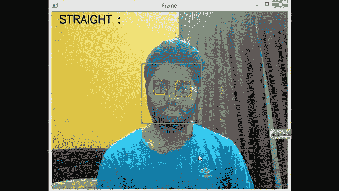

# 使用 OpenCV–Python 确定面部倾斜

> 原文:[https://www . geesforgeks . org/确定面部倾斜-使用-opencv-python/](https://www.geeksforgeeks.org/determine-the-face-tilt-using-opencv-python/)

在本文中，我们将看到如何使用 Python 中的 OpenCV 来确定面部倾斜。

为了实现这一点，我们将使用一个流行的计算机视觉库 [opencv-python](https://www.geeksforgeeks.org/opencv-python-tutorial/) 。在这个程序中，在 OpenCV 库的帮助下，我们将从网络摄像头或视频文件中检测实时流中的人脸，并随后通过人脸倾斜的程度来确定角度。

## **要求:**

*   [安装 python 的 OpenCV](https://www.geeksforgeeks.org/how-to-install-opencv-for-python-in-windows/) 。
*   我们将使用两个预训练的 XML 分类器分别检测人脸和眼睛。这些分类器可以从 opencv 库中下载，或者只需点击下面的链接。
*   人脸检测分类器:[haarcscade _ frontal face _ default . XML](https://drive.google.com/file/d/15tK4N1O0-H7hsykNOg0g3zCzasERhjAa/view?usp=sharing)
*   眼睛检测分类器:[haarcscade _ eye . XML](https://drive.google.com/file/d/1LomiNJxNeNJ6W5KIH8GaeuhlJwvnqtTw/view?usp=sharing)

## **算法:**

*   首先，我们使用上面提到的用于人脸的 haarcascade 分类器来检测网络摄像头馈送/视频中的人脸，并在其周围制作绿色边界框。
*   接下来，我们使用在眼睛上训练的类似的 haarcascade 分类器来检测眼睛，并在每只眼睛周围制作一个红色边界框。
*   除了在每只眼睛周围做一个盒子，我们还会识别和存储每个盒子的中心。这里，我们假设边界框的中心与眼睛的中心相同。
*   为了计算倾斜角，我们假设连接两只眼睛中心的直线垂直于面部。
*   我们用(x，y)坐标表示两个中心的坐标。x 轴是水平轴，y 轴是垂直轴。
*   当给定两个点 & 时，连接两个点的直线与 x 轴的角度可以通过以下表达式从几何中获得:


*   在我们的例子中，由连接两只眼睛的中心和水平线的线形成的角度被计算出来。正角度表示向右倾斜，负角度表示向左倾斜。
*   提供 10 度的误差范围(即，如果脸部两侧倾斜超过 10 度，程序将分类为右倾斜或左倾斜)。

#### 下面是实现:

## 计算机编程语言

```
import cv2 as cv
import numpy as np

# 0 for webcam feed ; add "path to file"
# for detection in video file
capture = cv.VideoCapture(0)
face_cascade = cv.CascadeClassifier('haarcascade_frontalface_default.xml')
eye_cascade = cv.CascadeClassifier("haarcascade_eye.xml")

while True:
    ret, frame = capture.read()
    gray = cv.cvtColor(frame, cv.COLOR_BGR2GRAY)
    faces = face_cascade.detectMultiScale(gray, 1.1, 5)
    x, y, w, h = 0, 0, 0, 0
    for (x, y, w, h) in faces:
        cv.rectangle(frame, (x, y), (x + w, y + h), (0, 255, 0), 2)
        cv.circle(frame, (x + int(w * 0.5), y +
                          int(h * 0.5)), 4, (0, 255, 0), -1)
    eyes = eye_cascade.detectMultiScale(gray[y:(y + h), x:(x + w)], 1.1, 4)
    index = 0
    eye_1 = [None, None, None, None]
    eye_2 = [None, None, None, None]
    for (ex, ey, ew, eh) in eyes:
        if index == 0:
            eye_1 = [ex, ey, ew, eh]
        elif index == 1:
            eye_2 = [ex, ey, ew, eh]
        cv.rectangle(frame[y:(y + h), x:(x + w)], (ex, ey),
                     (ex + ew, ey + eh), (0, 0, 255), 2)
        index = index + 1
    if (eye_1[0] is not None) and (eye_2[0] is not None):
        if eye_1[0] < eye_2[0]:
            left_eye = eye_1
            right_eye = eye_2
        else:
            left_eye = eye_2
            right_eye = eye_1
        left_eye_center = (
            int(left_eye[0] + (left_eye[2] / 2)),
          int(left_eye[1] + (left_eye[3] / 2)))

        right_eye_center = (
            int(right_eye[0] + (right_eye[2] / 2)),
          int(right_eye[1] + (right_eye[3] / 2)))

        left_eye_x = left_eye_center[0]
        left_eye_y = left_eye_center[1]
        right_eye_x = right_eye_center[0]
        right_eye_y = right_eye_center[1]

        delta_x = right_eye_x - left_eye_x
        delta_y = right_eye_y - left_eye_y

        # Slope of line formula
        angle = np.arctan(delta_y / delta_x) 

        # Converting radians to degrees
        angle = (angle * 180) / np.pi 

        # Provided a margin of error of 10 degrees
        # (i.e, if the face tilts more than 10 degrees
        # on either side the program will classify as right or left tilt)
        if angle > 10:
            cv.putText(frame, 'RIGHT TILT :' + str(int(angle))+' degrees',
                       (20, 30), cv.FONT_HERSHEY_SIMPLEX, 1,
                       (0, 0, 0), 2, cv.LINE_4)
        elif angle < -10:
            cv.putText(frame, 'LEFT TILT :' + str(int(angle))+' degrees',
                       (20, 30), cv.FONT_HERSHEY_SIMPLEX, 1,
                       (0, 0, 0), 2, cv.LINE_4)
        else:
            cv.putText(frame, 'STRAIGHT :', (20, 30),
                       cv.FONT_HERSHEY_SIMPLEX, 1,
                       (0, 0, 0), 2, cv.LINE_4)

    cv.imshow('Frame', frame)

    if cv.waitKey(1) & 0xFF == 27:
        break
capture.release()
cv.destroyAllWindows()
```

**输出:**

