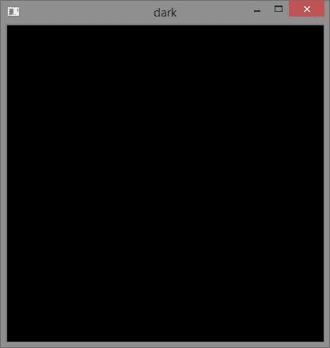
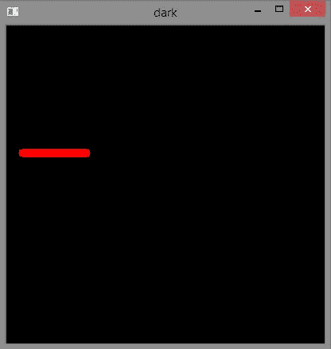
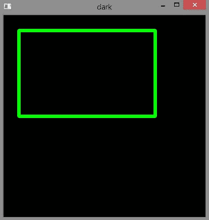
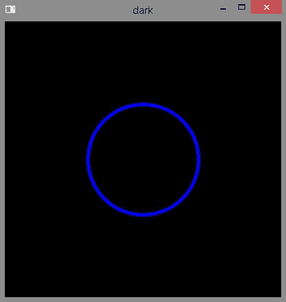
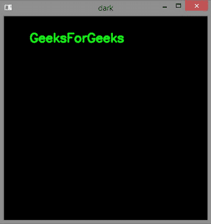

# 使用 OpenCV

在图像上绘制几何形状

> 原文:[https://www . geesforgeks . org/draw-geometric-shapes-images-using-opencv/](https://www.geeksforgeeks.org/draw-geometric-shapes-images-using-opencv/)

[OpenCV](https://www.geeksforgeeks.org/set-opencv-anaconda-environment/) 提供了很多绘图功能，可以在图像上绘制几何形状和书写文字。让我们看看一些绘图功能，并使用 OpenCV 在图像上绘制几何形状。

一些绘图功能包括:

> **cv2.line() :** 用于在图像上画线。
> **cv2.rectangle() :** 用于在图像上绘制矩形。
> **cv2.circle() :** 用于在图像上画圆。
> **cv2.putText() :** 用于在图像上书写文字。

为了演示上述功能的使用，我们需要一个尺寸为 400 X 400 的图像，用纯色填充(本例中为黑色)。为了做到这一点，我们可以利用***numpy . zeross***功能来创建所需的图像。

## 蟒蛇 3

```py
# Python3 program to draw solid-colored
# image using numpy.zeroes() function
import numpy as np
import cv2

# Creating a black image with 3 channels
# RGB and unsigned int datatype
img = np.zeros((400, 400, 3), dtype = "uint8")
cv2.imshow('dark', img)

# Allows us to see image
# until closed forcefully
cv2.waitKey(0)
cv2.destroyAllWindows()
```

**输出:**



现在，让我们在这个实心的黑色图像上画一些几何形状。

#### 画一条线:

> cv2.line(imageObjectName，(' start_coordinates ')，(' end_coordinates ')，(' color_in_bgr ')，' line_thickness ')

## 蟒蛇 3

```py
# Python3 program to draw line
# shape on solid image
import numpy as np
import cv2

# Creating a black image with 3 channels
# RGB and unsigned int datatype
img = np.zeros((400, 400, 3), dtype = "uint8")

# Creating line
cv2.line(img, (20, 160), (100, 160), (0, 0, 255), 10)

cv2.imshow('dark', img)

# Allows us to see image
# until closed forcefully
cv2.waitKey(0)
cv2.destroyAllWindows()
```

**输出:**



#### 画一个矩形:

> cv2.rectangle(imageObjectName，(' top_left_vertex_coordinates ')，(' lower _ right _ vertex _ coordinates ')，(' stroke_color_in_bgr ')，' stroke_thickness ')

## 蟒蛇 3

```py
# Python3 program to draw rectangle
# shape on solid image
import numpy as np
import cv2

# Creating a black image with 3
# channels RGB and unsigned int datatype
img = np.zeros((400, 400, 3), dtype = "uint8")

# Creating rectangle
cv2.rectangle(img, (30, 30), (300, 200), (0, 255, 0), 5)

cv2.imshow('dark', img)

# Allows us to see image
# until closed forcefully
cv2.waitKey(0)
cv2.destroyAllWindows()
```

**输出:**



#### 画一个圆:

> cv2.circle(imageObjectName，(' center_coordinates ')，(' circle_radius ')，(' color_in_bgr ')，' stroke_thickness ')

## 蟒蛇 3

```py
# Python3 program to draw circle
# shape on solid image
import numpy as np
import cv2

# Creating a black image with 3
# channels RGB and unsigned int datatype
img = np.zeros((400, 400, 3), dtype = "uint8")

# Creating circle
cv2.circle(img, (200, 200), 80, (255, 0, 0), 3)

cv2.imshow('dark', img)

# Allows us to see image
# until closed forcefully
cv2.waitKey(0)
cv2.destroyAllWindows()
```

**输出:**



#### 书写文本:

> cv2.putText(imageObjectName，' TextContent '，(' text _ starting _ point _ coordinates ')，' fontToBeUsed '，' font_size '，(' text_color '，' text_thickness '，' line_type ')

## 计算机编程语言

```py
# Python3 program to write 
# text on solid image
import numpy as np
import cv2

# Creating a black image with 3
# channels RGB and unsigned int datatype
img = np.zeros((400, 400, 3), dtype = "uint8")

# writing text
font = cv2.FONT_HERSHEY_SIMPLEX
cv2.putText(img, 'GeeksForGeeks', (50, 50),
            font, 0.8, (0, 255, 0), 2, cv2.LINE_AA)

cv2.imshow('dark', img)

# Allows us to see image
# until closed forcefully
cv2.waitKey(0)
cv2.destroyAllWindows()
```

**输出:**



**在图像上绘制形状的应用:**

*   绘制几何形状可以帮助我们突出图像的特定部分。
*   像线这样的几何形状可以帮助我们指出或识别图像中的特定区域。
*   在图像的特定区域上书写文本可以为该区域添加描述。

**参考:**
[https://docs . opencv . org/2.4/modules/core/doc/drawing _ functions . html](https://docs.opencv.org/2.4/modules/core/doc/drawing_functions.html)