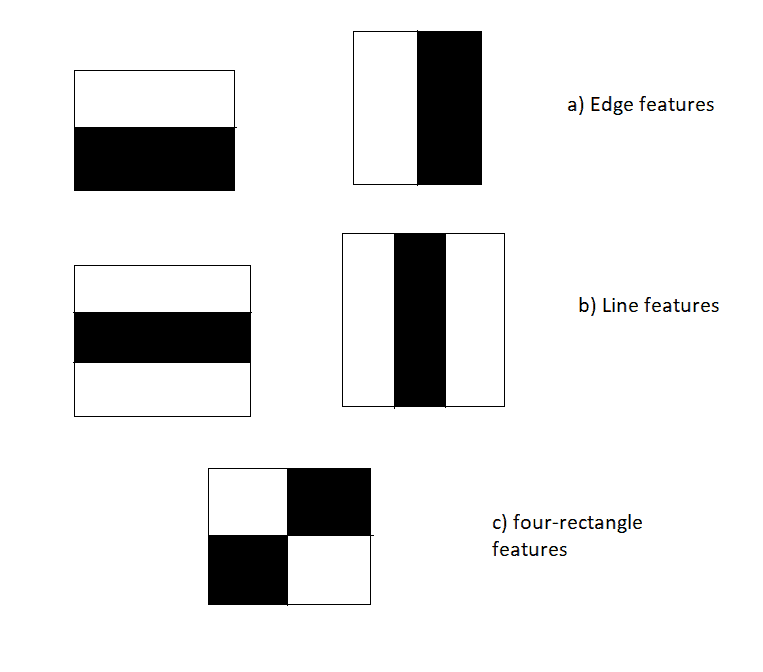

# 使用 OpenCV-Python 的级联分类器进行人脸检测

> 原文:[https://www . geesforgeks . org/人脸检测-使用-级联-分类器-使用-opencv-python/](https://www.geeksforgeeks.org/face-detection-using-cascade-classifier-using-opencv-python/)

在本文中，我们将看到如何使用 OpenCV Python 中的级联分类器来检测人脸。人脸检测在当今世界的不同领域都有着重要的意义。它是人脸识别(也用作生物识别)、摄影(用于自动聚焦人脸)、人脸分析(年龄、性别、情感识别)、视频监控等多个应用中的重要一步。

面部检测的流行算法之一是“haarcascade”。它在计算上不太昂贵，是一种快速算法，并且具有很高的精度。

**haarcscade 文件可以从这里下载:**[haarcscade _ frontalface _ default . XML](https://drive.google.com/file/d/1PPO2MCttsmSqyB-vKh5C7SumwFKuhgyj/view?usp=sharing)

它分四个阶段工作:

*   **哈尔特征选择**:类似哈尔的特征由暗区域和亮区域组成。它通过取暗区域的强度之和与亮区域的强度之和的差来产生单个值。这样做是为了提取识别对象所需的有用元素。维奥拉和琼斯提出的特点是:



*   **积分图像的创建**:积分图像中的给定像素是左侧所有像素及其上方所有像素的总和。由于提取类哈尔特征的过程涉及计算暗矩形区域和亮矩形区域的差异，因此 Integral Images 的引入大大减少了完成该任务所需的时间。
*   **AdaBoost 训练**:该算法从所有特征中选择最佳特征。它将多个“弱分类器”(最佳特征)组合成一个“强分类器”。生成的“强分类器”基本上是所有“弱分类器”的线性组合。
*   **级联分类器**:它是一种在级联中组合像 AdaBoost 这样越来越复杂的分类器的方法，允许快速丢弃负输入(非人脸)，同时在有希望的或正的类人脸区域上花费更多的计算。它显著减少了计算时间，并使过程更加高效。

OpenCV 附带了许多预先训练好的分类器。这些 XML 文件可以通过 cv2 模块的 cascadeClassifier 方法加载。这里我们将使用 haarcscade _ frontal face _ default . XML 来检测人脸。

## 逐步实施:

**第一步:加载图像**

## 计算机编程语言

```
img = cv2.imread('Photos/cric.jpg')
```

**第二步:将图像转换为灰度**

最初，图像是三层图像(即 RGB)，因此它被转换为一层图像(即灰度)。

## 计算机编程语言

```
gray_img = cv2.cvtColor(img, cv2.COLOR_BGR2GRAY)
```