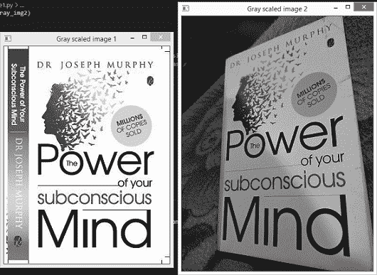
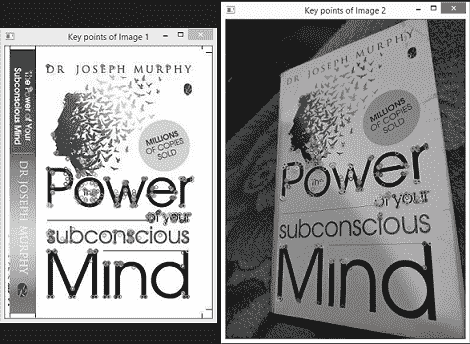
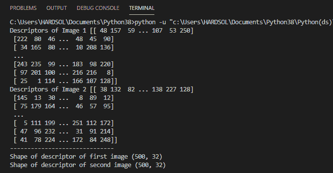
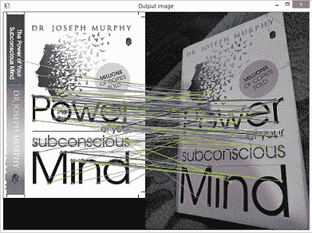
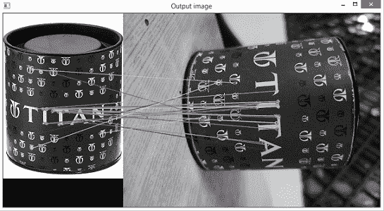

# 在 OpenCV 中使用蛮力进行特征匹配

> 原文:[https://www . geesforgeks . org/feature-matching-using-蛮力 in-opencv/](https://www.geeksforgeeks.org/feature-matching-using-brute-force-in-opencv/)

在本文中，我们将使用 OpenCV 库在 Python 中使用暴力进行特征匹配。

**先决条件:** [<u>OpenCV</u>](https://www.geeksforgeeks.org/opencv-python-tutorial/)

OpenCV 是一个用于解决计算机视觉问题的 python 库。

OpenCV 是一个开源的计算机视觉库。因此，计算机视觉是一种向机器传授智能的方式，让它们像人类一样看东西。

换句话说，OpenCV 是允许计算机像人类一样看到和处理视觉数据的东西。

**安装:**

要安装 openCV 库，请在命令提示符下编写以下命令。

```
pip install opencv-python
```

### 方法:

*   导入 OpenCV 库。
*   使用 i *mread()* 函数加载图像，并将图像的路径或名称作为参数传递。
*   创建用于检测图像特征的 ORB 检测器。
*   使用 ORB 检测器找到两幅图像的关键点和描述符。
*   现在在检测了图像的特征之后。现在编写用于匹配图像特征的蛮力匹配器，并将其存储在名为“*蛮力*的变量中。
*   为了匹配，我们使用了 brute _ force.match()，并将第一个图像的描述符和第二个图像的描述符作为参数传递。
*   找到匹配后，我们必须根据匹配之间的哼唱距离对匹配进行排序，哼唱距离越小，匹配的准确性越好。
*   现在在根据哼唱距离排序之后，我们必须为其绘制特征匹配，我们使用 *drawMatches()* 函数，其中传递第一个图像和第一个图像的关键点，第二个图像和第二个图像的关键点以及 *best_matches* 作为参数，并将其存储在名为“ *output_image* 的变量中。
*   现在在绘制特征匹配之后，我们必须看到匹配，为此我们使用了 cv2 库中的 *imshow()* 函数，并传递窗口名称和 *output_image* 。
*   现在写 *waitkey()* 函数，写 *destroyAllWindows()* 销毁所有窗口。

### 定向快速旋转探测器

ORB 检测器代表定向快速和旋转简要，这是一个免费的算法，这个算法的好处是它不需要图形处理器，它可以在普通的中央处理器上计算。

ORB 基本上是 FAST 和 BRIEF 两种算法的组合，其中 FAST 代表来自加速段测试的特征，而 BRIEF 代表二进制鲁棒独立基本特征。

ORB 检测器首先使用 FAST 算法，该 FAST 算法找到关键点，然后应用 Harries 角点度量找到其中前 N 个数的关键点，该算法通过比较强度变化等显著区域来快速选择关键点。

该算法适用于关键点匹配，关键点是图像中与众不同的区域，如亮度变化。

现在 BRIEF 算法的作用来了，这个算法取关键点，变成只包含 0 和 1 组合的二进制描述符/二进制特征向量。

由 FAST 算法创建的关键点和由 BRIEF 算法创建的描述符一起表示对象。“简要”是特征描述符计算的更快方法，并且它还提供了高识别率，除非存在大的平面内旋转。

### 蛮力匹配器

蛮力匹配器用于将第一幅图像的特征与另一幅图像进行匹配。

它获取第一个图像的一个描述符，并匹配第二个图像的所有描述符，然后转到第一个图像的第二个描述符，并匹配第二个图像的所有描述符，以此类推。

**示例 1:使用** OpenCV **库从图像路径读取/导入图像。**

## 计算机编程语言

```
# importing openCV library
import cv2

# function to read the images by taking there path
def read_image(path1,path2):
  # reading the images from their using imread() function
    read_img1 = cv2.imread(path1)
    read_img2 = cv2.imread(path2)
    return (read_img1,read_img2)

# function to convert images from RGB to gray scale
def convert_to_grayscale(pic1,pic2):
    gray_img1 = cv2.cvtColor(pic1,cv2.COLOR_BGR2GRAY)
    gray_img2 = cv2.cvtColor(pic2,cv2.COLOR_BGR2GRAY)
    return (gray_img1,gray_img2)

# main function
if __name__ == '__main__':
 # giving the path of both of the images
    first_image_path = 'C:/UsersPython(ds)/1611755129039.jpg'
    second_image_path = 'C:/Users/Python(ds)/1611755720390.jpg'

    # reading the image from there path by calling the function
    img1, img2 = read_image(first_image_path,second_image_path)

    # converting the readed images into the gray scale images by calling the function
    gray_pic1, gray_pic2 = convert_to_grayscale(img1,img2)
    cv2.imshow('Gray scaled image 1',gray_pic1)
    cv2.imshow('Gray scaled image 2',gray_pic2)
    cv2.waitKey()
    cv2.destroyAllWindows()
```

**输出:**



**示例 2:创建 ORB 检测器，用于查找图像中的特征。**

## 计算机编程语言

```
# importing openCV library
import cv2

# function to read the images by taking there path
def read_image(path1,path2):
    read_img1 = cv2.imread(path1)
    read_img2 = cv2.imread(path2)
    return (read_img1,read_img2)

# function to convert images from RGB to gray scale
def convert_to_grayscale(pic1,pic2):
    gray_img1 = cv2.cvtColor(pic1,cv2.COLOR_BGR2GRAY)
    gray_img2 = cv2.cvtColor(pic2,cv2.COLOR_BGR2GRAY)
    return (gray_img1,gray_img2)

# function to detect the features by finding key points and descriptors from the image
def detector(image1,image2):
    # creating ORB detector
    detect = cv2.ORB_create()

    # finding key points and descriptors of both images using detectAndCompute() function
    key_point1,descrip1 = detect.detectAndCompute(image1,None)
    key_point2,descrip2 = detect.detectAndCompute(image2,None)
    return (key_point1,descrip1,key_point2,descrip2)

# main function
if __name__ == '__main__':
 # giving the path of both of the images
    first_image_path = 'C:/Users/Python(ds)//1611755129039.jpg'
    second_image_path = 'C:/Users/Python(ds)/1611755720390.jpg'

    # reading the image from there paths
    img1, img2 = read_image(first_image_path,second_image_path)

    # converting the readed images into the gray scale images
    gray_pic1, gray_pic2 = convert_to_grayscale(img1,img2)

    # storing the finded key points and descriptors of both of the images
    key_pt1,descrip1,key_pt2,descrip2 = detector(gray_pic1,gray_pic2)

    # showing the images with their key points finded by the detector
    cv2.imshow("Key points of Image 1",cv2.drawKeypoints(gray_pic1,key_pt1,None))
    cv2.imshow("Key points of Image 2",cv2.drawKeypoints(gray_pic2,key_pt2,None))

    # printing descriptors of both of the images
    print(f'Descriptors of Image 1 {descrip1}')
    print(f'Descriptors of Image 2 {descrip2}')
    print('------------------------------')

    # printing the Shape of the descriptors
    print(f'Shape of descriptor of first image {descrip1.shape}')
    print(f'Shape of descriptor of second image {descrip2.shape}')

    cv2.waitKey()
    cv2.destroyAllWindows()
```

**输出:**

 

第一个输出图像显示了两个图像的绘制关键点。

**关键点**是感兴趣的点，简单来说就是指当人类看到图像的时候，他在那个图像中注意到的特征，就像机器读取图像的时候看到一些被称为关键点的感兴趣的点一样。

第二个输出图像显示了描述符和描述符的形状。

这些**描述符**基本上是数字的数组或箱。这些用于描述特征，使用这些描述符我们可以匹配两个不同的图像。

在第二个输出图像中，我们可以看到第一个图像描述符形状和第二个图像描述符形状分别为(467，32)和(500，32)。因此，定向快速旋转简要(ORB)检测器试图在默认情况下找到图像中的 500 个特征，对于每个描述符，它将描述 32 个值。

那么，现在我们将如何使用这些描述符呢？我们可以使用**蛮力匹配器**(如本文上面所讨论的)将这些描述符匹配在一起，并找出我们得到了多少相似之处。

**示例 3:使用蛮力匹配器的特征匹配。**

## 计算机编程语言

```
# importing openCV library
import cv2

# function to read the images by taking there path
def read_image(path1,path2):
    read_img1 = cv2.imread(path1)
    read_img2 = cv2.imread(path2)
    return (read_img1,read_img2)

# function to convert images from RGB to gray scale
def convert_to_grayscale(pic1,pic2):
    gray_img1 = cv2.cvtColor(pic1,cv2.COLOR_BGR2GRAY)
    gray_img2 = cv2.cvtColor(pic2,cv2.COLOR_BGR2GRAY)
    return (gray_img1,gray_img2)

# function to detect the features by finding key points
# and descriptors from the image
def detector(image1,image2):
    # creating ORB detector
    detect = cv2.ORB_create()

    # finding key points and descriptors of both images using
    # detectAndCompute() function
    key_point1,descrip1 = detect.detectAndCompute(image1,None)
    key_point2,descrip2 = detect.detectAndCompute(image2,None)
    return (key_point1,descrip1,key_point2,descrip2)

# function to find best detected features using brute force
# matcher and match them according to there humming distance
def BF_FeatureMatcher(des1,des2):
    brute_force = cv2.BFMatcher(cv2.NORM_HAMMING,crossCheck=True)
    no_of_matches = brute_force.match(des1,des2)

    # finding the humming distance of the matches and sorting them
    no_of_matches = sorted(no_of_matches,key=lambda x:x.distance)
    return no_of_matches

# function displaying the output image with the feature matching
def display_output(pic1,kpt1,pic2,kpt2,best_match):

    # drawing the feature matches using drawMatches() function
    output_image = cv2.drawMatches(pic1,kpt1,pic2,kpt2,best_match,None,flags=2)
    cv2.imshow('Output image',output_image)

# main function
if __name__ == '__main__':
    # giving the path of both of the images
    first_image_path = 'C:/Users/Python(ds)/1611755129039.jpg'
    second_image_path = 'C:/Users/Python(ds)/1611755720390.jpg'

    # reading the image from there paths
    img1, img2 = read_image(first_image_path,second_image_path)

    # converting the readed images into the gray scale images
    gray_pic1, gray_pic2 = convert_to_grayscale(img1,img2)

    # storing the finded key points and descriptors of both of the images
    key_pt1,descrip1,key_pt2,descrip2 = detector(gray_pic1,gray_pic2)

    # sorting the number of best matches obtained from brute force matcher
    number_of_matches = BF_FeatureMatcher(descrip1,descrip2)
    tot_feature_matches = len(number_of_matches)

    # printing total number of feature matches found
    print(f'Total Number of Features matches found are {tot_feature_matches}')

    # after drawing the feature matches displaying the output image
    display_output(gray_pic1,key_pt1,gray_pic2,key_pt2,number_of_matches)
    cv2.waitKey()
    cv2.destroyAllWindows()
```

**输出:**

 

我们总共得到 178 个特征匹配。总共绘制了 178 个匹配，但它们是根据哼唱距离按升序排序的，这意味着第 178 个特征的距离大于第一个特征，因此第一个特征匹配比第 178 个特征匹配更准确。

它看起来很乱，因为所有 178 个特征匹配都被绘制出来了，让我们绘制前十五个特征(为了可见性)。

**示例 4:使用蛮力匹配器的第一/前十五个特征匹配。**

## 计算机编程语言

```
# importing openCV library
import cv2

# function to read the images by taking there path
def read_image(path1,path2):
    read_img1 = cv2.imread(path1)
    read_img2 = cv2.imread(path2)
    return (read_img1,read_img2)

# function to convert images from RGB to gray scale
def convert_to_grayscale(pic1,pic2):
    gray_img1 = cv2.cvtColor(pic1,cv2.COLOR_BGR2GRAY)
    gray_img2 = cv2.cvtColor(pic2,cv2.COLOR_BGR2GRAY)
    return (gray_img1,gray_img2)

# function to detect the features by finding key points
# and descriptors from the image
def detector(image1,image2):

    # creating ORB detector
    detect = cv2.ORB_create()

    # finding key points and descriptors of both images
    # using detectAndCompute() function
    key_point1,descrip1 = detect.detectAndCompute(image1,None)
    key_point2,descrip2 = detect.detectAndCompute(image2,None)
    return (key_point1,descrip1,key_point2,descrip2)

# function to find best detected features using
# brute force matcher and match them according to there humming distance
def BF_FeatureMatcher(des1,des2):
    brute_force = cv2.BFMatcher(cv2.NORM_HAMMING,crossCheck=True)
    no_of_matches = brute_force.match(des1,des2)

    # finding the humming distance of the matches and sorting them
    no_of_matches = sorted(no_of_matches,key=lambda x:x.distance)
    return no_of_matches

# function displaying the output image with the feature matching
def display_output(pic1,kpt1,pic2,kpt2,best_match):
    # drawing first fifteen best feature matches using drawMatches() function
    output_image = cv2.drawMatches(pic1,kpt1,pic2,
                                   kpt2,best_match[:15],None,flags=2)
    cv2.imshow('Output image',output_image)

# main function
if __name__ == '__main__':
    # giving the path of both of the images
    first_image_path = 'C:/Users/Python(ds)/1611755129039.jpg'
    second_image_path = 'C:/Users/Python(ds)/1611755720390.jpg'

    # reading the image from there paths
    img1, img2 = read_image(first_image_path,second_image_path)

    # converting the readed images into the gray scale images
    gray_pic1, gray_pic2 = convert_to_grayscale(img1,img2)

    # storing the finded key points and descriptors of both of the images
    key_pt1,descrip1,key_pt2,descrip2 = detector(gray_pic1,gray_pic2)

    # sorting the number of best matches obtained from brute force matcher
    number_of_matches = BF_FeatureMatcher(descrip1,descrip2)

    # after drawing the feature matches displaying the output image
    display_output(gray_pic1,key_pt1,gray_pic2,key_pt2,number_of_matches)
    cv2.waitKey()
    cv2.destroyAllWindows()
```

**输出:**


输出图像显示了使用强力匹配器的前十五个最佳特征匹配。

从上面的输出中，我们可以看到这些匹配比所有剩余的特征匹配更准确。

我们再举一个特征匹配的例子。

**示例 5:使用蛮力的特征匹配。**

## 计算机编程语言

```
# importing openCV library
import cv2

# function to read the images by taking there path
def read_image(path1,path2):
    read_img1 = cv2.imread(path1)
    read_img2 = cv2.imread(path2)
    return (read_img1,read_img2)

# function to convert images from RGB to gray scale
def convert_to_grayscale(pic1,pic2):
    gray_img1 = cv2.cvtColor(pic1,cv2.COLOR_BGR2GRAY)
    gray_img2 = cv2.cvtColor(pic2,cv2.COLOR_BGR2GRAY)
    return (gray_img1,gray_img2)

# function to detect the features by finding key points and
# descriptors from the image
def detector(image1,image2):

    # creating ORB detector
    detect = cv2.ORB_create()
    # finding key points and descriptors of both images
    # using detectAndCompute() function
    key_point1,descrip1 = detect.detectAndCompute(image1,None)
    key_point2,descrip2 = detect.detectAndCompute(image2,None)
    return (key_point1,descrip1,key_point2,descrip2)

# function to find best detected features using brute
# force matcher and match them according to there humming distance
def BF_FeatureMatcher(des1,des2):
    brute_force = cv2.BFMatcher(cv2.NORM_HAMMING,crossCheck=True)
    no_of_matches = brute_force.match(des1,des2)

    # finding the humming distance of the matches and sorting them
    no_of_matches = sorted(no_of_matches,key=lambda x:x.distance)
    return no_of_matches

# function displaying the output image with the feature matching
def display_output(pic1,kpt1,pic2,kpt2,best_match):
    # drawing the feature matches using drawMatches() function
    output_image = cv2.drawMatches(pic1,kpt1,pic2,kpt2,
                                   best_match[:30],None,flags=2)
    cv2.imshow('Output image',output_image)

# main function
if __name__ == '__main__':
    # giving the path of both of the images
    first_image_path = 'C:/Users/Python(ds)/Titan_1.jpg'
    second_image_path = 'C:/Users/Python(ds)/Titan_nor.jpg'

    # reading the image from there paths
    img1, img2 = read_image(first_image_path,second_image_path)

    # converting the readed images into the gray scale images
    gray_pic1, gray_pic2 = convert_to_grayscale(img1,img2)

    # storing the finded key points and descriptors of both of the images
    key_pt1,descrip1,key_pt2,descrip2 = detector(gray_pic1,gray_pic2)

    # sorting the number of best matches obtained from brute force matcher
    number_of_matches = BF_FeatureMatcher(descrip1,descrip2)
    tot_feature_matches = len(number_of_matches)
    print(f'Total Number of Features matches found are {tot_feature_matches}')

    # after drawing the feature matches displaying the output image
    display_output(gray_pic1,key_pt1,gray_pic2,key_pt2,number_of_matches)
    cv2.waitKey()
    cv2.destroyAllWindows()
```

**输出:**

 

在上面的例子中，我们总共获得了 147 个最佳特征匹配，其中我们只绘制了前 30 个匹配，这样我们就可以正确地看到匹配。

**示例 6:** **通过拍摄旋转的列车图像，使用蛮力匹配器进行特征匹配。**

## 计算机编程语言

```
# importing openCV library
import cv2

# function to read the images by taking there path
def read_image(path1,path2):
    read_img1 = cv2.imread(path1)
    read_img2 = cv2.imread(path2)
    return (read_img1,read_img2)

# function to convert images from RGB to gray scale
def convert_to_grayscale(pic1,pic2):
    gray_img1 = cv2.cvtColor(pic1,cv2.COLOR_BGR2GRAY)
    gray_img2 = cv2.cvtColor(pic2,cv2.COLOR_BGR2GRAY)
    return (gray_img1,gray_img2)

# function to detect the features by finding key points
# and descriptors from the image
def detector(image1,image2):
    # creating ORB detector
    detect = cv2.ORB_create()

    # finding key points and descriptors of both images
    # using detectAndCompute() function
    key_point1,descrip1 = detect.detectAndCompute(image1,None)
    key_point2,descrip2 = detect.detectAndCompute(image2,None)
    return (key_point1,descrip1,key_point2,descrip2)

# function to find best detected features using brute
# force matcher and match them according to there humming distance
def BF_FeatureMatcher(des1,des2):
    brute_force = cv2.BFMatcher(cv2.NORM_HAMMING,crossCheck=True)
    no_of_matches = brute_force.match(des1,des2)

    # finding the humming distance of the matches and sorting them
    no_of_matches = sorted(no_of_matches,key=lambda x:x.distance)
    return no_of_matches

# function displaying the output image with the feature matching
def display_output(pic1,kpt1,pic2,kpt2,best_match):
    # drawing the feature matches using drawMatches() function
    output_image = cv2.drawMatches(pic1,kpt1,pic2,
                                   kpt2,best_match[:30],None,flags=2)
    cv2.imshow('Output image',output_image)

# main function
if __name__ == '__main__':
    # giving the path of both of the images
    first_image_path = 'C:/Users/Python(ds)/Titan_1.jpg'
    second_image_path = 'C:/Users/Python(ds)/Titan_rotated.jpg'

    # reading the image from there paths
    img1, img2 = read_image(first_image_path,second_image_path)

    # converting the readed images into the gray scale images
    gray_pic1, gray_pic2 = convert_to_grayscale(img1,img2)

    # storing the finded key points and descriptors of both of the images
    key_pt1,descrip1,key_pt2,descrip2 = detector(gray_pic1,gray_pic2)

    # sorting the number of best matches obtained from brute force matcher
    number_of_matches = BF_FeatureMatcher(descrip1,descrip2)
    tot_feature_matches = len(number_of_matches)
    print(f'Total Number of Features matches found are {tot_feature_matches}')

    # after drawing the feature matches displaying the output image
    display_output(gray_pic1,key_pt1,gray_pic2,key_pt2,number_of_matches)
    cv2.waitKey()
    cv2.destroyAllWindows()
```

**输出:**

 

在本例中，当我们拍摄旋转的列车图像时，我们发现最佳特征匹配的总数相差不大，即 148 个。

在第一个输出图像中，我们只绘制了前三十个最佳特征匹配。