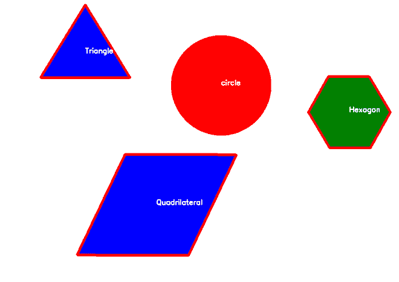

# 如何使用 OpenCV 在 Python 中检测图像中的形状？

> 原文:[https://www . geeksforgeeks . org/如何使用-opencv/](https://www.geeksforgeeks.org/how-to-detect-shapes-in-images-in-python-using-opencv/) 检测 python 图像中的形状

**先决条件:** [OpenCV](https://www.geeksforgeeks.org/opencv-python-tutorial/)

OpenCV 是一个开源库，主要用于处理图像和视频，以识别形状、对象、文本等。它主要用于 python。在本文中，我们将看到如何检测图像中的形状。为此我们需要 OpenCV 的 **cv2.findContours()** 功能，并且我们还将使用 **cv2.drawContours()** 功能在图像上绘制边缘。轮廓是形状的轮廓或边界。

### 方法

*   导入模块
*   导入图像
*   将其转换为灰度图像
*   对图像进行阈值处理，然后找出轮廓。
*   在等高线范围内运行一个循环，并遍历它。
*   在这个循环中，画出形状的轮廓(使用 drawContours())并找出形状的中心点。
*   根据检测到的形状的轮廓点对其进行分类，并将检测到的形状名称放在形状的中心点。

### 使用的功能

*   **cv2.findContours():** 基本上这种方法找出了图像中形状的所有边界点。

> **语法:**cv2 . find 等高线(src，等高线 _ 检索，等高线 _ 近似)
> 
> **参数:**
> 
> *   **src:** 输入图像 n 维(但是在我们的例子中，我们将使用二维图像，这是
>     最喜欢的。)
> *   **轮廓 _ 检索:**
>     *   简历。RETR _ 外部:仅检索极端外部轮廓
>     *   简历。RETR 列表:检索所有轮廓，而不建立任何层次关系。
>     *   简历。RETR 树:检索所有轮廓并重建嵌套轮廓的完整层次。
> *   **等高线 _ 近似值:**
>     *   简历。CHAIN _ neuro _ NONE:它将存储所有的边界点。
>     *   简历。链 _ 近似 _ 简单:它将存储端点的数量(例如，在矩形的情况下，它将存储 4)
> 
> **返回值:**轮廓点列表

*   **cv2.drawContours() :** 此方法绘制轮廓。如果您提供边界点，它也可以绘制形状。

> **语法:** cv。绘制轮廓(src、轮廓、轮廓指数、颜色、厚度)
> 
> **参数:**
> 
> *   **src:** n 维图像
> *   **轮廓:**轮廓点它可以列表。
> *   **轮廓指数:**
>     *   -1:绘制所有轮廓
> *   要绘制单个轮廓，我们可以在这里传递索引值
>     *   **颜色:**颜色值
>     *   **厚度:**轮廓尺寸

**输入:**


**程序:**

## 蟒蛇 3

```py
import cv2
import numpy as np
from matplotlib import pyplot as plt

# reading image
img = cv2.imread('shapes.png')

# converting image into grayscale image
gray = cv2.cvtColor(img, cv2.COLOR_BGR2GRAY)

# setting threshold of gray image
_, threshold = cv2.threshold(gray, 127, 255, cv2.THRESH_BINARY)

# using a findContours() function
contours, _ = cv2.findContours(
    threshold, cv2.RETR_TREE, cv2.CHAIN_APPROX_SIMPLE)

i = 0

# list for storing names of shapes
for contour in contours:

    # here we are ignoring first counter because 
    # findcontour function detects whole image as shape
    if i == 0:
        i = 1
        continue

    # cv2.approxPloyDP() function to approximate the shape
    approx = cv2.approxPolyDP(
        contour, 0.01 * cv2.arcLength(contour, True), True)

    # using drawContours() function
    cv2.drawContours(img, [contour], 0, (0, 0, 255), 5)

    # finding center point of shape
    M = cv2.moments(contour)
    if M['m00'] != 0.0:
        x = int(M['m10']/M['m00'])
        y = int(M['m01']/M['m00'])

    # putting shape name at center of each shape
    if len(approx) == 3:
        cv2.putText(img, 'Triangle', (x, y),
                    cv2.FONT_HERSHEY_SIMPLEX, 0.6, (255, 255, 255), 2)

    elif len(approx) == 4:
        cv2.putText(img, 'Quadrilateral', (x, y),
                    cv2.FONT_HERSHEY_SIMPLEX, 0.6, (255, 255, 255), 2)

    elif len(approx) == 5:
        cv2.putText(img, 'Pentagon', (x, y),
                    cv2.FONT_HERSHEY_SIMPLEX, 0.6, (255, 255, 255), 2)

    elif len(approx) == 6:
        cv2.putText(img, 'Hexagon', (x, y),
                    cv2.FONT_HERSHEY_SIMPLEX, 0.6, (255, 255, 255), 2)

    else:
        cv2.putText(img, 'circle', (x, y),
                    cv2.FONT_HERSHEY_SIMPLEX, 0.6, (255, 255, 255), 2)

# displaying the image after drawing contours
cv2.imshow('shapes', img)

cv2.waitKey(0)
cv2.destroyAllWindows()
```

**输出:**

