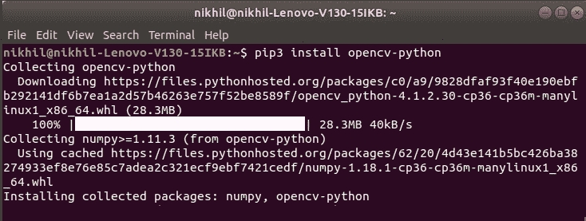

# 如何在 Linux 中为 Python 安装 OpenCV？

> 原文:[https://www . geeksforgeeks . org/如何安装-opencv-for-python-in-Linux/](https://www.geeksforgeeks.org/how-to-install-opencv-for-python-in-linux/)

**先决条件:** [Python 语言简介](https://www.geeksforgeeks.org/python-language-introduction/)

OpenCV 是用于计算机视觉、机器学习和图像处理的巨大开源库，现在它在实时操作中发挥着重要作用，这在当今的系统中非常重要。通过使用它，人们可以处理图像和视频来识别物体、人脸，甚至是人类的笔迹。当它与各种库(如 Numpuy)集成时，python 能够处理 OpenCV 数组结构进行分析。为了识别图像模式及其各种特征，我们使用向量空间并对这些特征执行数学运算。

要安装 OpenCV，必须在系统上预装 Python 和 PIP。要检查您的系统是否已经包含 Python，请按照以下说明操作:

使用 **`Ctrl+Alt+T`** 打开终端

现在为蟒蛇 2 运行以下命令:

```py
python --version 
```

****为蟒 3.x****

```py
python3.x --version 
```

**如果已经安装了 Python，它将生成一条消息，其中包含可用的 Python 版本。**

****

**如果 Python 不存在，请通过[如何在 Linux 上安装 Python？](https://www.geeksforgeeks.org/how-to-install-python-on-linux/)并按照提供的说明操作。

**PIP** 是一个包管理系统，用于安装和管理用 Python 编写的软件包/库。这些文件存储在一个被称为 Python 包索引(PyPI)的大型“在线存储库中”。
要检查您的系统上是否已经安装了画中画，只需进入终端并执行以下命令:**

```py
pip3 --version
```

****

**如果画中画不存在，通过[如何在 Linux 上安装画中画？](https://www.geeksforgeeks.org/how-to-install-pip-in-linux/)并按照提供的说明操作。**

### **下载和安装 OpenCV:**

**OpenCV 可以使用 pip(包管理器)直接下载安装。要安装 OpenCV，只需转到终端并键入以下命令:**

```py
pip3 install opencv-python
```

****从安装开始:****

*   ****在终端中输入命令并继续:**
    **
*   ****采集信息、下载数据:**
    **
*   ****安装软件包:**
    **
*   ****安装完毕:**
    **

**要检查 OpenCV 是否正确安装，只需运行以下命令来执行版本检查:**

```py
python3
>>>import cv2
>>>print(cv2.__version__) 
```

****