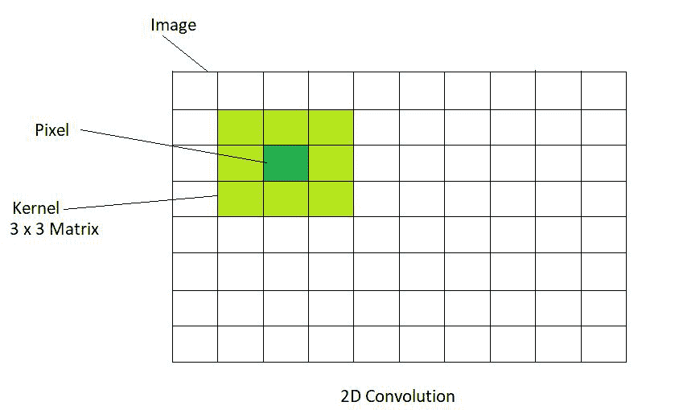

# 在 OpenCV 中使用卷积进行图像滤波

> 原文:[https://www . geeksforgeeks . org/image-filling-use-卷积-in-opencv/](https://www.geeksforgeeks.org/image-filtering-using-convolution-in-opencv/)

**先决条件:**[OpenCV 基础](https://www.geeksforgeeks.org/introduction-to-opencv/)[卷积基础](https://www.geeksforgeeks.org/introduction-to-convolutions-using-python/)

本文讨论了在开放源代码计算机视觉中利用卷积进行图像滤波。为了在 Python 中使用 OpenCV 库，必须安装以下库:

*   Numpy 库
*   Matplotlib 程式库
*   OpenCV 库

要安装以下库，请在命令提示符下运行以下命令:

```
 pip install opencv-python
 pip install numpy
 pip install matplotlib
```

## 二维卷积

图像处理中最基本和最基础的操作是卷积。这可以通过使用内核来实现。核是一个矩阵，通常比图像小，核矩阵的中心与像素重合。

在 2D 卷积中，核矩阵是一个二维的正方形矩阵，其中 A 和 B 都是奇数

<center>
</center>

输出图像的位置是通过将矩阵的每个值与图像矩阵的相应值相乘，然后将它们相加而获得的。基于执行的这些操作，可以执行各种效果，例如图像的模糊和锐化。

### 身份核

身份内核是可以执行的最简单和最基本的内核操作。产生的输出图像与作为输入给出的图像完全一样。它确实改变了输入图像。它是一个中心元素等于 1 的方阵。矩阵的所有其他元素都是 0。下面给出的代码演示了身份内核的操作:

**使用的图像:**

<center>
</center>

## 蟒蛇 3

```
# Importing OpenCV and Numpy Libraries
import cv2
import numpy as np

# Reads image from the disk using cv2.imread() function 
img = cv2.imread('geeksforgeeks.png')

# Apply identity kernel
# In an Identity Kernel matrix the value of the middle element is 1
# The values of all the other elements are 0
id_kernel = np.array([[0, 0, 0],
                    [0, 1, 0],
                    [0, 0, 0]])

# Filtered image is obtained using the variable flt_img
# cv2.fliter2D() is the function used
# src is the source of image(here, img)
# ddepth is destination depth. -1 will mean output image will have same depth as input image
# kernel is used for specifying the kernel operation (here, id_kernel)
flt_img = cv2.filter2D(src=img, ddepth=-1, kernel=id_kernel)

# Display the filtered image using cv2.imshow() function
# Here, output image is same as input image since we are using identity kernel
cv2.imshow('Identity', flt_img)

# cv2.waitkey(delay) function holds the screen till any key is pressed by the user
# It pauses the screen for delay milliseconds if the delay is a positive value
# It pauses the screen for a key event infinitely if the delay is 0 or negative
cv2.waitKey(0)

# cv2.destroyAllWindows() function deletes all the GUI windows from memory
cv2.destroyAllWindows()
```