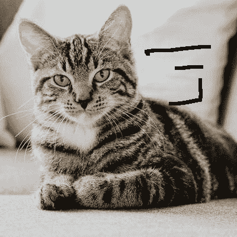

# 使用 OpenCV 进行图像修复

> 原文:[https://www . geesforgeks . org/image-inpainting-using-opencv/](https://www.geeksforgeeks.org/image-inpainting-using-opencv/)

**图像修复**是去除图像上的噪声、笔画或文字等损伤的过程。它在修复旧照片时特别有用，因为旧照片可能会有刮伤的边缘或墨迹。这些可以通过这种方法以数字方式删除。

图像修复的工作原理是用与相邻像素相似的像素替换损坏的像素，从而使它们不显眼，并帮助它们与背景很好地融合。请看下图。


图像右侧有一些标记。为了修复这个图像，我们需要一个**遮罩**，它本质上是一个黑色的图像，上面有白色的标记来指示需要校正的区域。在这种情况下，掩码是在 GIMP 上手动创建的。
T3】

**修复算法–**

OpenCV 实现了两种修复算法:

1.  **“一种基于快速行进法的图像修复技术”，Alexandru Telea，2004:**
    这是基于快速行进法(FMM)。查看要修复的区域，该算法首先从边界像素开始，然后到达边界内的像素。它用背景中像素的加权和替换每个要修复的像素，将更多的权重赋予更近的像素和边界像素。
2.  **“纳维尔-斯托克斯，流体动力学，图像和视频修复”，贝尔塔米奥，马塞洛，安德里亚·l·贝尔托齐和吉列尔莫·萨皮罗，2001:**
    该算法受偏微分方程的启发。从边缘(已知区域)开始向未知区域传播等照度线(连接同强度点的线)。最后，区域中的变化被最小化以填充颜色。

使用`cv2.INPAINT_TELEA`可以调用 FMM，而使用`cv2.INPAINT_NS`可以调用纳维尔-斯托克斯。下面的 Python 代码使用 Navier-Stokes 修复了猫的图像。

```py
import numpy as np
import cv2

# Open the image.
img = cv2.imread('cat_damaged.png')

# Load the mask.
mask = cv2.imread('cat_mask.png', 0)

# Inpaint.
dst = cv2.inpaint(img, mask, 3, cv2.INPAINT_NS)

# Write the output.
cv2.imwrite('cat_inpainted.png', dst)
```

**输出:**
