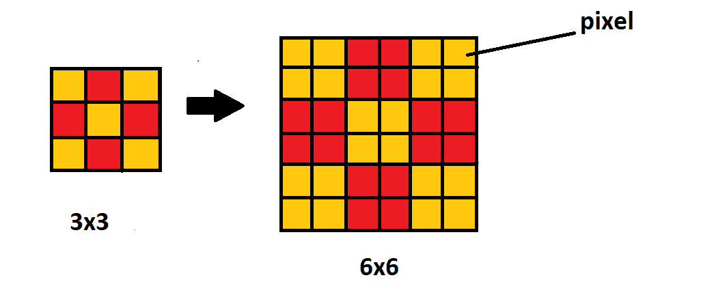
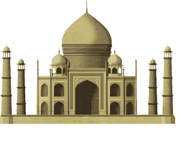
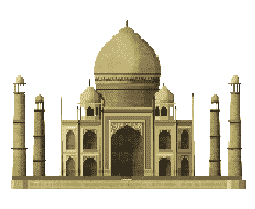
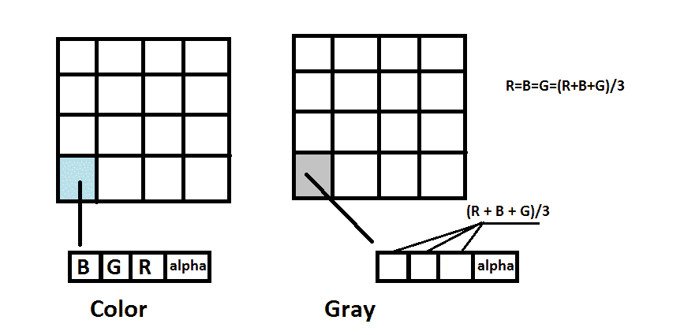
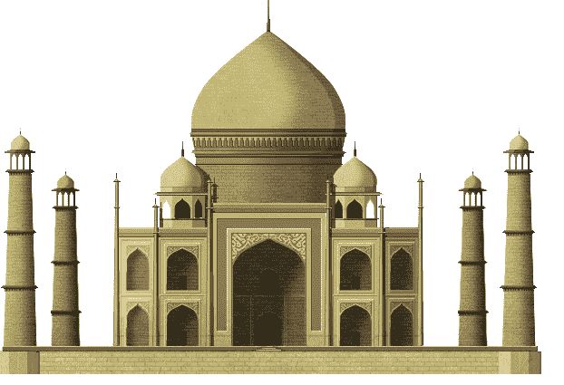
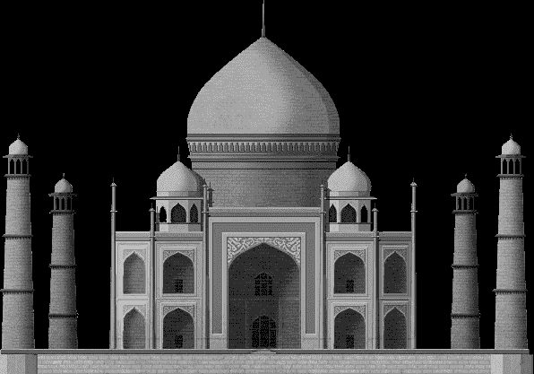
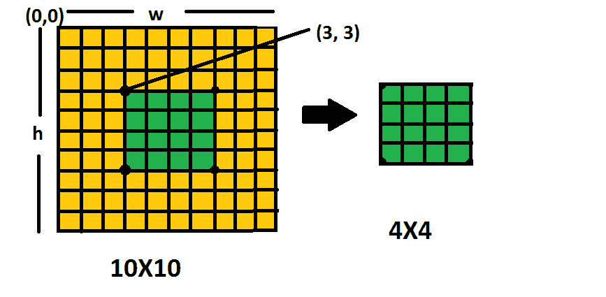

# 无 OpenCV 的图像处理| Python

> 原文:[https://www . geesforgeks . org/image-processing-不带-opencv-python/](https://www.geeksforgeeks.org/image-processing-without-opencv-python/)

我们知道 OpenCV 被广泛用于对图像进行操作，并且具有广泛的功能。但是如果我们想在不使用任何像 OpenCV 这样的外部库的情况下处理图像文件呢。让我们看看如何才能做到这一点。

### 图像缩放(使用最近邻插值):

最近邻插值是最简单的插值方式。该方法简单地确定“最近的”相邻像素，并假定其强度值。
假设 p > m 和 q > n，考虑一个小图像，它的像素宽为“w ”,高为“h ”,我们希望将它的像素宽重新调整为“p ”,高为“q”。现在，我们需要两个缩放常数:

```
scale_x = p/w
scale_y = q/h
```

现在，我们只需遍历输出图像中的所有像素，通过按 *scale_x* 和 *scale_y* 缩放我们的控制变量，并对结果缩放的索引值进行舍入，来寻址要复制的源像素。
**图片表示:**
3x 3 像素的图像(总共 9 个像素)，现在如果我们想将图像的大小增加到 6X6 那么，根据最近邻算法 6/3(即 2 个)像素应该与原始图像中的像素具有相同的 RGB 值。



**图像缩放程序:**

## 蟒蛇 3

```
# using matplotlib and numpy

import matplotlib.image as img
import numpy as npy

# provide the location of image for reading
m = img.imread("taj.png");

# determining the length of original image
w, h = m.shape[:2];

# xNew and yNew are new width and
# height of image required
after scaling
xNew = int(w * 1 / 2);
yNew = int(h * 1 / 2);

# calculating the scaling factor
# work for more than 2 pixel
xScale = xNew/(w-1);
yScale = yNew/(h-1);

# using numpy taking a matrix of xNew
# width and yNew height with
# 4 attribute [alpha, B, G, B] values
newImage = npy.zeros([xNew, yNew, 4]);

for i in range(xNew-1):
   for j in range(yNew-1):
       newImage[i + 1, j + 1]= m[1 + int(i / xScale),
                                 1 + int(j / yScale)]

# Save the image after scaling
img.imsave('scaled.png', newImage);
```

**输出:**





### 图像的灰度缩放:

使用平均值方法，该方法突出显示像素的强度，而不是显示它包含哪些 RGB 值。当我们计算 RGB 的平均值并将其分配给像素的 RGB 值时，由于像素的 RGB 值是相同的，所以它将不能创建任何颜色，因为所有的颜色都是由于 RGB 值的不同比率而形成的，因为在这种情况下比率将是 1:1:1。因此，随后形成的图像将看起来像灰色图像。
**绘画作品:**



**对图像进行灰度缩放的程序:**

## 蟒蛇 3

```
# using numpy
import numpy as npy

# using matplotlib
import matplotlib.image as img

# using statistics to import mean
# for mean calculation
from statistics import mean

m = img.imread("taj.png")

# determining width and height of original image
w, h = m.shape[:2]

# new Image dimension with 4 attribute in each pixel
newImage = npy.zeros([w, h, 4])
print( w )
print( h )

for i in range(w):
   for j in range(h):
      # ratio of RGB will be between 0 and 1
      lst = [float(m[i][j][0]), float(m[i][j][1]), float(m[i][j][2])]
      avg = float(mean(lst))
      newImage[i][j][0] = avg
      newImage[i][j][1] = avg
      newImage[i][j][2] = avg
      newImage[i][j][3] = 1 # alpha value to be 1

# Save image using imsave
img.imsave('grayedImage.png', newImage)
```

**输出:**





### 图像裁剪:

裁剪基本上是去除不想要的像素。这可以通过在不同的图像网格中获取所需的像素来完成，该网格的大小是裁剪后所需的大小。
考虑一个大小为 10×10 像素的图像，如果我们要求只裁剪图像中心的 4×4 像素，那么我们需要从(3，3)开始收集(10-4)/2 的像素值，在 *x 方向*最多 4 个像素，在 *y 方向*最多 4 个像素。
**绘画作品:**



**裁剪图像的程序:**

## 蟒蛇 3

```
# using matplotlib and numpy
import matplotlib.image as img
import numpy as npy

# reading image in variable m
m = img.imread("taj.png")

# determining dimension of image width(w) height(h)
w, h = m.shape[:2]

# required image size after cropping
xNew = int(w * 1 / 4)
yNew = int(h * 1 / 4)
newImage = npy.zeros([xNew, yNew, 4])

# print width height of original image
print(w)
print(h)

for i in range(1, xNew):
    for j in range(1, yNew):
       # cropping start from 100, 100 pixel of original image
        newImage[i, j]= m[100 + i, 100 + j]

# save image
img.imsave('cropped.png', newImage)
```

**输出:**


