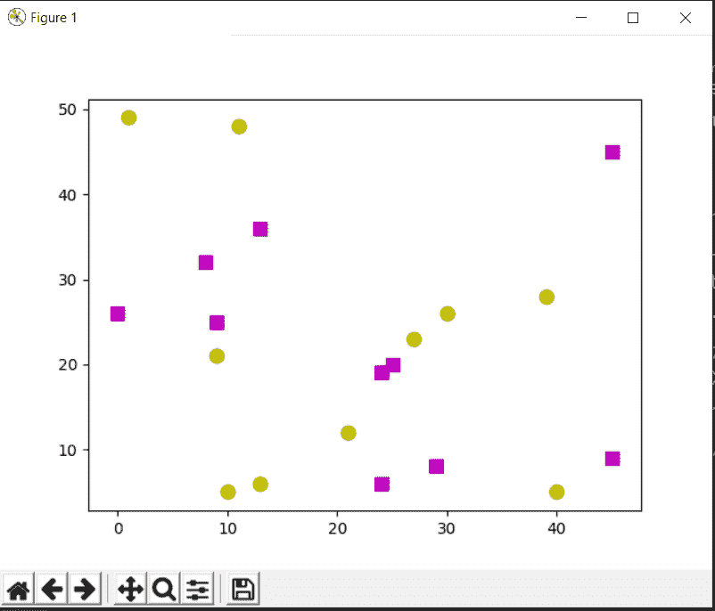

# 使用 OpenCV 实现 KNN

> 原文:[https://www . geesforgeks . org/implementation-of-KNN-using-opencv/](https://www.geeksforgeeks.org/implementation-of-knn-using-opencv/)

KNN 是机器学习中使用最广泛的分类算法之一。要了解更多关于 KNN 算法的信息，请阅读这里的 [KNN 算法](https://www.geeksforgeeks.org/k-nearest-neighbours/)

今天我们将看到如何在 OpenCV 中实现这个算法，以及如何在 2D 平面中可视化结果，显示我们在训练数据中拥有的类的不同特征。

让我们为我们的代码考虑两个类。我们使用随机生成器生成属于 2 类的 20 个随机数据点。培训分*【品红】*班或*【黄色】*班。*洋红色*被画成正方形，而*洋红色*的标签是 1。同样，黄色被画成圆形，标签是 0。

**代码:**

## 蟒蛇 3

```py
# Import necessary libraries
import cv2 as cv
import numpy as np
import matplotlib.pyplot as plt

# Create 20 data points randomly on the 2-D plane.
# Data_points are random points located on the 2D plane.
Data_points = np.random.randint(0, 50, (20, 2)).astype(np.float32)

# Label the data points with their class labels.
labels = np.random.randint(0, 2, (20, 1)).astype(np.float32)
# labels are the classes assigned to data points.

# Take the yellow class for 0 label and magenta class for 1 label
yellow = Data_points[labels.ravel()== 0]
magenta = Data_points[labels.ravel()== 1]

# Plot the classes on the 2-D plane
# o for circle
plt.scatter(yellow[:, 0], yellow[:, 1], 80, 'y', 'o')
# s for square
plt.scatter(magenta[:, 0], magenta[:, 1], 80, 'm', 's')
plt.show()
```

**输出:**



现在考虑一个未知的新数据点，我们的 KNN 分类器将根据其特征和我们定义的邻居数量，将该数据点标记为 0 或 1。

**代码:**

## 蟒蛇 3

```py
# generate a random data point
# unknown is a random data point for which we will perform prediction.
unknown = np.random.randint(0, 50, (1, 2)).astype(np.float32)
# create the knn classifier
knn = cv.ml.KNearest_create()

# we use cv.ml.ROW_SAMPLE to occupy a row of samples from the samples.
knn.train(Data_points, cv.ml.ROW_SAMPLE, labels)
# get the labelled result, the numbers, the distance of each data point.
# find nearest finds the specified number of neighbours and predicts responses.
ret, res, neighbours, distance = knn.findNearest(unknown, 5)

# For each row of samples the method finds the k nearest neighbours.
# For regression problems, the predicted result is a mean of all the neighbours.
# For classification, the class is determined by the majority.

# plot the data point with other data points
plt.scatter(unknown[:, 0], unknown[:, 1], 80, 'g', '^')
# show the result.
plt.show()

# print the results obtained
print( "Label of the unknown data - ", res )
print( "Nearest neighbors -  ", neighbours )
print( "Distance of each neighbor - ", distance )
```

**输出:**

```py
Label of the unknown data -  [[1.]]
Nearest neighbors -   [[1\. 1\. 0\. 1\. 1.]]
Distance of each neighbor -  [[  1\.  65\. 130\. 173\. 245.]]

```

