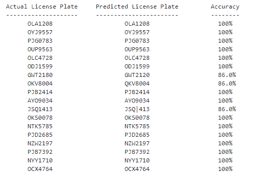
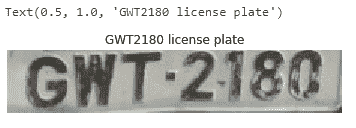

# 利用 OpenCV 和魔方光学字符识别进行车牌识别

> 原文:[https://www . geesforgeks . org/车牌识别-带-opencv-and-tesseract-ocr/](https://www.geeksforgeeks.org/license-plate-recognition-with-opencv-and-tesseract-ocr/)

你将学习自动车牌识别。我们将使用光学字符识别引擎来自动识别车辆牌照中的文本。

**Python-宇宙魔方:**
Py-宇宙魔方是一款针对 Python 的光学字符识别(OCR)工具。也就是说，它会识别并“读取”嵌入图像中的文本。python-宇宙魔方是谷歌宇宙魔方-光学字符识别引擎的包装器。它也作为一个单独的脚本使用，因为它可以读取所有的图像类型，如 jpeg，png，gif，bmp，tiff 等。此外，如果作为脚本使用，Python-宇宙魔方将打印识别出的文本，而不是将其写入文件。它有能力识别 100 多种语言。

**安装:**

```py
pip install pytesseract

```

**OpenCV:**
OpenCV 是一个开源的计算机视觉库。该库有 2500 多种优化算法。这些算法通常用于搜索和识别人脸、识别物体、识别风景以及使用增强现实生成标记来覆盖图像等。

**安装:**

```py
pip install opencv-python

```

**注意:**确保您正确安装了 pytesseract 和 OpenCV-python 模块
**注意:**您应该已经准备好数据集，并且所有图像应该如下图所示在图像处理技术中获得最佳性能；dataset 文件夹应该与您在其中编写这段 python 代码的文件夹在同一个文件夹中，否则您将不得不在任何需要的地方手动指定 dataset 的路径。

**Procedure:**

```py
# Loading the required python modules
import pytesseract # this is tesseract module
import matplotlib.pyplot as plt
import cv2 # this is opencv module
import glob
import os
```

> **注意:**图像文件的名称必须是各自车牌图像中的准确数字。例如:如果你有一个车牌号码为“FTY349U”的，那么将图像文件命名为“FTY349U.jpg”。

**编码:使用镶嵌引擎对车牌进行光学字符识别**

```py
# specify path to the license plate images folder as shown below
path_for_license_plates = os.getcwd() + "/license-plates/**/*.jpg"
list_license_plates = []
predicted_license_plates = []

for path_to_license_plate in glob.glob(path_for_license_plates, recursive = True):

    license_plate_file = path_to_license_plate.split("/")[-1]
    license_plate, _ = os.path.splitext(license_plate_file)
    '''
    Here we append the actual license plate to a list
    '''
    list_license_plates.append(license_plate)

    '''
    Read each license plate image file using openCV
    '''
    img = cv2.imread(path_to_license_plate)

    '''
    We then pass each license plate image file
    to the Tesseract OCR engine using the Python library 
    wrapper for it. We get back predicted_result for 
    license plate. We append the predicted_result in a
    list and compare it with the original the license plate
    '''
    predicted_result = pytesseract.image_to_string(img, lang ='eng',
    config ='--oem 3 --psm 6 -c tessedit_char_whitelist = ABCDEFGHIJKLMNOPQRSTUVWXYZ0123456789')

    filter_predicted_result = "".join(predicted_result.split()).replace(":", "").replace("-", "")
    predicted_license_plates.append(filter_predicted_result)
```

现在我们已经预测了板块，但是我们还没有看到什么是预测，所以为了查看数据和预测，我们做了一些可视化，如下所示。我们也在不使用任何内置函数的情况下计算预测的准确性。

```py
print("Actual License Plate", "\t", "Predicted License Plate", "\t", "Accuracy")
print("--------------------", "\t", "-----------------------", "\t", "--------")

def calculate_predicted_accuracy(actual_list, predicted_list):
    for actual_plate, predict_plate in zip(actual_list, predicted_list):
        accuracy = "0 %"
        num_matches = 0
        if actual_plate == predict_plate:
            accuracy = "100 %"
        else:
            if len(actual_plate) == len(predict_plate):
                for a, p in zip(actual_plate, predict_plate):
                    if a == p:
                        num_matches += 1
                accuracy = str(round((num_matches / len(actual_plate)), 2) * 100)
                accuracy += "%"
        print("     ", actual_plate, "\t\t\t", predict_plate, "\t\t  ", accuracy)

calculate_predicted_accuracy(list_license_plates, predicted_license_plates)
```

**输出:**

<center></center>

We see that the Tesseract OCR engine mostly predicts all of the license plates correctly with 100% accuracy. For the license plates, the Tesseract OCR Engine predicted incorrectly (i.e. GWT2180, OKV8004, JSQ1413), we will apply image processing techniques on those license plate files and pass them to the Tesseract OCR again. Applying the image processing techniques would increase the accuracy of the Tesseract Engine for the license plates of GWT2180, OKV8004, JSQ1413.

**代码:图像处理技术**

```py
# Read the license plate file and display it
test_license_plate = cv2.imread(os.getcwd() + "/license-plates / GWT2180.jpg")
plt.imshow(test_license_plate)
plt.axis('off')
plt.title('GWT2180 license plate')
```

**输出:**

<center></center>

*   **Image resizing:**

    使用 cv2 将图像文件在水平和垂直方向上的大小调整两倍

    ```py
    resize_test_license_plate = cv2.resize(
        test_license_plate, None, fx = 2, fy = 2, 
        interpolation = cv2.INTER_CUBIC)
    ```

*   **转换为灰度:**接下来，我们将调整后的图像文件转换为灰度，以优化检测并大幅减少图像中存在的颜色数量，这将有助于轻松检测车牌。

    ```py
    grayscale_resize_test_license_plate = cv2.cvtColor(
        resize_test_license_plate, cv2.COLOR_BGR2GRAY)
    ```

*   **Denoising the Image:**
    Gaussian Blur is a technique for denoising images. it makes the edges more clearer and smoother which in-turn makes the characters more readable.

    ```py
    gaussian_blur_license_plate = cv2.GaussianBlur(
        grayscale_resize_test_license_plate, (5, 5), 0)
    ```

    现在，将转换后的车牌文件传递给宇宙魔方光学字符识别引擎，并查看预测结果。

    ```py
    new_predicted_result_GWT2180 = pytesseract.image_to_string(gaussian_blur_license_plate, lang ='eng',
    config ='--oem 3 -l eng --psm 6 -c tessedit_char_whitelist = ABCDEFGHIJKLMNOPQRSTUVWXYZ0123456789')
    filter_new_predicted_result_GWT2180 = "".join(new_predicted_result_GWT2180.split()).replace(":", "").replace("-", "")
    print(filter_new_predicted_result_GWT2180)
    ```

    **输出:**

    ```py
    GWT2180 
    ```

    同样，对所有其他没有达到 100%准确率的车牌进行图像处理。最后，车牌检测模型准备就绪。