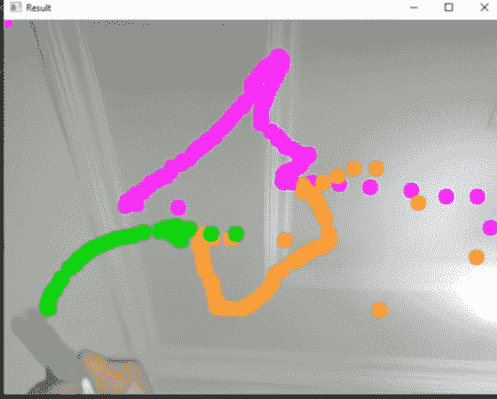

# 使用 OpenCV 的实时网络摄像头绘图

> 原文:[https://www . geesforgeks . org/live-网络摄像头-绘图-使用-opencv/](https://www.geeksforgeeks.org/live-webcam-drawing-using-opencv/)

让我们看看如何使用 OpenCV 绘制网络摄像头捕捉到的对象的运动。我们的程序从网络摄像头获取视频输入，并跟踪我们正在移动的物体。在识别物体后，它将精确地制作轮廓。之后，它会在输出屏幕上打印你所有的绘图。

```py
# importing the modules
import cv2
import numpy as np

# set Width and Height of output Screen
frameWidth = 640
frameHeight = 480

# capturing Video from Webcam
cap = cv2.VideoCapture(0)
cap.set(3, frameWidth)
cap.set(4, frameHeight)

# set brightness, id is 10 and
# value can be changed accordingly
cap.set(10,150)

# object color values
myColors = [[5, 107, 0, 19, 255, 255],
            [133, 56, 0, 159, 156, 255],
            [57, 76, 0, 100, 255, 255],
            [90, 48, 0, 118, 255, 255]]

# color values which will be used to paint
# values needs to be in BGR
myColorValues = [[51, 153, 255],          
                 [255, 0, 255],
                 [0, 255, 0],           
                 [255, 0, 0]]

# [x , y , colorId ] 
myPoints = []  

# function to pick color of object
def findColor(img, myColors, myColorValues):

    # converting the image to HSV format
    imgHSV = cv2.cvtColor(img, cv2.COLOR_BGR2HSV)
    count = 0
    newPoints = []

    # running for loop to work with all colors
    for color in myColors:
        lower = np.array(color[0:3])
        upper = np.array(color[3:6])
        mask = cv2.inRange(imgHSV,lower,upper)
        x, y = getContours(mask)

        # making the circles
        cv2.circle(imgResult, (x,y), 15,
                   myColorValues[count], cv2.FILLED)
        if x != 0 and y != 0:
            newPoints.append([x,y,count])
        count += 1
    return newPoints

# contouyrs function used to improve accuracy of paint
def getContours(img):
    _, contours, hierarchy = cv2.findContours(img, cv2.RETR_EXTERNAL,
                                              cv2.CHAIN_APPROX_NONE)
    x, y, w, h = 0, 0, 0, 0

    # working with contours
    for cnt in contours:
        area = cv2.contourArea(cnt)
        if area > 500:
            peri = cv2.arcLength(cnt, True)
            approx = cv2.approxPolyDP(cnt, 0.02 * peri, True)
            x, y, w, h = cv2.boundingRect(approx)
    return x + w // 2, y

# draws your action on virtual canvas
def drawOnCanvas(myPoints, myColorValues):
    for point in myPoints:
        cv2.circle(imgResult, (point[0], point[1]),
                   10, myColorValues[point[2]], cv2.FILLED)

# running infinite while loop so that
# program keep running untill we close it
while True:
    success, img = cap.read()
    imgResult = img.copy()

    # finding the colors for the points
    newPoints = findColor(img, myColors, myColorValues)
    if len(newPoints)!= 0:
        for newP in newPoints:
            myPoints.append(newP)
    if len(myPoints)!= 0:

        # drawing the points
        drawOnCanvas(myPoints, myColorValues)

    # displaying output on Screen
    cv2.imshow("Result", imgResult)

    # condition to break programs execution
    # press q to stop the execution of program
    if cv2.waitKey(1) and 0xFF == ord('q'): 
        break
```

**输出:**
