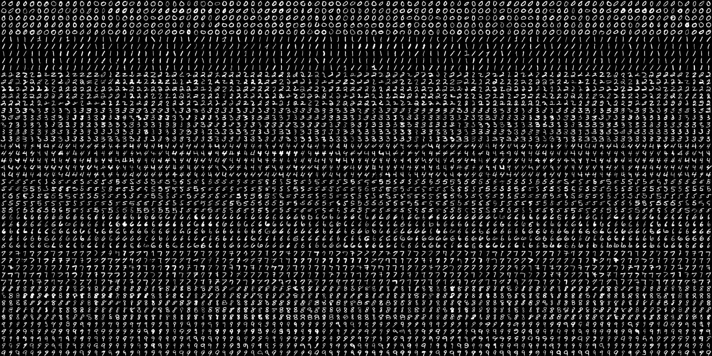

# 手写数字的 OCR | OpenCV

> 原文:[https://www . geesforgeks . org/ocr-of-手写数字-opencv/](https://www.geeksforgeeks.org/ocr-of-handwritten-digits-opencv/)

**OCR** 代表**光学字符识别**是一种计算机视觉技术，用于识别普通数学中使用的不同类型的手写数字。为了在 OpenCV 中执行光学字符识别，我们将使用 KNN 算法，该算法检测特定数据点的最近 k 个邻居，然后根据为 n 个邻居检测到的类别类型对该数据点进行分类。

**使用的数据**



该数据包含 5000 个手写数字，其中每种类型的数字有 500 个数字。每个数字的尺寸为 20×20 像素。我们将对数据进行分割，以便 250 位数字用于训练，250 位数字用于每节课的测试。

下面是实现。

```
import numpy as np
import cv2

# Read the image
image = cv2.imread('digits.png')

# gray scale conversion
gray_img = cv2.cvtColor(image,
                        cv2.COLOR_BGR2GRAY)

# We will divide the image
# into 5000 small dimensions 
# of size 20x20
divisions = list(np.hsplit(i,100) for i in np.vsplit(gray_img,50))

# Convert into Numpy array
# of size (50,100,20,20)
NP_array = np.array(divisions)

# Preparing train_data
# and test_data.
# Size will be (2500,20x20)
train_data = NP_array[:,:50].reshape(-1,400).astype(np.float32)

# Size will be (2500,20x20)
test_data = NP_array[:,50:100].reshape(-1,400).astype(np.float32)

# Create 10 different labels 
# for each type of digit
k = np.arange(10)
train_labels = np.repeat(k,250)[:,np.newaxis]
test_labels = np.repeat(k,250)[:,np.newaxis]

# Initiate kNN classifier
knn = cv2.ml.KNearest_create()

# perform training of data
knn.train(train_data,
          cv2.ml.ROW_SAMPLE, 
          train_labels)

# obtain the output from the
# classifier by specifying the
# number of neighbors.
ret, output ,neighbours,
distance = knn.findNearest(test_data, k = 3)

# Check the performance and
# accuracy of the classifier.
# Compare the output with test_labels
# to find out how many are wrong.
matched = output==test_labels
correct_OP = np.count_nonzero(matched)

#Calculate the accuracy.
accuracy = (correct_OP*100.0)/(output.size)

# Display accuracy.
print(accuracy)
```

**输出**

```
91.64
```