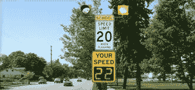

# OpenCV 和 Keras |自动驾驶汽车交通标志分类

> 原文:[https://www . geesforgeks . org/opencv-and-keras-traffic-sign-class-for-auto-driven-car/](https://www.geeksforgeeks.org/opencv-and-keras-traffic-sign-classification-for-self-driving-car/)

**简介**
在这篇文章中，我们将学习如何对日常生活中偶尔在道路上遇到的一些常见交通标志进行分类。在制造自动驾驶汽车时，有必要确保它高度准确地识别交通标志，除非结果可能是灾难性的。在旅行时，你可能会遇到许多交通标志，如限速信号、左转或右转信号、停车信号等。对所有这些进行精确分类可能是一项艰巨的任务，这也是这篇文章将帮助你的地方。



你可以从这个链接获得数据集–[数据](https://bitbucket.org/jadslim/german-traffic-signs/src/master/)。它包含 4 个文件–

*   **sign names . CSV**–它有所有的标签及其描述符。
*   **train . p**–它包含所有训练图像像素强度以及标签。
*   **valid . p**–它包含所有验证图像像素强度以及标签。
*   **test . p**–它包含所有测试图像像素强度以及标签。

以上文件带扩展名。p 被称为 pickle 文件，用于将对象序列化为字符流。稍后可以通过使用 python 中的 pickle 库加载它们来反序列化和重用它们。

让我们用简单易懂的步骤，用 Keras 实现一个**卷积神经网络(CNN)** 。有线电视新闻网由神经网络中的一系列卷积层和汇集层组成，这些层与输入映射以提取特征。卷积层将有许多过滤器，主要用于检测低级特征，如面的边缘。池层进行降维以减少计算。此外，它还通过忽略侧面像素来提取主导特征。要了解更多关于有线电视新闻网的信息，请访问[这个](https://en.wikipedia.org/wiki/Convolutional_neural_network)链接。

**导入库**
我们将需要以下库。在实现以下代码之前，请确保您安装了 **NumPy** 、 **Pandas** 、 **Keras** 、 **Matplotlib** 和 **OpenCV** 。

```py
import numpy as np
import matplotlib.pyplot as plt
import keras
from keras.models import Sequential
from keras.layers import Dense, Dropout, Flatten
from keras.layers.convolutional import Conv2D, MaxPooling2D
from keras.optimizers import Adam
from keras.utils.np_utils import to_categorical
from keras.preprocessing.image import ImageDataGenerator
import pickle
import pandas as pd
import random
import cv2

np.random.seed(0)
```

这里，我们使用 numpy 进行数值计算，pandas 用于导入和管理数据集，Keras 用于用更少的代码快速构建卷积神经网络，cv2 用于执行一些预处理步骤，这些步骤对于 CNN 从图像中高效提取特征是必要的。

**加载数据集**
加载数据的时间。我们将使用 pandas 来加载 signnames.csv，并使用 pickle 来加载火车、验证和测试 pickle 文件。在提取数据之后，使用字典标签“特征”和“标签”将其分割。

```py
# Read data
data = pd.read_csv("german-traffic-signs / signnames.csv")

with open('german-traffic-signs / train.p', 'rb') as f:
    train_data = pickle.load(f)
with open('german-traffic-signs / valid.p', 'rb') as f:
    val_data = pickle.load(f)
with open('german-traffic-signs / test.p', 'rb') as f:
    test_data = pickle.load(f)

# Extracting the labels from the dictionaries
X_train, y_train = train_data['features'], train_data['labels']
X_val, y_val = val_data['features'], val_data['labels']
X_test, y_test = test_data['features'], test_data['labels']

# Printing the shapes
print(X_train.shape)
print(X_val.shape)
print(X_test.shape)
```

**输出:**

```py
(34799, 32, 32, 3)
(4410, 32, 32, 3)
(12630, 32, 32, 3)

```

**使用 OpenCV 对数据进行预处理**
在输入模型之前对图像进行预处理会给出非常准确的结果，因为它有助于提取图像的复杂特征。OpenCV 有一些内置的功能，比如 **cvtColor()** 和**均衡器()**来完成这个任务。按照以下步骤完成此任务–

*   首先，使用 **cvtColor()** 函数将图像转换为灰度图像，以减少计算量。
*   **均衡器 Hist()** 功能通过将像素与其附近的像素归一化来均衡像素的强度，从而增加图像的对比度。
*   最后，我们通过将像素值除以 255 来对 0 和 1 之间的像素值进行归一化。

```py
def preprocessing(img):
    img = cv2.cvtColor(img, cv2.COLOR_BGR2GRAY)
    img = cv2.equalizeHist(img)
    img = img / 255
    return img

X_train = np.array(list(map(preprocessing, X_train)))
X_val = np.array(list(map(preprocessing, X_val)))
X_test = np.array(list(map(preprocessing, X_test)))

X_train = X_train.reshape(34799, 32, 32, 1)
X_val = X_val.reshape(4410, 32, 32, 1)
X_test = X_test.reshape(12630, 32, 32, 1)
```

重塑数组后，是时候将它们输入模型进行训练了。但是为了提高我们的有线电视新闻网模型的准确性，我们将涉及使用图像数据生成器生成增强图像的另一个步骤。

这样做是为了减少训练数据的过度拟合，因为获得更多不同的数据将产生更好的模型。值 0.1 被解释为 10%，而 10 是旋转的度数。我们也像平常一样，将标签转换为分类值。

```py
datagen = ImageDataGenerator(width_shift_range = 0.1, 
                  height_shift_range = 0.1, 
                  zoom_range = 0.2, 
                  shear_range = 0.1, 
                  rotation_range = 10)
datagen.fit(X_train)

y_train = to_categorical(y_train, 43)
y_val = to_categorical(y_val, 43)
y_test = to_categorical(y_test, 43)
```

**建立模型**
由于数据集中有 43 类图像，我们将 num _ classes 设置为 43。该模型包含两个 Conv2D 层，后跟一个 MaxPooling2D 层。为了有效提取要素，这要做两次，然后是密集层。添加了 0.5 的丢失层，以避免数据过拟合。

```py
num_classes = 43

def cnn_model():
    model = Sequential()
    model.add(Conv2D(60, (5, 5), 
                     input_shape =(32, 32, 1), 
                     activation ='relu'))

    model.add(Conv2D(60, (5, 5), activation ='relu'))
    model.add(MaxPooling2D(pool_size =(2, 2)))

    model.add(Conv2D(30, (3, 3), activation ='relu'))
    model.add(Conv2D(30, (3, 3), activation ='relu'))
    model.add(MaxPooling2D(pool_size =(2, 2)))

    model.add(Flatten())
    model.add(Dense(500, activation ='relu'))
    model.add(Dropout(0.5))
    model.add(Dense(num_classes, activation ='softmax'))

    # Compile model
    model.compile(Adam(lr = 0.001), 
                  loss ='categorical_crossentropy', 
                  metrics =['accuracy'])
    return model

model = cnn_model()
history = model.fit_generator(datagen.flow(X_train, y_train, 
                            batch_size = 50), steps_per_epoch = 2000, 
                            epochs = 10, validation_data =(X_val, y_val), 
                            shuffle = 1)
```

```py
Output:
Epoch 1/10
2000/2000 [==============================] - 129s 65ms/step - loss: 0.9130 - acc: 0.7322 - val_loss: 0.0984 - val_acc: 0.9669
Epoch 2/10
2000/2000 [==============================] - 119s 60ms/step - loss: 0.2084 - acc: 0.9352 - val_loss: 0.0609 - val_acc: 0.9803
Epoch 3/10
2000/2000 [==============================] - 116s 58ms/step - loss: 0.1399 - acc: 0.9562 - val_loss: 0.0409 - val_acc: 0.9878
Epoch 4/10
2000/2000 [==============================] - 115s 58ms/step - loss: 0.1066 - acc: 0.9672 - val_loss: 0.0262 - val_acc: 0.9925
Epoch 5/10
2000/2000 [==============================] - 116s 58ms/step - loss: 0.0890 - acc: 0.9726 - val_loss: 0.0268 - val_acc: 0.9925
Epoch 6/10
2000/2000 [==============================] - 115s 58ms/step - loss: 0.0777 - acc: 0.9756 - val_loss: 0.0237 - val_acc: 0.9927
Epoch 7/10
2000/2000 [==============================] - 132s 66ms/step - loss: 0.0700 - acc: 0.9779 - val_loss: 0.0327 - val_acc: 0.9900
Epoch 8/10
2000/2000 [==============================] - 122s 61ms/step - loss: 0.0618 - acc: 0.9812 - val_loss: 0.0267 - val_acc: 0.9914
Epoch 9/10
2000/2000 [==============================] - 115s 57ms/step - loss: 0.0565 - acc: 0.9830 - val_loss: 0.0146 - val_acc: 0.9957
Epoch 10/10
2000/2000 [==============================] - 120s 60ms/step - loss: 0.0577 - acc: 0.9828 - val_loss: 0.0222 - val_acc: 0.9939

```

在成功编译模型，并在列车上拟合和验证数据后，让我们使用 Matplotlib 对其进行评估。

**评估测试**
标绘损失函数。

```py
plt.plot(history.history['loss'])
plt.plot(history.history['val_loss'])
plt.legend(['training', 'validation'])
plt.title('Loss')
plt.xlabel('epoch')
```

 **输出:**

**绘制精度函数。**

```py
plt.plot(history.history['acc'])
plt.plot(history.history['val_acc'])
plt.legend(['training', 'validation'])
plt.title('Accuracy')
plt.xlabel('epoch')
```

**输出:**

如您所见，我们很好地拟合了数据，将训练和验证损失保持在最低水平。是时候评估我们的模型在测试数据上的表现了。

```py
score = model.evaluate(X_test, y_test, verbose = 0)
print('Test Loss: ', score[0])
print('Test Accuracy: ', score[1])
```

**输出:**

```py
Test Loss:  0.16352852963907774
Test Accuracy:  0.9701504354899777

```

让我们通过将测试图像输入模型来检查它。该模型给出了 0 级(限速 20)的预测，这是正确的。

```py
plt.imshow(X_test[990].reshape(32, 32))
print("Predicted sign: "+ str(
        model.predict_classes(X_test[990].reshape(1, 32, 32, 1))))
```

```py
Output:
Predicted sign: [0]

```