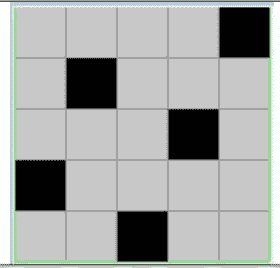
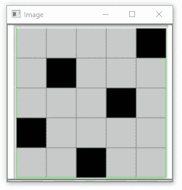

# OpenCV–计算图像中黑白像素的数量

> 原文:[https://www . geesforgeks . org/opencv-计算图像中黑白像素的数量/](https://www.geeksforgeeks.org/opencv-counting-the-number-of-black-and-white-pixels-in-the-image/)

在本文中，我们将讨论使用 OpenCV 和 NumPy 计算图像中黑色像素和白色像素的数量。

**先决条件:**

*   [OpenCV](https://www.geeksforgeeks.org/opencv-python-tutorial/)
*   num py

我们用于演示的图像如下所示:

<center></center>

显示 OpenCV 提供了 *imshow()* 方法来显示我们最近阅读的图像。

#### **计数像素**

NumPy 提供了一个 sum()函数，返回 NumPy 数组中所有数组元素的总和。此 sum()函数可用于根据所需标准计算像素数。

现在，一些像素模式的知识进入了画面。正如我们所知，彩色图像中的每个像素的范围从[0-255]包括所有像素，黑色的像素值为 0，白色的像素值为 255。这给了我们黑色和白色像素分别与其他颜色像素区分的特定固定条件。

这种情况可以在 NumPy 中写成:

> number _ of _ white _ pix = NP . sum(img = = 255)#仅提取白色像素
> 
> number _ of _ black _ pix = NP . sum(img = = 0)#仅提取黑色像素

第一行表示从 cv2 图像对象**“img”**中提取并计数所有像素，其像素值为 255，即白色像素。同样，第二行表示从像素值为 0 的 cv2 图像对象**【img】**中提取并计数所有像素，即黑色像素。

sum()中的条件仅从图像中提取符合该条件的像素，并为它们指定值 True (1)，其余像素被指定为 False (0)。因此，所有真(1)的和给出了满足括号内给定条件的像素的计数。

**代码:Python 实现使用 OpenCV** 统计图像中黑白像素的个数

## 蟒蛇 3

```
# importing libraries
import cv2
import numpy as np

# reading the image data from desired directory
img = cv2.imread("chess5.png")
cv2.imshow('Image',img)

# counting the number of pixels
number_of_white_pix = np.sum(img == 255)
number_of_black_pix = np.sum(img == 0)

print('Number of white pixels:', number_of_white_pix)
print('Number of black pixels:', number_of_black_pix)
```

**输出:**

<center>


要处理的图像


上图中黑白像素的计数

</center>

因此，我们可以从上述结果中推断出，图像可以被处理以借助于它们的颜色代码来检索任何期望颜色的像素，或者根据需要基于任何其他条件来获得像素。

#### 参考文献:

*   [https://numpy . org/doc/stable/reference/generated/numpy . sum . html](https://numpy.org/doc/stable/reference/generated/numpy.sum.html)
*   [https://note . nkmk . me/en/python-num py-count](https://note.nkmk.me/en/python-numpy-count/)