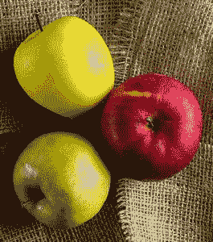
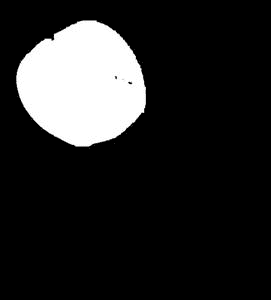
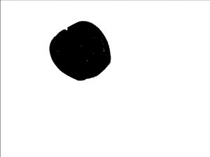
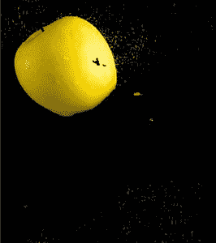
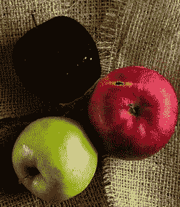

# OpenCV–反转遮罩

> 原文:[https://www.geeksforgeeks.org/opencv-invert-mask/](https://www.geeksforgeeks.org/opencv-invert-mask/)

在本文中，我们将学习如何在 OpenCV 中反转在图像上创建的遮罩。蒙版是一种用于从图像中突出显示特定对象的技术。它可以被定义为将图像的某些像素设置为某个空值，例如 0(黑色)，以便只有图像中像素值不为 0 的部分被突出显示。

反转蒙版基本上反转了整个过程，也就是说，高亮部分的像素变为 0，所有其他像素保持非零。为此，我们对每个像素执行按位“非”运算，以转置(反转)其值。

例如，如果我们考虑一个面具:

```
[ 0 1 0
  0 0 0
  0 1 0 ]
```

现在，为了反转这个掩码，我们对每个值执行按位“非”运算，也就是说，0 变为 1，反之亦然:

```
[ 1 0 1
  1 1 1
  1 0 1 ]
```

要反转 OpenCV 中的遮罩，我们使用 **cv2.bitwise_not()** 函数，该函数对单个像素执行按位 not 运算。

> **语法**:cv2 . bitwise _ not(masked _ image)
> 
> **参数**:
> 
> *   **masked_image:** 是要反转的图像。
> *   **返回值:**返回反转的蒙版图像。

**使用的图像:**



原象

**例 1:** 在这个程序中，我们从读取图像开始。然后我们创建一个“int”数据类型的单位矩阵(5 X 5)的内核。现在，我们将图像转换为 HSV 格式，因为所有操作只能在 HSV 格式下执行。然后我们对图像执行腐蚀、变形和膨胀技术来创建蒙版。现在，为了反转遮罩，我们使用 cv2 库的 bitwise_not 方法来翻转像素值(0 - > 1 和 1 - > 0)。最后，我们显示这个反转的遮罩图像。

## 蟒蛇 3

```
# Python program to explain
# mask inversion on a b/w image.

# importing cv2 and numpy library
import cv2
import numpy as np

# Reading an image
img = cv2.imread('rgy.jpg')

# The kernel to be used for dilation purpose
kernel = np.ones((5, 5), np.uint8)

# converting the image to HSV format
hsv = cv2.cvtColor(img, cv2.COLOR_BGR2HSV)

# defining the lower and upper values of HSV,
# this will detect yellow colour
Lower_hsv = np.array([20, 70, 100])
Upper_hsv = np.array([30, 255, 255])

# creating the mask by eroding,morphing,
# dilating process
Mask = cv2.inRange(hsv, Lower_hsv, Upper_hsv)
Mask = cv2.erode(Mask, kernel, iterations=1)
Mask = cv2.morphologyEx(Mask, cv2.MORPH_OPEN, kernel)
Mask = cv2.dilate(Mask, kernel, iterations=1)

# Inverting the mask by
# performing bitwise-not operation
Mask = cv2.bitwise_not(Mask)

# Displaying the image
cv2.imshow('Mask', Mask)

# waits for user to press any key
# (this is necessary to avoid Python
# kernel form crashing)
cv2.waitKey(0)

# closing all open windows
cv2.destroyAllWindows()
```

**输出:**



在不颠倒掩模的情况下



倒置掩模

**例 2:** 这个程序和上面解释的程序类似。唯一的区别是，我们没有将图像转换为 b/w，而是直接屏蔽黄色苹果，然后使用 bitwise_not 操作反转创建的屏蔽。

## 蟒蛇 3

```
# Python program to explain
# mask inversion on a RGB image.

# importing cv2 and numpy library
import cv2
import numpy as np

# Reading an image
img = cv2.imread('rgy.jpg')

# The kernel to be used for dilation 
# purpose
kernel = np.ones((5, 5), np.uint8)

# converting the image to HSV format
hsv = cv2.cvtColor(img, cv2.COLOR_BGR2HSV)

# defining the lower and upper values
# of HSV, this will detect yellow colour
Lower_hsv = np.array([20, 70, 100])
Upper_hsv = np.array([30, 255, 255])

# creating the mask
Mask = cv2.inRange(hsv, Lower_hsv, Upper_hsv)

# Inverting the mask 
mask_yellow = cv2.bitwise_not(Mask)
Mask = cv2.bitwise_and(img, img, mask = mask_yellow)

# Displaying the image
cv2.imshow('Mask', Mask)

# waits for user to press any key
cv2.waitKey(0)

# closing all open windows
cv2.destroyAllWindows()
```

**输出:**



在不颠倒掩模的情况下



倒置掩模