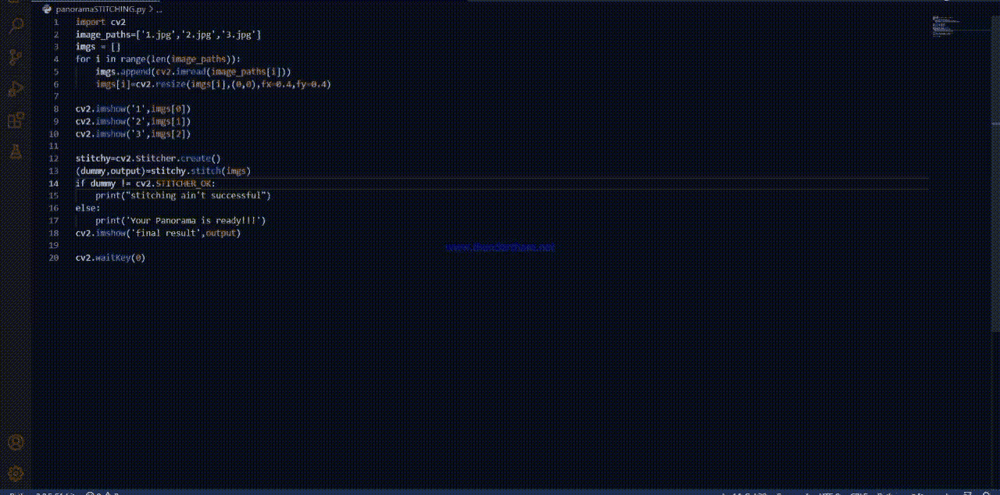

# OpenCV 全景拼接

> 原文:[https://www.geeksforgeeks.org/opencv-panorama-stitching/](https://www.geeksforgeeks.org/opencv-panorama-stitching/)

本文描述了如何使用 OpenCV 和 python“缝合”图像。

全景图基本上是一张水平拉伸的照片，没有失真。

在今天的讨论中，我们将把 3 张图片拼接在一起，创建我们自己的全景图。为了实现这一点，图像之间必须有一些共同的关键点。换句话说，来自连续图像的一小部分必须重叠，否则图像不能缝合在一起。一旦我们准备好了相关的图像，我们就可以简单地使用 OpenCV 模块中属于 Stitcher 类的 stitch()函数。它以一系列图像作为参数，并将它们缝合在一起。该函数返回结果图像和布尔值**真**如果拼接成功，则返回**假。**

根据需要调整输入图像的大小。如果图像太大，缩小比例总是更好的选择。

OpenCV 的拼接算法类似于 Lowe 和 Brown 关于使用不变特征进行自动全景图像拼接的论文。但这里是 opencv 的拼接类的流程图算法。

<center></center>

### **说明:**

全景拼接算法可以分为四个基本步骤。这些步骤如下:

1.  从输入图像中检测关键点(图像上的点)和提取局部不变描述符(SIFT 特征)。
2.  在输入图像之间找到匹配的描述符。
3.  用 RANSAC 算法计算单应矩阵。
4.  然后将单应矩阵应用于图像，以包装和拟合这些图像，并将它们合并成一个图像。

描述符是描述特定关键点周围的局部环境的向量。

关键点是通过计算图像在不同级别的高斯模糊度的差异来找到的。这意味着图像在不同程度上被高斯模糊化，从轻微模糊到更模糊等等。然后，这些图像被彼此相减，导致具有不同高斯模糊级别的图像的差异。合成的图像相互叠加，寻找局部不同的极值点，即关键点。

描述符是通过查看关键点的邻域，将局部邻域分解成小区域，然后计算这些小区域中的梯度来计算的。这些梯度以直方图的形式收集。基本上，这些梯度出现的频率和它们的幅度被转化为小的局部区域的直方图。最后，连接从直方图计算的所有值将产生描述符向量。这整体上被称为 SIFT 特征，它只不过是一种计算关键点和描述符的方法。

来到单应矩阵，它将一个图像的对应点映射到另一个图像。这对于创建全景图至关重要。有必要计算两幅图像的单应性，因为它有助于将一幅图像包裹到另一幅图像上，这对于创建全景图很有用。RANSAC 算法有助于计算这个单应矩阵。

实际的缝合是由。stitcher 类的函数或方法。它实现了上述步骤。这个功能是 OpenCV 最新版本自带的。函数接受图像列表作为参数。它返回一个元组(状态，输出)，其中状态是一个布尔值，当拼接成功时为真，否则为假。输出是合成的全景图。

### **实施:**

## 蟒蛇 3

```py
import cv2
image_paths=['1.jpg','2.jpg','3.jpg']
# initialized a list of images
imgs = []

for i in range(len(image_paths)):
    imgs.append(cv2.imread(image_paths[i]))
    imgs[i]=cv2.resize(imgs[i],(0,0),fx=0.4,fy=0.4)
    # this is optional if your input images isn't too large
    # you don't need to scale down the image
    # in my case the input images are of dimensions 3000x1200
    # and due to this the resultant image won't fit the screen
    # scaling down the images 
# showing the original pictures
cv2.imshow('1',imgs[0])
cv2.imshow('2',imgs[1])
cv2.imshow('3',imgs[2])

stitchy=cv2.Stitcher.create()
(dummy,output)=stitchy.stitch(imgs)

if dummy != cv2.STITCHER_OK:
  # checking if the stitching procedure is sucessful
  # .stitch() function returns a true value if stitching is 
  # done successfully
    print("stitching ain't successful")
else: 
    print('Your Panorama is ready!!!')

# final output
cv2.imshow('final result',output)

cv2.waitKey(0)
```

### **输出:**

