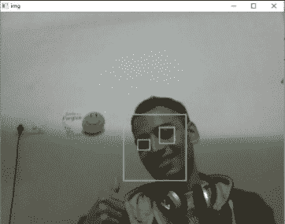

# 用于人脸检测的 Opencv Python 程序

> 原文:[https://www . geesforgeks . org/opencv-python-program-face-detection/](https://www.geeksforgeeks.org/opencv-python-program-face-detection/)

给定程序的目标是实时检测感兴趣的对象(面部)，并保持对同一对象的跟踪。这是一个如何在 Python 中检测人脸的简单例子。您可以尝试使用您选择的任何其他对象的训练样本，通过在所需对象上训练分类器来进行检测。

下面是下载需求的步骤。

**步骤:**

1.  下载 Python 2.7.x 版本、numpy 和 Opencv 2.7.x 版本。检查您的 Windows 位或 64 位是否兼容，并相应地安装。
2.  确保 numpy 在 python 中运行，然后尝试安装 opencv。
3.  将 haarcscade _ eye . XML & haarcscade _ frontal face _ default . XML 文件放在同一个文件夹中(下面代码中给出了链接)。

**实施
T2】**

```
# OpenCV program to detect face in real time
# import libraries of python OpenCV 
# where its functionality resides
import cv2 

# load the required trained XML classifiers
# https://github.com/Itseez/opencv/blob/master/
# data/haarcascades/haarcascade_frontalface_default.xml
# Trained XML classifiers describes some features of some
# object we want to detect a cascade function is trained
# from a lot of positive(faces) and negative(non-faces)
# images.
face_cascade = cv2.CascadeClassifier('haarcascade_frontalface_default.xml')

# https://github.com/Itseez/opencv/blob/master
# /data/haarcascades/haarcascade_eye.xml
# Trained XML file for detecting eyes
eye_cascade = cv2.CascadeClassifier('haarcascade_eye.xml') 

# capture frames from a camera
cap = cv2.VideoCapture(0)

# loop runs if capturing has been initialized.
while 1: 

    # reads frames from a camera
    ret, img = cap.read() 

    # convert to gray scale of each frames
    gray = cv2.cvtColor(img, cv2.COLOR_BGR2GRAY)

    # Detects faces of different sizes in the input image
    faces = face_cascade.detectMultiScale(gray, 1.3, 5)

    for (x,y,w,h) in faces:
        # To draw a rectangle in a face 
        cv2.rectangle(img,(x,y),(x+w,y+h),(255,255,0),2) 
        roi_gray = gray[y:y+h, x:x+w]
        roi_color = img[y:y+h, x:x+w]

        # Detects eyes of different sizes in the input image
        eyes = eye_cascade.detectMultiScale(roi_gray) 

        #To draw a rectangle in eyes
        for (ex,ey,ew,eh) in eyes:
            cv2.rectangle(roi_color,(ex,ey),(ex+ew,ey+eh),(0,127,255),2)

    # Display an image in a window
    cv2.imshow('img',img)

    # Wait for Esc key to stop
    k = cv2.waitKey(30) & 0xff
    if k == 27:
        break

# Close the window
cap.release()

# De-allocate any associated memory usage
cv2.destroyAllWindows() 
```

输出:

[](https://media.geeksforgeeks.org/wp-content/uploads/output1.jpg)

 **下一篇:** [用于人脸检测的 Opencv C++程序](https://www.geeksforgeeks.org/opencv-c-program-face-detection/)

参考文献:

*   [https://www.youtube.com/v=WfdYYNamHZ8](https://www.youtube.com/v=WfdYYNamHZ8)
*   [http://docs . opencv . org/2.4/modules/objdetect/doc/cascade _ classification . html？highlight = cascadeculator # cascadeculator](http://docs.opencv.org/2.4/modules/objdetect/doc/cascade_classification.html?highlight=cascadeclassifier#cascadeclassifier)
*   [http://www . multimedia-computing . de/mediawiki//images/5/52/MRL-TR-may 02-修订本-Dec02.pdf](http://www.multimedia-computing.de/mediawiki//images/5/52/MRL-TR-May02-revised-Dec02.pdf)

本文由**阿夫扎尔·安萨里**供稿。如果你喜欢 GeeksforGeeks 并想投稿，你也可以使用[contribute.geeksforgeeks.org](http://www.contribute.geeksforgeeks.org)写一篇文章或者把你的文章邮寄到 contribute@geeksforgeeks.org。看到你的文章出现在极客博客主页上，帮助其他极客。

如果你发现任何不正确的地方，或者你想分享更多关于上面讨论的话题的信息，请写评论。