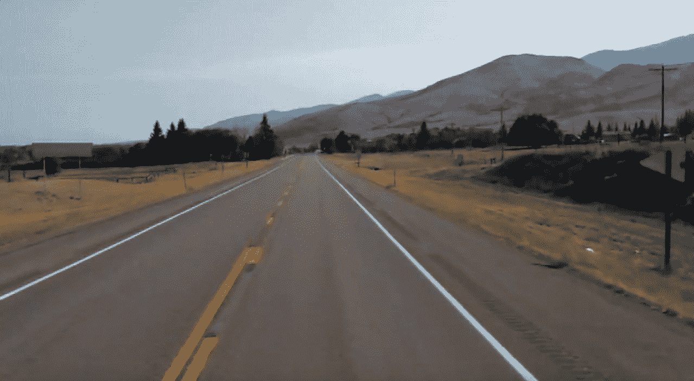
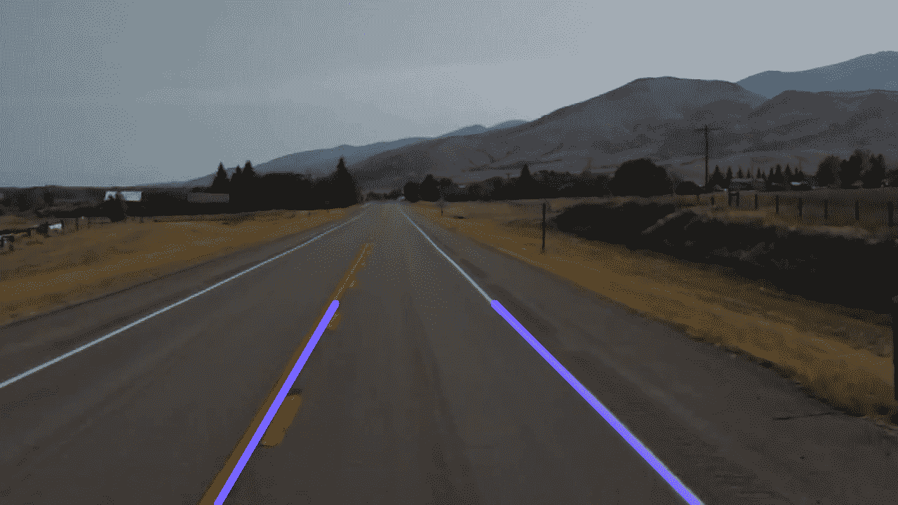

# OpenCV |实时道路车道检测

> 原文:[https://www . geesforgeks . org/opencv-实时-道路-车道-检测/](https://www.geeksforgeeks.org/opencv-real-time-road-lane-detection/)

**简介**

自动驾驶汽车是人工智能领域最具颠覆性的创新之一。在深度学习算法的推动下，它们不断推动我们的社会向前发展，并在移动领域创造新的机会。自动驾驶汽车可以去传统汽车能去的任何地方，做有经验的人类司机所做的一切。但是对它进行适当的训练是非常必要的。在自动驾驶汽车的培训过程中，涉及的许多步骤之一是车道检测，这是初步步骤。今天，我们将学习如何使用视频进行车道检测。

**车道检测涉及以下步骤:**


*   **捕获和解码视频文件:**我们将使用 VideoCapture 对象捕获视频，并且在捕获被初始化之后，每个视频帧都被解码(即转换为图像序列)。
*   **图像灰度转换:**视频帧为 RGB 格式，RGB 转换为灰度是因为处理单通道图像比处理三通道彩色图像快。
*   **降低噪声:**噪声会产生伪边缘，因此在进一步之前，必须进行图像平滑。高斯滤波器用于执行这一过程。
*   **Canny 边缘检测器:**它计算我们的模糊图像的所有方向的梯度，并跟踪密度变化较大的边缘。更多解释请浏览本文: [Canny 边缘检测器](https://www.geeksforgeeks.org/real-time-edge-detection-using-opencv-python/)
*   **感兴趣区域:**该步骤仅考虑道路车道覆盖的区域。这里创建了一个遮罩，它与我们的道路图像具有相同的维度。此外，在我们的 canny 图像的每个像素和这个掩模之间执行逐位“与”运算。它最终屏蔽了 canny 图像，并显示了由掩模的多边形轮廓跟踪的感兴趣区域。
*   **霍夫线变换:**霍夫线变换是用于检测直线的变换。这里使用了概率霍夫线变换，它给出了作为检测到的线的极值的输出

**数据集:**数据集由一条道路的视频文件组成。
你可以从这个 GitHub 链接下载数据集–[数据集](https://github.com/rslim087a/road-video)

**现在开始执行流程:**

*   默认情况下，它附带蟒蛇皮*   Matplotlib:要安装 matplotlib，请在命令行中键入–“pip 安装 matplotlib”*   OpenCV: It can be installed in two ways, using anaconda or using pip.
    To install using anaconda, type- “conda install -c conda-forge opencv”, or to install using pip, type-
    “pip install opencv-python” into your command line

    ```
    # Import the required libraries
    import cv2
    import numpy as np
    import matplotlib.pyplot as plt
    ```

    canny 函数计算 x 和 y 两个方向的导数，根据它，我们可以看到强度值的变化。较大的导数等于高强度(剧烈变化)，较小的导数等于低强度(轻微变化):

    ```
    def canny_edge_detector(image):

        # Convert the image color to grayscale
        gray_image = cv2.cvtColor(image, cv2.COLOR_RGB2GRAY) 

        # Reduce noise from the image
        blur = cv2.GaussianBlur(gray_image, (5, 5), 0) 
        canny = cv2.Canny(blur, 50, 150)
        return canny
    ```

    找到感兴趣的区域后，隐藏我们的精明形象:

    ```
    def region_of_interest(image):
        height = image.shape[0]
        polygons = np.array([
            [(200, height), (1100, height), (550, 250)]
            ])
        mask = np.zeros_like(image)

        # Fill poly-function deals with multiple polygon
        cv2.fillPoly(mask, polygons, 255) 

        # Bitwise operation between canny image and mask image
        masked_image = cv2.bitwise_and(image, mask) 
        return masked_image
    ```

    我们将找到我们道路车道的坐标:

    ```
    def create_coordinates(image, line_parameters):
        slope, intercept = line_parameters
        y1 = image.shape[0]
        y2 = int(y1 * (3 / 5))
        x1 = int((y1 - intercept) / slope)
        x2 = int((y2 - intercept) / slope)
        return np.array([x1, y1, x2, y2])
    ```

    分别借助于正斜率和负斜率来区分左车道和右车道，并将它们附加到列表中，如果斜率是负的，则道路车道属于车辆的左侧，如果斜率是正的，则道路车道属于车辆的右侧:

    ```
    def average_slope_intercept(image, lines):
        left_fit = []
        right_fit = []
        for line in lines:
            x1, y1, x2, y2 = line.reshape(4)

            # It will fit the polynomial and the intercept and slope
            parameters = np.polyfit((x1, x2), (y1, y2), 1) 
            slope = parameters[0]
            intercept = parameters[1]
            if slope < 0:
                left_fit.append((slope, intercept))
            else:
                right_fit.append((slope, intercept))

        left_fit_average = np.average(left_fit, axis = 0)
        right_fit_average = np.average(right_fit, axis = 0)
        left_line = create_coordinates(image, left_fit_average)
        right_line = create_coordinates(image, right_fit_average)
        return np.array([left_line, right_line])
    ```

    将坐标拟合到我们的实际图像中，然后返回带有检测到的线的图像(带有检测到的车道的道路):

    ```
    def display_lines(image, lines):
        line_image = np.zeros_like(image)
        if lines is not None:
            for x1, y1, x2, y2 in lines:
                cv2.line(line_image, (x1, y1), (x2, y2), (255, 0, 0), 10)
        return line_image
    ```

    首先，视频文件被读取并解码成帧，并使用霍夫线方法检测穿过图像的直线。然后我们调用所有的函数。

    ```
    # Path of dataset directory
    cap = cv2.VideoCapture("datasets\test2.mp4") 
    while(cap.isOpened()):
        _, frame = cap.read()
        canny_image = canny_edge_detector(frame)
        cropped_image = region_of_interest(canny_image)

        lines = cv2.HoughLinesP(cropped_image, 2, np.pi / 180, 100, 
                                np.array([]), minLineLength = 40, 
                                maxLineGap = 5) 

        averaged_lines = average_slope_intercept(frame, lines) 
        line_image = display_lines(frame, averaged_lines)
        combo_image = cv2.addWeighted(frame, 0.8, line_image, 1, 1) 
        cv2.imshow("results", combo_image)

        # When the below two will be true and will press the 'q' on
        # our keyboard, we will break out from the loop

        # # wait 0 will wait for infinitely between each frames. 
        # 1ms will wait for the specified time only between each frames
        if cv2.waitKey(1) & 0xFF == ord('q'):      
            break

    # close the video file
    cap.release() 

    # destroy all the windows that is currently on
    cv2.destroyAllWindows() 
    ```

    **输入:**
    

    **输出:**
    

    请浏览此链接并下载输出视频，以便更清晰地可视化–[输出](https://github.com/dolly8/Temp)