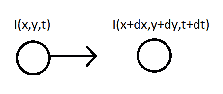
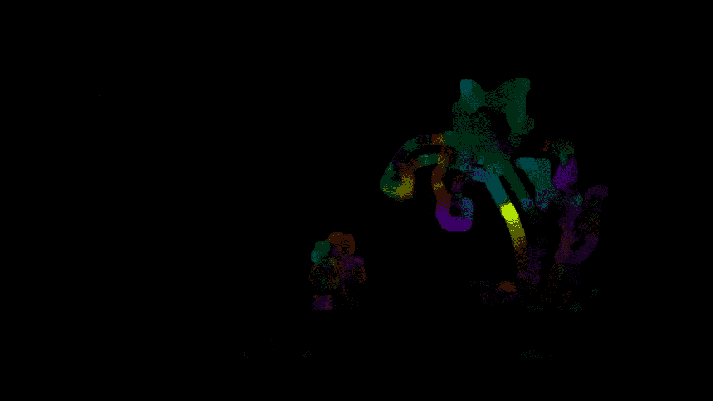

# Opencv–古纳尔-法内克光流

> 原文:[https://www . geesforgeks . org/opencv-the-Gunnar-farneback-optical-flow/](https://www.geeksforgeeks.org/opencv-the-gunnar-farneback-optical-flow/)

在本文中，我们将通过 Gunnar FarneBack 技术了解密集光流，它发表在 Gunnar FarneBack 2003 年的一篇名为“基于多项式展开的两帧运动估计”的研究论文中。
**先决条件:** OpenCV
**光流:**
光流被称为物体表观运动的模式，即它是序列中每两个连续帧之间物体的运动，这是由被捕捉物体的运动或捕捉它的摄像机引起的。考虑一个强度为 *I (x，y，t)* 的物体，在时间 *dt* 之后，它移动到由 *dx* 和 *dy* 组成，现在，新的强度将是， *I (x+dx，y+dy，t+dt)* 。



我们，假设两帧之间的像素强度是恒定的，即，
*I (x，y，t) = I (x+dx，y+dy，t+dt)*
泰勒近似是在 RHS 侧完成的，结果是，


除以 *δt* ，得到**光流方程**，即


其中， *u = dx/dt* 和 *v = dy/dt* 。
同样， *dI/dx* 是沿横轴的图像梯度， *dI/dy* 是沿纵轴的图像梯度，dI/dt 是沿时间。
既然，我们只有一个方程来求两个未知数，我们就用不同的方法来求解，

*   [稀疏光流(卢卡斯·卡纳德法)](https://www.geeksforgeeks.org/python-opencv-optical-flow-with-lucas-kanade-method/)
*   密集光流(古纳尔·法内克方法)

**Gunnar Farneback 光流**
在密集光流中，我们观察所有的点(与 Lucas Kanade 不同，Lucas Kanade 只对 [Shi-Tomasi 算法](https://www.geeksforgeeks.org/python-corner-detection-with-shi-tomasi-corner-detection-method-using-opencv/)检测到的角点起作用)，并检测两帧之间的像素强度变化，在转换为 hsv 格式以获得清晰的可见性后，产生具有高亮像素的图像。
它根据一组流动矢量计算光流的大小和方向，即 *(dx/dt，dy/dt)* 。随后，它通过色调可视化流动的角度(方向)，通过 HSV 颜色表示值可视化流动的距离(幅度)。为了使能见度达到最佳，高速公路的强度设置为 255。OpenCV 提供了一个功能**cv2 . calcopticalflowfarneback**来观察密集的光流。
**语法:**

```
 cv2.calcOpticalFlowFarneback(prev, next, pyr_scale, levels, winsize, iterations, poly_n, poly_sigma, flags[, flow])
```

**参数:**

*   **prev:**8 位单通道格式的第一幅输入图像。
*   **下一个:**与*上一个*相同类型和大小的第二个输入图像。
*   **pyr_scale :** 参数，指定为每个图像构建金字塔的图像比例(比例< 1)。一个经典的金字塔一般是 0.5 的比例，每增加一层，它就会减少一半。
*   **关卡:** *关卡=1* 表示，没有多余的图层(只有初始图像)。它是包含第一个图像的金字塔层数。
*   **winsize :** 是平均窗口大小，大小越大，算法对噪声的鲁棒性越强，提供快速的运动检测，虽然给出的是模糊的运动场。
*   **迭代次数:**在每个金字塔级别要执行的迭代次数。
*   **poly_n :** 一般是 5 或者 7，是像素邻域的大小，用来寻找像素之间的多项式展开。
*   **poly_sigma :** 高斯的标准差，即导数要平滑作为多项式展开的基础。 *poly= 5* 可以是 1.1， *poly* 可以是 1.5 = 7。
*   **流量:**计算出的流量图像，其大小与*上一个*相似，类型为 CV_32FC2。
*   **标志:**可以是-
    OPTFLOW_USE_INITIAL_FLOW 使用输入流作为初始近似的组合。
    optlow _ FARNEBACK _ GAUSSIAN 使用高斯 *winsize*winsize* 滤镜。

**代码:**

## 蟒蛇 3

```
# Importing libraries
import cv2
import numpy as np
# Capturing the video file 0 for videocam else you can provide the url
capture = cv2.VideoCapture("video_file.avi")

# Reading the first frame
_, frame1 = capture.read()
# Convert to gray scale
prvs = cv2.cvtColor(frame1, cv2.COLOR_BGR2GRAY)
# Create mask
hsv_mask = np.zeros_like(frame1)
# Make image saturation to a maximum value
hsv_mask[..., 1] = 255

# Till you scan the video
while(1):

    # Capture another frame and convert to gray scale
    _, frame2 = capture.read()
    next = cv2.cvtColor(frame2, cv2.COLOR_BGR2GRAY)

    # Optical flow is now calculated
    flow = cv2.calcOpticalFlowFarneback(prvs, next, None, 0.5, 3, 15, 3, 5, 1.2, 0)
    # Compute magnite and angle of 2D vector
    mag, ang = cv2.cartToPolar(flow[..., 0], flow[..., 1])
    # Set image hue value according to the angle of optical flow
    hsv_mask[..., 0] = ang * 180 / np.pi / 2
    # Set value as per the normalized magnitude of optical flow
    hsv_mask[..., 2] = cv2.normalize(mag, None, 0, 255, cv2.NORM_MINMAX)
    # Convert to rgb
    rgb_representation = cv2.cvtColor(hsv_mask, cv2.COLOR_HSV2BGR)

    cv2.imshow('frame2', rgb_representation)
    kk = cv2.waitKey(20) & 0xff
    # Press 'e' to exit the video
    if kk == ord('e'):
        break
    # Press 's' to save the video
    elif kk == ord('s'):
        cv2.imwrite('Optical_image.png', frame2)
        cv2.imwrite('HSV_converted_image.png', rgb_representation)
    prvs = next

capture.release()
cv2.destroyAllWindows()
```

**输入**


**输出:**



*   https://docs.opencv.org/2.4/modules/video/doc/motion_analysis_and_object_tracking.html