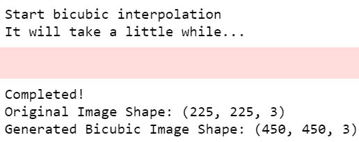

# Python OpenCV–用于调整图像大小的双三次插值

> 原文:[https://www . geesforgeks . org/python-opencv-bicubic-插值-调整大小-image/](https://www.geeksforgeeks.org/python-opencv-bicubic-interpolation-for-resizing-image/)

图像大小调整是一个重要的概念，希望增加或减少图片中的像素数量。图像尺寸调整的应用可以出现在更广泛的场景中:图像的音译、镜头失真的校正、视角的改变和图片的旋转。根据使用的插值算法，调整大小的结果有很大的不同。

**注意:**在应用插值算法时，某些信息肯定会丢失，因为这些是近似算法。

## 什么是插值？

插值通过使用已知数据来估计未知点的值。例如:如果您想了解网格中选定位置的图片像素强度(比如坐标(x，y)，但是只有(x-1，y-1)和(x+1，y+1)是已知的，那么您将使用线性插值来估计(x，y)处的值。已知值的数量越多，估计像素值的精度就越高。

## 插值算法

不同的插值算法包括**最近邻、**T2 双线性、**双三次**等。打赌他们的复杂性，这些使用从 0 到 256(或更多)相邻像素时插值。在评估新像素值时，通过增加考虑的相邻像素的数量，这些算法的精度显著提高。插值算法主要用于将高分辨率图像调整大小和变形为偶尔出现的分辨率图像。有各种各样的插值算法，其中之一是双三次插值。

## 双三次插值

除了已知像素值的 2×2 邻域之外，双三次多项式还考虑了已知像素的最接近的 4×4 邻域——总共 16 个像素，这比双线性多项式更进一步。与更远的像素相比，更靠近待估计像素的像素被赋予更高的权重。因此，最远的像素具有最小的权重。双三次插值的结果比神经网络或双线性算法好得多。这可能是因为在估计期望值时考虑了更多的已知像素值。因此，它成为所有最重要的标准插值方法之一。

### 用 Python 实现双三次插值

**导入必要的模块:**我们导入所有的依赖项，比如 cv2 (OpenCV)、NumPy 和 math。

## 计算机编程语言

```py
# Import modules
import cv2
import numpy as np
import math
import sys, time
```

**编写双三次插值的插值核函数:**双三次插值核的形式为:


核方程

这里，系数 a 的值决定了内核的性能，为了获得最佳性能，它通常位于-0.5 到-0.75 之间。

## 计算机编程语言

```py
# Interpolation kernel
def u(s, a):

    if (abs(s) >= 0) & (abs(s) <= 1):
        return (a+2)*(abs(s)**3)-(a+3)*(abs(s)**2)+1

    elif (abs(s) > 1) & (abs(s) <= 2):
        return a*(abs(s)**3)-(5*a)*(abs(s)**2)+(8*a)*abs(s)-4*a
    return 0
```

**为输入图像添加填充:**定义填充功能，为图像添加边框。OpenCV 有各种填充功能。当插值需要填充源时，源图像的边界需要扩展，因为它需要有信息，以便可以计算沿着边界的所有目标像素的像素值。

## 计算机编程语言

```py
# Padding
def padding(img, H, W, C):
    zimg = np.zeros((H+4, W+4, C))
    zimg[2:H+2, 2:W+2, :C] = img

    # Pad the first/last two col and row
    zimg[2:H+2, 0:2, :C] = img[:, 0:1, :C]
    zimg[H+2:H+4, 2:W+2, :] = img[H-1:H, :, :]
    zimg[2:H+2, W+2:W+4, :] = img[:, W-1:W, :]
    zimg[0:2, 2:W+2, :C] = img[0:1, :, :C]

    # Pad the missing eight points
    zimg[0:2, 0:2, :C] = img[0, 0, :C]
    zimg[H+2:H+4, 0:2, :C] = img[H-1, 0, :C]
    zimg[H+2:H+4, W+2:W+4, :C] = img[H-1, W-1, :C]
    zimg[0:2, W+2:W+4, :C] = img[0, W-1, :C]

    return zimg
```

**编写双三次插值函数:**定义双三次函数，将图像作为输入传递。(您可以根据需要将比例因子更改为 x2 或 x4。)

## 计算机编程语言

```py
# Bicubic operation
def bicubic(img, ratio, a):

    # Get image size
    H, W, C = img.shape

    # Here H = Height, W = weight,
    # C = Number of channels if the
    # image is coloured.
    img = padding(img, H, W, C)

    # Create new image
    dH = math.floor(H*ratio)
    dW = math.floor(W*ratio)

    # Converting into matrix
    dst = np.zeros((dH, dW, 3))

    # np.zeroes generates a matrix
    # consisting only of zeroes
    # Here we initialize our answer
    # (dst) as zero

    h = 1/ratio

    print('Start bicubic interpolation')
    print('It will take a little while...')
    inc = 0

    for c in range(C):
        for j in range(dH):
            for i in range(dW):

                # Getting the coordinates of the
                # nearby values
                x, y = i * h + 2, j * h + 2

                x1 = 1 + x - math.floor(x)
                x2 = x - math.floor(x)
                x3 = math.floor(x) + 1 - x
                x4 = math.floor(x) + 2 - x

                y1 = 1 + y - math.floor(y)
                y2 = y - math.floor(y)
                y3 = math.floor(y) + 1 - y
                y4 = math.floor(y) + 2 - y

                # Considering all nearby 16 values
                mat_l = np.matrix([[u(x1, a), u(x2, a), u(x3, a), u(x4, a)]])
                mat_m = np.matrix([[img[int(y-y1), int(x-x1), c],
                                    img[int(y-y2), int(x-x1), c],
                                    img[int(y+y3), int(x-x1), c],
                                    img[int(y+y4), int(x-x1), c]],
                                   [img[int(y-y1), int(x-x2), c],
                                    img[int(y-y2), int(x-x2), c],
                                    img[int(y+y3), int(x-x2), c],
                                    img[int(y+y4), int(x-x2), c]],
                                   [img[int(y-y1), int(x+x3), c],
                                    img[int(y-y2), int(x+x3), c],
                                    img[int(y+y3), int(x+x3), c],
                                    img[int(y+y4), int(x+x3), c]],
                                   [img[int(y-y1), int(x+x4), c],
                                    img[int(y-y2), int(x+x4), c],
                                    img[int(y+y3), int(x+x4), c],
                                    img[int(y+y4), int(x+x4), c]]])
                mat_r = np.matrix(
                    [[u(y1, a)], [u(y2, a)], [u(y3, a)], [u(y4, a)]])

                # Here the dot function is used to get the dot 
                # product of 2 matrices
                dst[j, i, c] = np.dot(np.dot(mat_l, mat_m), mat_r)

    # If there is an error message, it
    # directly goes to stderr
    sys.stderr.write('\n')

    # Flushing the buffer
    sys.stderr.flush()
    return dst
```

**从用户处获取输入，并将输入传递给双三次函数，以生成调整大小的图像:**将所需图像传递给双三次函数，并将输出保存为目录中的单独文件。

## 蟒蛇 3

```py
# Read image
# You can put your input image over here 
# to run bicubic interpolation
# The read function of Open CV is used 
# for this task
img = cv2.imread('gfg.png')

# Scale factor
ratio = 2

# Coefficient
a = -1/2

# Passing the input image in the 
# bicubic function
dst = bicubic(img, ratio, a)  
print('Completed!')

# Saving the output image
cv2.imwrite('bicubic.png', dst) 
bicubicImg=cv2.imread('bicubic.png')
```

**将生成的图像与输入图像进行比较:**使用 shape()方法比较两个图像的高度、宽度和颜色模式。

## 蟒蛇 3

```py
# display shapes of both images
print('Original Image Shape:',img.shape)
print('Generated Bicubic Image Shape:',bicubicImg.shape)
```

**完整代码:**

**输入图像:**


gfg.png

## 蟒蛇 3

```py
# import modules
import cv2
import numpy as np
import math
import sys
import time

# Interpolation kernel
def u(s, a):
    if (abs(s) >= 0) & (abs(s) <= 1):
        return (a+2)*(abs(s)**3)-(a+3)*(abs(s)**2)+1
    elif (abs(s) > 1) & (abs(s) <= 2):
        return a*(abs(s)**3)-(5*a)*(abs(s)**2)+(8*a)*abs(s)-4*a
    return 0

# Padding
def padding(img, H, W, C):
    zimg = np.zeros((H+4, W+4, C))
    zimg[2:H+2, 2:W+2, :C] = img

    # Pad the first/last two col and row
    zimg[2:H+2, 0:2, :C] = img[:, 0:1, :C]
    zimg[H+2:H+4, 2:W+2, :] = img[H-1:H, :, :]
    zimg[2:H+2, W+2:W+4, :] = img[:, W-1:W, :]
    zimg[0:2, 2:W+2, :C] = img[0:1, :, :C]

    # Pad the missing eight points
    zimg[0:2, 0:2, :C] = img[0, 0, :C]
    zimg[H+2:H+4, 0:2, :C] = img[H-1, 0, :C]
    zimg[H+2:H+4, W+2:W+4, :C] = img[H-1, W-1, :C]
    zimg[0:2, W+2:W+4, :C] = img[0, W-1, :C]
    return zimg

# Bicubic operation
def bicubic(img, ratio, a):

    # Get image size
    H, W, C = img.shape

    # Here H = Height, W = weight,
    # C = Number of channels if the 
    # image is coloured.
    img = padding(img, H, W, C)

    # Create new image
    dH = math.floor(H*ratio)
    dW = math.floor(W*ratio)

    # Converting into matrix
    dst = np.zeros((dH, dW, 3))  
    # np.zeroes generates a matrix 
    # consisting only of zeroes
    # Here we initialize our answer 
    # (dst) as zero

    h = 1/ratio

    print('Start bicubic interpolation')
    print('It will take a little while...')
    inc = 0

    for c in range(C):
        for j in range(dH):
            for i in range(dW):

                # Getting the coordinates of the
                # nearby values
                x, y = i * h + 2, j * h + 2

                x1 = 1 + x - math.floor(x)
                x2 = x - math.floor(x)
                x3 = math.floor(x) + 1 - x
                x4 = math.floor(x) + 2 - x

                y1 = 1 + y - math.floor(y)
                y2 = y - math.floor(y)
                y3 = math.floor(y) + 1 - y
                y4 = math.floor(y) + 2 - y

                # Considering all nearby 16 values
                mat_l = np.matrix([[u(x1, a), u(x2, a), u(x3, a), u(x4, a)]])
                mat_m = np.matrix([[img[int(y-y1), int(x-x1), c],
                                    img[int(y-y2), int(x-x1), c],
                                    img[int(y+y3), int(x-x1), c],
                                    img[int(y+y4), int(x-x1), c]],
                                   [img[int(y-y1), int(x-x2), c],
                                    img[int(y-y2), int(x-x2), c],
                                    img[int(y+y3), int(x-x2), c],
                                    img[int(y+y4), int(x-x2), c]],
                                   [img[int(y-y1), int(x+x3), c],
                                    img[int(y-y2), int(x+x3), c],
                                    img[int(y+y3), int(x+x3), c],
                                    img[int(y+y4), int(x+x3), c]],
                                   [img[int(y-y1), int(x+x4), c],
                                    img[int(y-y2), int(x+x4), c],
                                    img[int(y+y3), int(x+x4), c],
                                    img[int(y+y4), int(x+x4), c]]])
                mat_r = np.matrix(
                    [[u(y1, a)], [u(y2, a)], [u(y3, a)], [u(y4, a)]])

                # Here the dot function is used to get 
                # the dot product of 2 matrices
                dst[j, i, c] = np.dot(np.dot(mat_l, mat_m), mat_r)

    # If there is an error message, it
    # directly goes to stderr
    sys.stderr.write('\n')

    # Flushing the buffer
    sys.stderr.flush()
    return dst

# Read image
# You can put your input image over 
# here to run bicubic interpolation
# The read function of Open CV is used
# for this task
img = cv2.imread('gfg.png')

# Scale factor
ratio = 2
# Coefficient
a = -1/2

# Passing the input image in the 
# bicubic function
dst = bicubic(img, ratio, a)
print('Completed!')

# Saving the output image
cv2.imwrite('bicubic.png', dst)
bicubicImg = cv2.imread('bicubic.png')

# display shapes of both images
print('Original Image Shape:', img.shape)
print('Generated Bicubic Image Shape:', bicubicImg.shape)
```

**输出:**



**输出图像:**


bicubic.png 文件

**说明:**

因此，从上面的代码中，我们可以看到输入图像已经使用双三次插值技术调整了大小。出于发布原因，下面给出的图像已被压缩。您可以运行上面的代码来查看使用双三次插值平滑增加图像大小的实现。这里的未知像素值通过考虑 16 个最接近的已知值来填充。