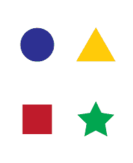
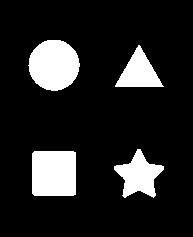
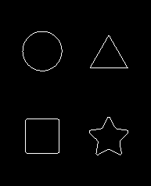
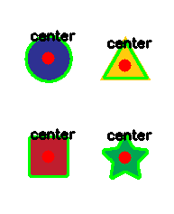

# Python OpenCV–找到轮廓中心

> 原文:[https://www . geesforgeks . org/python-opencv-find-轮廓中心/](https://www.geeksforgeeks.org/python-opencv-find-center-of-contour/)

**先决条件:** [**如何使用 OpenCV 检测 Python 中图像的形状？**](https://www.geeksforgeeks.org/how-to-detect-shapes-in-images-in-python-using-opencv/)

在本文中，我们将学习如何使用 python 中的 OpenCV 找到轮廓的中心。我们将使用[查找轮廓()](https://www.geeksforgeeks.org/find-and-draw-contours-using-opencv-python/)和矩()函数。

**我们将使用以下图像进行中心点检测:**



## **分步实施**

**步骤 1:** 导入所需模块。

## 蟒蛇 3

```
import cv2 as cv
import numpy as np
```

**第二步:**图像的阈值。

在我们进行轮廓检测之前，我们必须对上面的图像进行阈值处理，我们可以使用以下代码片段来完成:

## 蟒蛇 3

```
# change it with your absolute path for the image
image = cv.imread("shape.png")
gray = cv.cvtColor(image, cv.COLOR_BGR2GRAY)

blur = cv.GaussianBlur(gray, (5, 5),
                       cv.BORDER_DEFAULT)
ret, thresh = cv.threshold(blur, 200, 255,
                           cv.THRESH_BINARY_INV)
```

阈值和模糊参数可以改变，我们建议您尝试调整它们，看看有多少轮廓被检测到与给定的参数。

您可以使用以下命令保存阈值输出:

## 蟒蛇 3

```
cv.imwrite("thresh.png",thresh)
```

**输出:**

```
True
```

它应该是这样的:



我们将使用 find contours()方法从阈值化的图像中找到轮廓，该方法返回两个值，即所有轮廓及其层次的列表。轮廓是什么？简单地说，等高线是点列表或点列表树。这些点描述了一个轮廓，也就是一个矢量，它可以根据与背景的不同被绘制成一个轮廓。另一方面，层次结构显示了形状之间的相互关系，层本身或者形状是否在彼此之上。这可以使用层次结构来确定。

**第 3 步:**现在要在阈值图像中找到轮廓和层次，我们可以使用如下所示的 findContours()方法:

## 蟒蛇 3

```
contours, hierarchies = cv.findContours(
    thresh, cv.RETR_LIST, cv.CHAIN_APPROX_SIMPLE)
```

为了简单和理解轮廓是如何工作的，并且为了检查在阈值图像中我们能找到多少轮廓，我们可以使用下面的片段在空白图像矩阵上绘制它们:

## 蟒蛇 3

```
blank = np.zeros(thresh.shape[:2],
                 dtype='uint8')

cv.drawContours(blank, contours, -1,
                (255, 0, 0), 1)

cv.imwrite("Contours.png", blank)
```

**输出:**

```
True
```

图像应该是这样的:



**第四步:**将所有中心点归档，画在图像上。

现在为了找出中心点，我们将使用矩()方法。这里我们将使用它来寻找特定轮廓的图像时刻。图像矩是图像像素强度的特定加权平均值，借助于它，我们可以找到图像的一些特定属性，例如半径、面积、质心等。

**为了找到图像的质心，我们使用特定的公式:**

> cx = (M10 / M00)
> 
> cy = ( M01 / M00)
> 
> 其中 cx 和 cy 是中心点的 x 和 y 坐标，M 是力矩

下面的代码片段找到所有的中心点，并在图像上绘制它们。

## 蟒蛇 3

```
for i in contours:
    M = cv.moments(i)
    if M['m00'] != 0:
        cx = int(M['m10']/M['m00'])
        cy = int(M['m01']/M['m00'])
        cv.drawContours(image, [i], -1, (0, 255, 0), 2)
        cv.circle(image, (cx, cy), 7, (0, 0, 255), -1)
        cv.putText(image, "center", (cx - 20, cy - 20),
                   cv.FONT_HERSHEY_SIMPLEX, 0.5, (0, 0, 0), 2)
    print(f"x: {cx} y: {cy}")
```

**步骤 5:** 最后，我们可以使用以下命令保存图像:

## 蟒蛇 3

```
cv.imwrite("image.png", image)
```

**输出:**

```
True
```

这是最终图像的样子:

