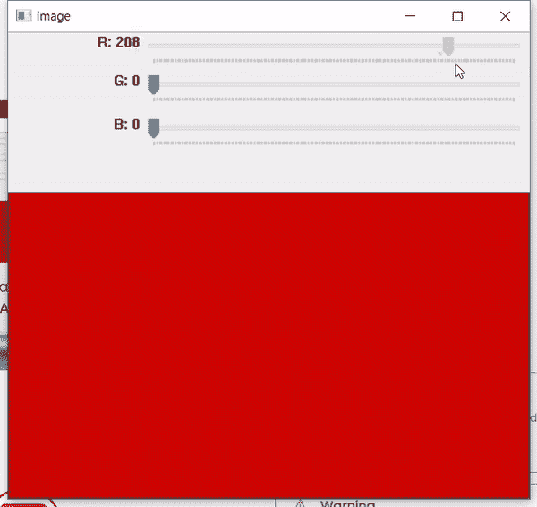

# Python OpenCV–getTrackbarPos()函数

> 原文:[https://www . geesforgeks . org/python-opencv-gettrackbarpos-function/](https://www.geeksforgeeks.org/python-opencv-gettrackbarpos-function/)

**getTrackbarPos()是 Python 中的函数 OpenCV** 返回指定跟踪条的当前位置。它需要两个参数。第一个是跟踪条名称，第二个是窗口名称，它是跟踪条的父窗口。返回跟踪条位置。

> **语法:**cv . gettrackbarpos(trackbaname，winname)
> 
> **参数:**
> 
> *   **轨道舱:**轨道舱名称
> *   **winname:** 轨迹栏父窗口的名称。
> 
> **返回:**指定跟踪条的当前位置

**注意:**【仅适用于 Qt 后端】这里，如果跟踪条连接到控制面板，则 winname 可以为空或空。

**下面是实现:**

## 蟒蛇 3

```py
# Demo Trackbar
# importing cv2 and numpy
import cv2
import numpy

def nothing(x):
    pass

# Creating a window with black image
img = numpy.zeros((300, 512, 3), numpy.uint8)
cv2.namedWindow('image')

# creating trackbars for red color change
cv2.createTrackbar('R', 'image', 0, 255, nothing)

# creating trackbars for Green color change
cv2.createTrackbar('G', 'image', 0, 255, nothing)

# creating trackbars for Bule color change
cv2.createTrackbar('B', 'image', 0, 255, nothing)

while(True):
    # show image
    cv2.imshow('image', img)

    # for button pressing and changing
    k = cv2.waitKey(1) & 0xFF
    if k == 27:
        break

    # get current positions of all Three trackbars
    r = cv2.getTrackbarPos('R', 'image')
    g = cv2.getTrackbarPos('G', 'image')
    b = cv2.getTrackbarPos('B', 'image')

    # display color mixture
    img[:] = [b, g, r]

# close the window
cv2.destroyAllWindows()
```

**输出:**



当我们移动 R、G 或 B 中任何一个的滑块时，它对应的 getTrackbarPos()值会改变，并返回特定滑块的位置。通过它我们可以改变下面盒子的颜色。您可以在我们传递给 getTrackbarPos()参数的代码中看到。让我们以 R 为例，我们传递‘R’和‘image’给函数。这里的“R”是我们创建的跟踪栏名称，“image”是我们运行代码时打开的窗口的名称。基本上，它是跟踪条的父窗口。这将滑块的位置返回为一个整数值，并保存在 r 中。我们用这个返回值“r”、“g”和“b”创建一个颜色框。