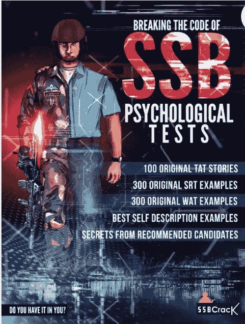
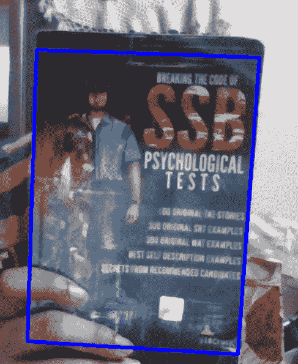

# Python OpenCV:使用单应性的对象跟踪

> 原文:[https://www . geesforgeks . org/python-opencv-object-tracking-use-monography/](https://www.geeksforgeeks.org/python-opencv-object-tracking-using-homography/)

在本文中，我们试图用视频中已经给出的图像来跟踪视频中的对象。我们还可以跟踪图像中的对象。在看到使用单应性的目标跟踪之前，让我们了解一些基础知识。

## 什么是单应？

单应性是将一个点中的点映射到另一个图像中相应点的变换。单应矩阵是 3×3 矩阵:


如果两个点不在同一个平面上，那么我们必须使用两个同形异义图。同样，对于 n 个平面，我们也要用 n 个同形。如果我们有更多的同形词，那么我们需要适当地处理它们。这就是为什么我们使用特征匹配。

**导入图像数据:**我们将读取以下图像:



上图是书的封面，存储为‘img . jpg’。

## 计算机编程语言

```py
# importing the required libraries
import cv2
import numpy as np

# reading image in grayscale
img = cv2.imread("img.jpg", cv2.IMREAD_GRAYSCALE)

# initializing web cam
cap = cv2.VideoCapture(0)
```

**特征匹配:**特征匹配是指根据搜索距离从两个相似的数据集中找到对应的特征。现在将使用 sift 算法和 flann 类型特征匹配。

## 计算机编程语言

```py
# creating the SIFT algorithm
sift = cv2.xfeatures2d.SIFT_create()

# find the keypoints and descriptors with SIFT
kp_image, desc_image =sift.detectAndCompute(img, None)

# initializing the dictionary
index_params = dict(algorithm = 0, trees = 5)
search_params = dict()

# by using Flann Matcher
flann = cv2.FlannBasedMatcher(index_params, search_params)
```

现在，我们还必须将视频捕获转换为灰度，通过使用适当的匹配器，我们必须将图像中的点匹配到帧中。

在这里，当我们画火柴时，我们可能会遇到例外，因为在两个平面上将有无限多的点。为了处理这种情况，我们应该只考虑一些点，为了得到一些精确的点，我们可以改变距离障碍。

## 计算机编程语言

```py
# reading the frame
_, frame = cap.read()

# converting the frame into grayscale
grayframe = cv2.cvtColor(frame, cv2.COLOR_BGR2GRAY)

# find the keypoints and descriptors with SIFT
kp_grayframe, desc_grayframe = sift.detectAndCompute(grayframe, None)

# finding nearest match with KNN algorithm
matches= flann.knnMatch(desc_image, desc_grayframe, k=2)

# initialize list to keep track of only good points
good_points=[]

for m, n in matches:
    #append the points according
    #to distance of descriptors
    if(m.distance < 0.6*n.distance):
        good_points.append(m)
```


**单应性:**要检测物体的单应性，我们必须获得矩阵，并使用函数 and 单应性()获得物体的单应性。

## 计算机编程语言

```py
# maintaining list of index of descriptors
# in query descriptors
query_pts = np.float32([kp_image[m.queryIdx]
                 .pt for m in good_points]).reshape(-1, 1, 2)

# maintaining list of index of descriptors
# in train descriptors
train_pts = np.float32([kp_grayframe[m.trainIdx]
                 .pt for m in good_points]).reshape(-1, 1, 2)

# finding  perspective transformation
# between two planes
matrix, mask = cv2.findHomography(query_pts, train_pts, cv2.RANSAC, 5.0)

# ravel function returns
# contiguous flattened array
matches_mask = mask.ravel().tolist()
```

到目前为止一切都已完成，但是当我们试图改变或移动物体到另一个方向时，计算机就不能找到它的同形词来处理这个问题，我们不得不使用透视变换。例如，人类可以看到比远处物体更大的近处物体，这里视角正在改变。这被称为透视变换。

## 计算机编程语言

```py
# initializing height and width of the image
h, w = img.shape

# saving all points in pts
pts = np.float32([[0, 0], [0, h], [w, h], [w, 0]])
            .reshape(-1, 1, 2)

# applying perspective algorithm
dst = cv2.perspectiveTransform(pts, matrix)
```

最后，让我们看看输出

## 计算机编程语言

```py
# using drawing function for the frame
homography = cv2.polylines(frame, [np.int32(dst)], True, (255, 0, 0), 3)

# showing the final output
# with homography
cv2.imshow("Homography", homography)
```

**输出:**

